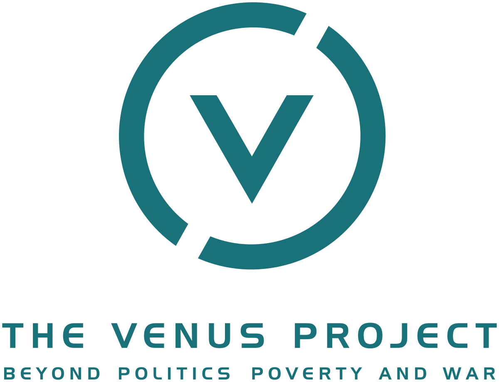
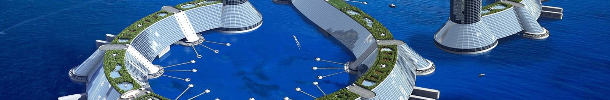

# Проект «Венера» (TVP)

Теги: #проектвенера #жакфреско #роксанамедоуз #tvp

Проект «Венера» — это кульминация работы всей жизни одного человека: Жака Фреско. Он представляет собой идею интеграции лучшего из достижений науки и техники во всеобъемлющий план для нового общества, основанного на заботе о человеке и окружающей среде. Данный проект является организацией, а научно-исследовательский центр расположен на участке площадью 10 гектаров в городке Венус, штат Флорида, США.

Проект «Венера» предлагает новый подход к развитию человека и решению экологических проблем. Это теоретически осуществимый образ светлого и лучшего будущего, который будет отвечать запросам настоящего и будущего человечества. Проект «Венера» призывает к целенаправленной реконструкции сегодняшнего общества c его извечными проблемами. Войны, бедность, голод, долги, загрязнение окружающей среды и неоправданные человеческие страдания рассматриваются не только как разрешимые, но и как полностью неприемлемые. Одним из исходных условий Проекта «Венера» является признание ресурсов Земли общим достоянием всех жителей планеты. Другие варианты распределения ресурсов приведут к тем же проблемам, с которыми мы сталкиваемся сегодня.

## Информация

- [Официальный сайт Проекта «Венера»](https://www.thevenusproject.com/)
- YouTube канал ([русский](https://www.youtube.com/channel/UC2lgvkAKm3jCSY4QB5JkNtg), [английский](https://www.youtube.com/user/thevenusprojectmedia))
- [FAQ по проекту «Венера»](%D0%A7%D0%B0%D1%81%D1%82%D0%BE%20%D0%B7%D0%B0%D0%B4%D0%B0%D0%B2%D0%B0%D0%B5%D0%BC%D1%8B%D0%B5%20%D0%B2%D0%BE%D0%BF%D1%80%D0%BE%D1%81%D1%8B%20%D0%9F%D1%80%D0%BE%D0%B5%D0%BA%D1%82%20%D0%92%D0%B5%D0%BD%D0%B5%D1%80%D0%B0%20FAQ.md) ([сайт](https://designing-the-future.org/the-venus-project-faq/), [youtube](https://youtu.be/4dLJH2S1llQ), [PDF](https://designing-the-future.org/wp-content/uploads/2014/04/TheVenusProject_FAQ_RUS.pdf), [EPUB](http://www.tvpactivism.ru/files/TheVenusProject_FAQ_RUS.epub))
- [Кто такой Жак Фреско?](%D0%96%D0%B0%D0%BA%20%D0%A4%D1%80%D0%B5%D1%81%D0%BA%D0%BE.md)
- [Кто такая Роксана Медоуз?](%D0%A0%D0%BE%D0%BA%D1%81%D0%B0%D0%BD%D0%B0%20%D0%9C%D0%B5%D0%B4%D0%BE%D1%83%D0%B7.md)
- [Экскурсия по Проекту Венера вместе с Жаком Фреско](https://www.youtube.com/watch?v=Bh3omlKVkOk&list=PLtrvASfI1KW4d-SY5W0mw7Dh1dHSmZyV3)
- [Полезные ссылки активистов Проекта Венера](https://vk.com/away.php?to=https%3A%2F%2Fdocs.google.com%2Fdocument%2Fd%2F1B2FZkqa8aDDTz2eXoD3rhjoI2YWIs2WZws1ozKixCyk%2Fedit&cc_key=)
- [Знакомство с проектом Венера (презентация) автор: Евгений Шулябкин](https://docs.google.com/presentation/d/1cBL14a5zpcH-mSI5M3j-p2VW7YcuW1kZzgQTV-fuYmo/edit#slide=id.p)

## Люди

- [Жак Фреско](%D0%96%D0%B0%D0%BA%20%D0%A4%D1%80%D0%B5%D1%81%D0%BA%D0%BE.md)
- [Роксана Медоуз](%D0%A0%D0%BE%D0%BA%D1%81%D0%B0%D0%BD%D0%B0%20%D0%9C%D0%B5%D0%B4%D0%BE%D1%83%D0%B7.md)
- Евгений Слюзко

## [Сообщества](TVP%20-%20%D0%A1%D0%BE%D0%BE%D0%B1%D1%89%D0%B5%D1%81%D1%82%D0%B2%D0%B0.md)

## Подпроекты

- Формальные
    - Типы проектов
        - Поддержка сайта
        - Перевод
        - Озвучка
        - Создание видео
        - Создание игр
    - Условия участия
        - Связаться с руководителем
        - Пройти тест на офиц. сайте
- Community
  - [TVP - Discord](TVP%20-%20Discord.md)
  - [TVP - Активизм](TVP%20-%20%D0%90%D0%BA%D1%82%D0%B8%D0%B2%D0%B8%D0%B7%D0%BC.md)

## Образование/информирование

- способы распространения
    - сообщества
    - видео
    - статьи
    - поисковые системы
- направления
    - науки
        - общая семантика
        - социальная инженерия

## [Основы формирования будущего](TVP%20-%20%D0%9E%D1%81%D0%BD%D0%BE%D0%B2%D1%8B%20%D1%84%D0%BE%D1%80%D0%BC%D0%B8%D1%80%D0%BE%D0%B2%D0%B0%D0%BD%D0%B8%D1%8F%20%D0%B1%D1%83%D0%B4%D1%83%D1%89%D0%B5%D0%B3%D0%BE.md)

- [Метод мышления](%D0%9D%D0%B0%D1%83%D1%87%D0%BD%D1%8B%D0%B9%20%D0%BC%D0%B5%D1%82%D0%BE%D0%B4.md)
- [Ценности](TVP%20-%20%D0%9A%D1%83%D0%BB%D1%8C%D1%82%D1%83%D1%80%D0%B0%20(%D1%86%D0%B5%D0%BD%D0%BD%D0%BE%D1%81%D1%82%D0%B8).md)
- [Технологии](%D0%A2%D0%B5%D1%85%D0%BD%D0%BE%D0%BB%D0%BE%D0%B3%D0%B8%D0%B8.md)

## [Производство](TVP%20-%20%D0%9F%D1%80%D0%BE%D0%B8%D0%B7%D0%B2%D0%BE%D0%B4%D1%81%D1%82%D0%B2%D0%BE.md)

## [Технологии проекта](TVP%20-%20%D0%A2%D0%B5%D1%85%D0%BD%D0%BE%D0%BB%D0%BE%D0%B3%D0%B8%D0%B8.md)