# Языки программирования

202102231318
Теги: #программирование #яп #языкПрограммирования 
___

**Язык** **программи́рования** — формальный **язык**, предназначенный для записи компьютерных программ. **Язык** **программирования** определяет набор лексических, синтаксических и семантических правил, определяющих внешний вид программы и действия, которые выполнит исполнитель (обычно — ЭВМ) под ее управлением. [Википедия](https://ru.wikipedia.org/wiki/%D0%AF%D0%B7%D1%8B%D0%BA_%D0%BF%D1%80%D0%BE%D0%B3%D1%80%D0%B0%D0%BC%D0%BC%D0%B8%D1%80%D0%BE%D0%B2%D0%B0%D0%BD%D0%B8%D1%8F)

[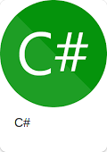](Csharp.md)
[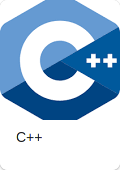](C++.md)
[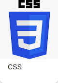](CSS.md)

[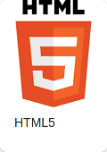](HTML5.md)
[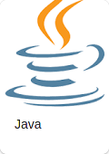](Java.md)
[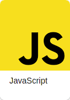](JavaScript.md)

[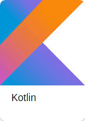](Kotlin.md)
[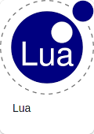](Lua.md)
[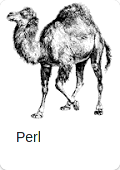](Perl.md)
[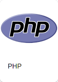](PHP.md)
[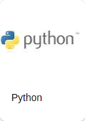](Python.md)
[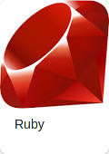](Ruby.md)
[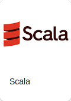](Scala.md)
[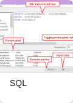](SQL.md)
[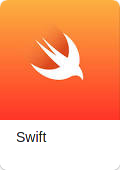](Swift.md)
[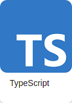](TypeScript.md)
[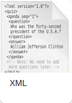](XML.md)

## Список

* [ASP.NET](ASP.NET.md)
* [C](C.md)
* [C#](Csharp.md)
* [C++](C++.md)
* [CSS](CSS.md)
* [Fortran](Fortran.md)
* [HTML5](HTML5.md)
* [Java](Java.md)
* [JavaScript](JavaScript.md)
* [JSON](JSON.md)
* [Kotlin](Kotlin.md)
* [Lisp](Lisp.md)
* [Lua](Lua.md)
* [Pascal](Pascal.md)
* [Perl](Perl.md)
* [PHP](PHP.md)
* [Python](Python.md)
* [Ruby](Ruby.md)
* [Scala](Scala.md)
* [SQL](SQL.md)
* [Swift](Swift.md)
* [TypeScript](TypeScript.md)
* [XML](XML.md)

## Какой язык выбрать

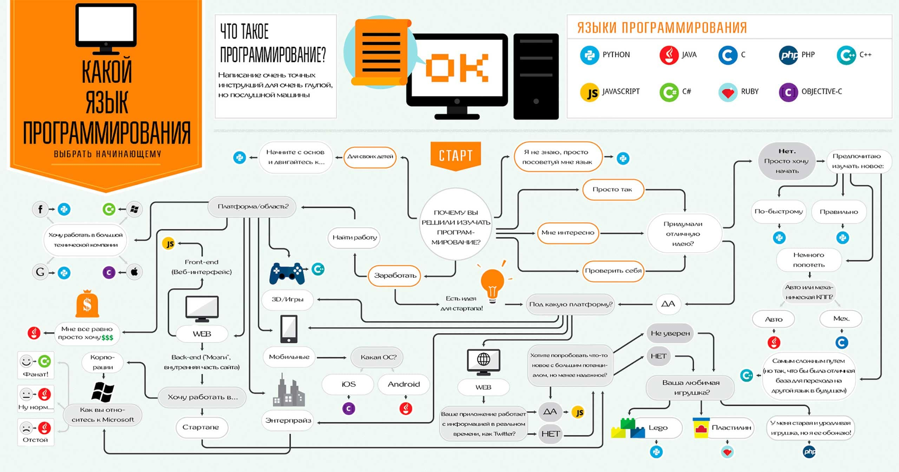
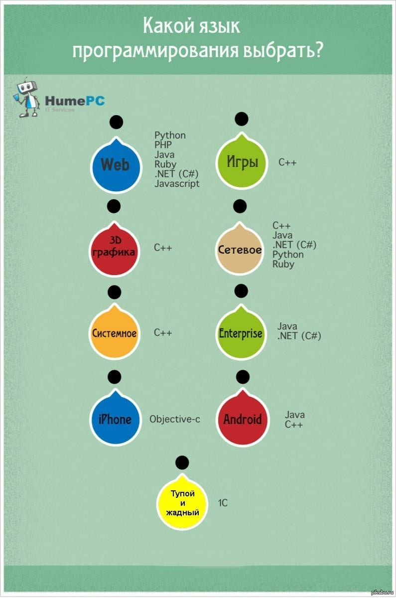

## Категории

- [00 Программирование](00%20%D0%9F%D1%80%D0%BE%D0%B3%D1%80%D0%B0%D0%BC%D0%BC%D0%B8%D1%80%D0%BE%D0%B2%D0%B0%D0%BD%D0%B8%D0%B5.md)
