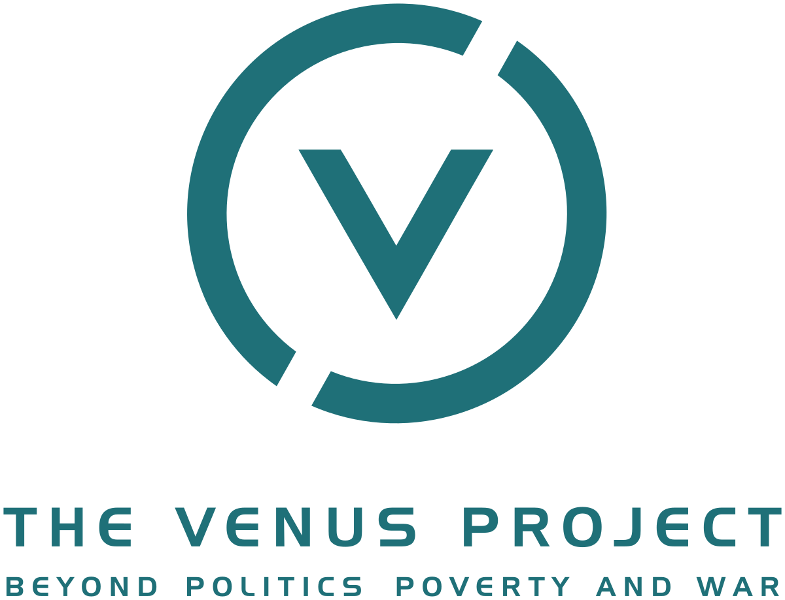

# Проект "Венера"

Проект «Венера» — это кульминация работы всей жизни одного человека: Жака Фреско. Он представляет собой идею интеграции лучшего из достижений науки и техники во всеобъемлющий план для нового общества, основанного на заботе о человеке и окружающей среде. Данный проект является организацией, а научно-исследовательский центр расположен на участке площадью 10 гектаров в городке Венус, штат Флорида, США.

Проект «Венера» предлагает новый подход к развитию человека и решению экологических проблем. Это теоретически осуществимый образ светлого и лучшего будущего, который будет отвечать запросам настоящего и будущего человечества. Проект «Венера» призывает к целенаправленной реконструкции сегодняшнего общества c его извечными проблемами. Войны, бедность, голод, долги, загрязнение окружающей среды и неоправданные человеческие страдания рассматриваются не только как разрешимые, но и как полностью неприемлемые. Одним из исходных условий Проекта «Венера» является признание ресурсов Земли общим достоянием всех жителей планеты. Другие варианты распределения ресурсов приведут к тем же проблемам, с которыми мы сталкиваемся сегодня.

## Ссылки

* [Официальный сайт Проекта «Венера»](https://www.thevenusproject.com/)
* [FAQ по проекту \(русский\)](https://designing-the-future.org/the-venus-project-faq/)
* [YouTube канал \(русский\)](https://www.youtube.com/channel/UC2lgvkAKm3jCSY4QB5JkNtg)
* [YouTube канал \(англ\)](https://www.youtube.com/user/thevenusprojectmedia)

