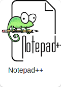

# Текстовые редакторы

202102230506 Tags: \#текстовыйРедактор

            

## Ссылки

* [Atom]()
* [BBedit]()
* [Brackets]()
* [gedit]()
* [IntelliJ IDEA]()
* [nano](nano.md)
* [Notepad++]()
* [PhpStrom]()
* [PyCharm]()
* [Sublime Text 3](sublime-text-3.md)
* [Vim]()
* [Visual Studio Code]()
* [WebStorm]()

