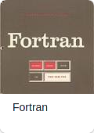

# Языки программирования

202102231318 Tags: \#программирование

**Язык** **программи́рования** — формальный **язык**, предназначенный для записи компьютерных программ. **Язык** **программирования** определяет набор лексических, синтаксических и семантических правил, определяющих внешний вид программы и действия, которые выполнит исполнитель \(обычно — ЭВМ\) под ее управлением. [Википедия](https://ru.wikipedia.org/wiki/%D0%AF%D0%B7%D1%8B%D0%BA_%D0%BF%D1%80%D0%BE%D0%B3%D1%80%D0%B0%D0%BC%D0%BC%D0%B8%D1%80%D0%BE%D0%B2%D0%B0%D0%BD%D0%B8%D1%8F)

                    

## Список

* [ASP.NET](https://github.com/redboo/knowledge/tree/bb8f6f8af84ac50347364350b7c97072ef646d85/db/ASP.NET)
* [C]()
* [C\#]()
* [C++]()
* [CSS]()
* [Fortran]()
* [HTML5]()
* [Java]()
* [JavaScript](javascript.md)
* [JSON]()
* [Kotlin]()
* [Lua]()
* [Perl]()
* [PHP]()
* [Python](python.md)
* [Ruby]()
* [Scala]()
* [SQL]()
* [Swift]()
* [TypeScript]()
* [XML]()

## Какой язык выбрать

 

## Категории

* [00 Программирование](00-programmirovanie.md)

