# 47 игровых механик. Секреты создания игровой зависимости

Что заставляет миллионы людей ежедневно кормить несуществующих рыбок, покупать несуществующие дома и «прокачивать» пиксели в виде свиней до 9-го уровня?

Вашему вниманию предлагается перевод статьи с сайта Techcrunch о том, как компании-разработчики социгр создают Playbook'и - своеобразные сборники рецептов и схем, следуя которым можно создавать «супер-пупер-крутые» игры.

Проект «Playdeck» от SCVNGR (разработчик социгр для мобильных платформ) - это *«колода карт, в которой описано 47 различных игровых механик, которые могут смешиваться, создавая фундамент для различных видов игр»*

«Некоторые из механик интересны для общего понимания **теории игровой динамики** («эпические победы», социальная структура игр, [теория игр](https://ru.wikipedia.org/wiki/%D0%A2%D0%B5%D0%BE%D1%80%D0%B8%D1%8F_%D0%B8%D0%B3%D1%80)). Многие из этих концепций общеизвестны - они были собраны для колоды SCVNGR со всех уголков интернета и почерпнуты из опыта известных деятелей (Jane McGonigal, Ian Bogost и Jess Schell), а также из материалов сайта Gamasutra.com, некоторые используются только в разработках компании и могут не сработать вне проектов SCVNGR.»

---

### 01: Достижения (Achievement)
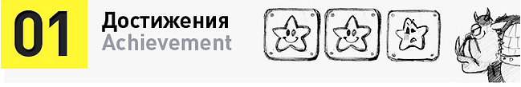
* <u>Определение:</u> Виртуальное или материальное выражение результата выполнения действия. Достижения часто рассматриваются как награда, либо сами по себе.
* <u>Пример:</u> Медаль, уровень, вознаграждение, очки… наградой будет все, что может считаться таковой.

---

### 02: Механика назначенной встречи (Appointment Dynamic)
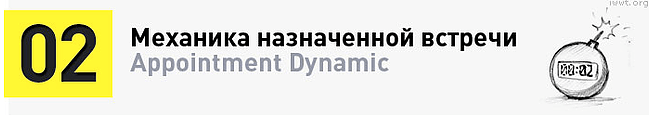
* <u>Определение:</u> Механика, в которой, для достижения успеха, нужно вернуться в игру в определенное время для совершения некоего действия. Зачастую тесно связана с интервальным графиком вознаграждений или механикой избегания.
* <u>Пример:</u> Cafe World и Farmville, в которые нужно возвращаться в назначенное время, чтобы сделать что-то хорошее, а если этого не сделать - случится что-то плохое.

---

### 03: Избегание (Avoidance)
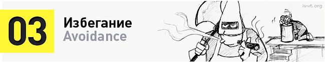
* <u>Определение:</u> Акт стимулирования игрока не наградой, а избеганием наказания. Помогает поддерживать постоянный уровень активности согласно задуманному разработчиком расписанию.
* <u>Пример:</u> Нажимайте рычаг каждые 30 секунд во избежание шокового удара.

---

### 04: Поведенческий контраст (Behavioral Contrast)
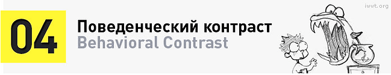
* <u>Определение:</u> Теория, определяющая, как резко может изменяться поведение в соответствии с новыми ожиданиями ("игра на контрастах").
* <u>Пример:</u> Обезьянка нажимает рычаг и получает банан. Обезьянка счастлива и продолжает жать рычаг. Но однажды она получает виноград. Обезьянка в восторге. Продолжая жать рычаг, как-то раз она снова получает банан. Вместо того, чтобы радоваться как раньше, обезьянка швыряет банан в экспериментатора. (В некоторых экспериментах в клетку помещали вторую обезьянку, привязанную к веревке и не имеющую доступ к бананам или рычагу. После того, как награда-виноград исчезает, первая обезьянка избивает вторую, не смотря на то, что последняя не имеет никакого отношения к исчезновению. Злость поистине иррациональна).

---

### 05: Поведенческий импульс (Behavioral Momentum)
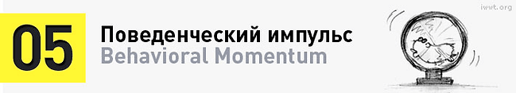
* <u>Определение:</u> Склонность игрока продолжать делать то, что он делал.
* <u>Пример:</u> В одном из своих выступлений Jesse Schell написал: *«Я десять часов проиграл в Farmville. Я умный человек и не потратил бы 10 часов на что-то бесполезное. Стало быть, это полезно, и я могу продолжить играть дальше».*

---

### 06: Вознаграждение за усилие (Blissful Productivity)
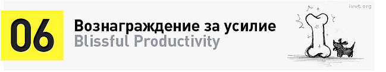
* <u>Определение:</u> Идея в том, что в процессе игры мы чувствуем себя счастливее трудясь, чем отдыхая. Собственно, все человечество эволюционировало в ходе выполнения работы за вознаграждения.
* <u>Пример:</u> Jane McGonical, выступая на конференции TED, отметила, что игроки World of Warcraft играют в среднем по 22 часа в неделю, зачастую после полного рабочего дня, и сделала вывод, что они готовы упорно трудиться, возможно, даже усерднее чем в реальной жизни, ради вознаграждения за усилия в игровом мире.

---

### 07: Теория постепенной подачи информации (Cascading Information Theory)
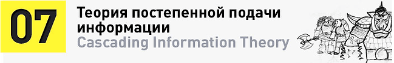
* <u>Определение:</u> Теория, согласно которой для полного понимания игры информация игроку должна выдаваться минимальными дозами.
* <u>Пример:</u> Демонстрация, первым делом, базовых действий, а затем - открытие доступа к другим, более сложным.

---

### 08: Цепи событий (Chain Schedules)
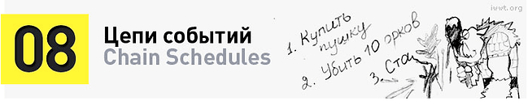
* <u>Определение:</u> Метод использования вознаграждения в качестве звена в цепочке связанных событий. Игроки, зачастую, склонны рассматривать такие события как отдельные элементы. Разблокирование одного из звеньев в цепочке часто рассматривается игроком просто как награда за действие.
* <u>Пример:</u> Убейте десять орков, чтобы попасть в пещеру дракона, где каждые тридцать минут появляется сам дракон.

---

### 09: Совместное исследование (Communal Discovery)
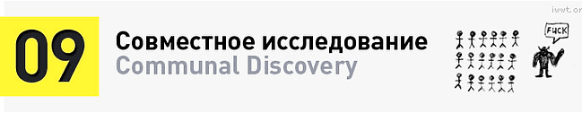
* <u>Определение:</u> Игровой механизм, в котором все сообщество объединяется для совместного поиска решений загадок, преодоления преград и брошенных игрой вызовов. Обладает ярко выраженным «вирусным» эффектом.
* <u>Пример:</u> Рейды в World of Warcraft.

---

### 10: Кроссплатформенные игры (Companion Gaming)
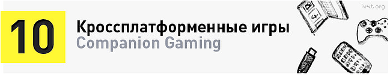
* <u>Определение:</u> Игры, в которые можно играть на разных платформах.
* <u>Пример:</u> Игры, в которые можно играть на iphone, facebook, xbox без изменений в геймплее.

---

### 11: Случайное событие (Contingency)
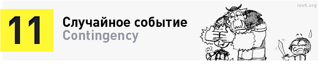
* <u>Определение:</u> Проблема, которую игрок должен преодолеть в рамках сценария вознаграждений (состоящего из трех частей: «Случайное событие», «Усиление» (№36) , «Реакция на событие» (№37)).
* <u>Пример:</u> 10 орков блокируют вам путь.

---

### 12: Обратный отсчёт (Countdown)
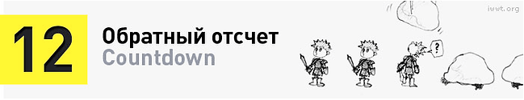
* <u>Определение:</u> Ситуация, для решения которой игрокам дается ограниченное количество времени. Данный метод позволяет резко повысить уровень активности игрока, по сравнению с его первоначальной активностью (но только на определенный период времени).
* <u>Пример:</u> В Bejeweled Blitz игроку дается 30 секунд, чтобы заработать как можно больше очков. Также к данной механике относятся: бонусные уровни, уровни на время.

---

### 13: Сборный рейтинг победителей (Cross Situational Leaderboards)
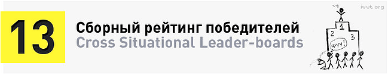
* <u>Определение:</u> Это происходит, когда для нескольких (неоднородных и несвязанных) игровых сценариев используется один рейтинговый механизм. Игроки часто считают такую схему рейтингования несправедливой, поскольку не все были поставлены в равные условия на пути к победе.
* <u>Пример:</u> Игроки произвольно направляются одним из трех путей. Победитель определяется по наибольшему количеству очков, набранных в целом (то есть, в ходе прохождения игры, вне зависимости от особенностей и сложности сценария). Поскольку игроки могут пройти только один путь (без права перевыбора), они будут чувствовать несправедливость в сценарии игры и расстраиваться.

---

### 14: Сдерживающие факторы (Disincentives)
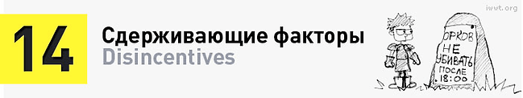
* <u>Определение:</u> Элемент игры, использующий штраф (или изменение ситуации) для смены манеры поведения игрока.
* <u>Пример:</u> Потеря здоровья; учащающиеся ловушки; упрощение схемы оплаты услуг.

---

### 15: Бесконечные игры (Endless Games)
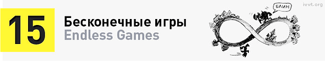
* <u>Определение:</u> Игры без концовки. Чаще всего встречается в социальных и казуальных играх, которые могут развиваться вечно, либо к играм, где статическое (но позитивное) состояние само по себе является наградой.
* <u>Пример:</u> Farmville (победа в постоянстве вещей), Hearthstone (бесконечные матчи), World of Warcraft (нету конечной цели, победы).

---

### 16: Зависть (Envy)
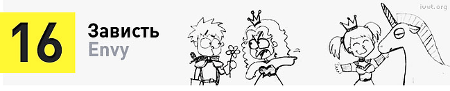
* <u>Определение:</u> Желание обладать тем, чем владеют другие игроки. Чтобы этот механизм работал, необходимо давать игрокам возможность посмотреть, что есть у друга/соседа (эксплуатируется тяга индивидуума к вуаеризму).
* <u>Пример:</u> у моего друга есть эта вещь, и я ее хочу! ("Система осмотра экипировки на другом персонаже")

---

### 17: Эпическое значение (Epic Meaning)
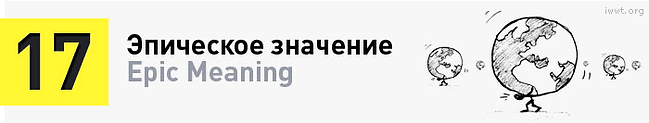
* <u>Определение:</u> Игроки будут в высшей степени мотивированы, если будут считать, что создают нечто великое, впечатляющее, что-то намного более важное, чем они сами.
* <u>Пример:</u> Из выступления Jane McGonical на конференции TED, в котором она упоминает мир WoW. Wikipedia - крупнейшая Вики в мире, а вот второй по размерам Wiki является база статей по World of Warcraft, в которой насчитывается более 80 000 статей написанных игроками и более 5 миллионов посетителей в месяц которые читают, дополняют и корректируют имеющиеся материалы.

---

### 18: Ненаграждение (Extinction)

* <u>Определение:</u> Термин, обозначающий прекращение предоставления награды. Цель данного метода - вызов в игроках злости. В качестве побуждающего мотива используется чувство обиды из-за отсутствия ожидаемой награды. Этот метод снижает общую пользовательскую активность.
* <u>Пример:</u> Убийство 10-ти орков больше не дает новый уровень.

---

### 19: Вознаграждения с фиксированными интервалами (Fixed Interval Reward Schedules)
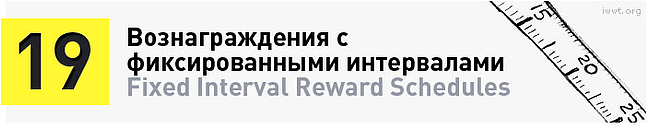
* <u>Определение:</u> Вознаграждение выдается постоянно, после определенного промежутка времени, скажем, в 30 минут. Отличительной чертой этого механизма является снижение уровня активности после получения игроком награды, а затем - к постепенно возрастающей активности на время выдачи вознаграждения, после чего следует очередная пауза в активности игрока.
* <u>Пример:</u> Farmville: подождите 30 минут - и ростки появятся.

---

### 20: Вознаграждения за определенную цепочку действий (Fixed Ratio Reward Schedule)
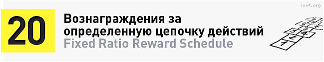
* <u>Определение:</u> Механизм, согласно которому игрок получает вознаграждение после выполнения определенной цепочки действий. Применение данной механики поначалу снижает активность игрока (поскольку совершение первого действия не дает награды), однако, затем активность играющего повышается, по мере того как вознаграждение становится все ближе и ближе.
* <u>Пример:</u> Уничтожьте 20 крейсеров - и получите уровень, посетите 5 локаций - и заработайте медаль. Цепочки квестов в World of Warcraft.

---

### 21: Бесплатный обед (Free Lunch)
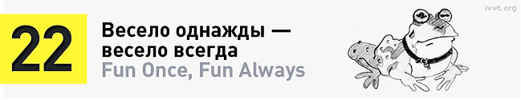
* <u>Определение:</u> Сценарий, в процессе которого игрок чувствует, что получает что-то бесплатно, потому что кто-то другой выполнил его работу. Очень важно, чтобы работа воспринималась выполненной (просто не самим игроком), во избежание потери доверия к сценарию. Игрок должен чувствовать, что ему «повезло» с чем-то.
* <u>Пример:</u> Groupon. Благодаря тому, что 100 других людей осуществили сделку, вы получаете ее задешево. Нет незавершенности, потому что вы узнаете, что работа была сделана (100 человек потратили деньги), но вам самим не пришлось этим заниматься.

---

### 22: Весело однажды - весело всегда (Fun Once - Fun Always)

* <u>Определение:</u> Концепция, согласно которой действие доставляет игроку удовольствие вне зависимости от количества его повторений. Как правило, это относится к простым действиями.
* <u>Пример:</u> По данной концепции создаются задания для игроков, состоящие из поиска и «посещений» определенных локаций, запусков игровых механизмов. "Дейли-квесты", баттлграунды, сбор ингридиентов для кулинарных рецептов/зелий/вещей, etc.

---

### 23: Вознаграждения по расписанию (Interval Reward Schedules)
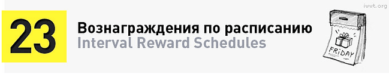
* <u>Определение:</u> Вознаграждения, выдающиеся по истечении определенного времени. Есть две разновидности: переменные и постоянные.
* <u>Пример:</u> Подождите N минут - и соберите арендную плату/урожай/очки опыта.

---

### 24: Лотерея (Lottery)
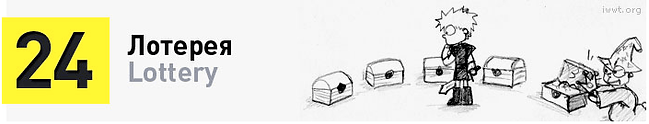
* <u>Определение:</u> Игровая динамика, в которой победитель определяется случайным образом. Создает высокую заинтересованность игроков в «шаровой» награде. Справедливость такой методики несколько сомнительна: победители, как правило, продолжают играть неопределенное количество времени, в то время как проигравшие, в обиде, быстро покидают игру, несмотря на случайный характер распределения призов.
* <u>Пример:</u> Многие виды азартных игр, лотерейные билеты.

---

### 25: Лояльность (Loyalty)
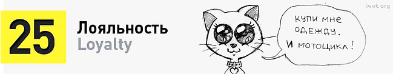
* <u>Определение:</u> Механизм создания лояльной аудитории посредством налаживания духовной связи игрока с игровым миром. Достигается с помощью внушения игроку чувства причастности к игровому миру (к примеру, обладанием личной собственностью в игре). Зачастую подкрепляется особыми визуальными образами, заметными другим игрокам; статусами или особыми наградами.
* <u>Пример:</u> Преданность вассалов в WоW. В реальном мире: особый статус клиента в заведении (портрет на стенде «любимые клиенты заведения»).
* <u>Визуально:</u> Документальный фильм [«World of Warcraft: поиск группы»](https://youtu.be/3s5ks2JLwzQ) показывает, как может выглядеть игровая лояльность.

---

### 26: Мета-игра (Meta Game)
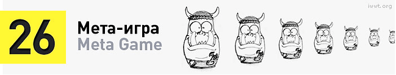
* <u>Определение:</u> Игра, встроенная внутрь основной игры. Такие игры обычно находятся случайно игроками, и не афишируются разработчиками (чтобы не вызывать путаницы) и, как правило, в них играет около ~2% основной аудитории. Они несут опасность, так как могут вызвать неразбериху (если будут легко обнаружены), но интересны разработчикам тем, что игроки получают большое удовлетворение, находя подобные сюрпризы.
* <u>Пример:</u> Спрятанные квесты/достижения в мире Warcraft, требующие совершения специальных (неочевидных) действий по мере прохождения других квестов.
* <u>Визуально:</u> Книга "Первому игроку приготовиться" Эрнеста Клайна являет собой яркий пример повествования в стиле мета-игры. Примеры: сыграть идеальную партию в Pac-Man, используя баги; ассоциация с оригами из «Бегущего по лезвию» Ридли Скотта. P.S.: экранизация книги - полное УГ, лучше читайте книгу, особенно если вы гик по части игр или просто заядлый игроман.

---

### 27: Микро-конкуренция (Micro Leader-boards)
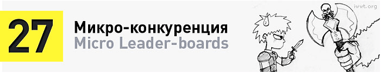
* <u>Определение:</u> Отдельные рейтинги для мини-игр. Хороши для игр с несколькими разнообразными игровыми механизмами, если вы хотите проводить много мини-соревнований. Также, такая диверсифицированная система наград помогает повысить лояльность игроков (больше возможностей получить награды).
* <u>Пример:</u> Будь лучшим игроком в баре Джо на этой неделе - и получи бесплатную закуску.

---

### 28: Модификаторы (Modifiers)
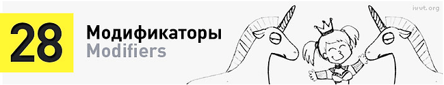
* <u>Определение:</u> Артефакт, который при использовании влияет на результат других действий. Как правило, модификаторы зарабатываются после выполнения серии заданий или ключевых действий.
* <u>Пример:</u> Модификатор X2, удваивающий очки во время следующего совершаемого действия.

---

### 29: Риск опасности потери мотивации в ходе игры (Moral Hazard of Game Play)
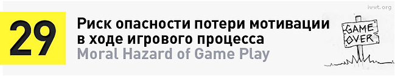
* <u>Определение:</u> Риск того, что принудительно раздавая награды игрокам, вы стираете «удовольствие от выполнения действия» и замещаете его «удовольствием от получения игровой награды». Предоставляя слишком много стимулов для совершения действия, можно уничтожить чувство удовольствия, получаемое игроком от принятия решений. Как следствие, если забрать все очки и награды, игрок потеряет мотивацию для совершения (изначально увлекательного самого по себе) действия.
* <u>Пример:</u> Перефразируя Jesse Schell, *«Если я буду давать вам бонусы каждый раз, когда вы чистите зубы, вы в итоге перестанете чистить зубы из-за того, что это полезно, и будете делать это только за бонусы. И если бонусов не станет, ваши зубы развалятся».*

---

### 30: Частная собственность (Ownership)
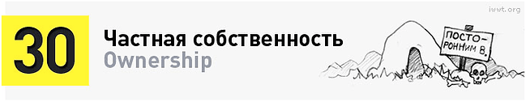
* <u>Определение:</u> Процесс контролирования чего-либо, и процесс превращения игрового объекта в личную собственность игрока.
* <u>Пример:</u> Обладание собственностью может быть выражено разными формами: начиная от захвата территории и контролирования ячеек до лидерства в рейтингах популярности (измеряемого количеством виртуальных друзей).

---

### 31: Гордость (Pride)
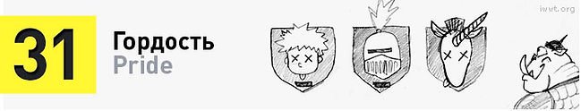
* <u>Определение:</u> Чувство обладания и радость за свое достижение.
* <u>Пример:</u> Я собрал 10 медалей. Они мои. Таких медалей много, но эти - мои. Ура! ("Именные достижения")

---

### 32: Личная жизнь (Privacy)
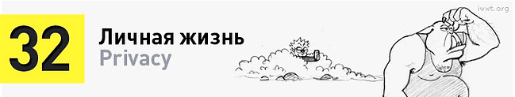
* <u>Определение:</u> Идея заключается в том, что у игрока всегда есть информация не для посторонних людей. Условие распространить данную информацию может стать как демотиватором (я не буду выполнять действие, потому что не хочу делиться этим), так и мотиватором (поделившись этим, я укрепляю свои позиции).
* <u>Пример:</u> Весы, ежедневно публикующие ваш вес в Twitter (это пример из жизни, он является проверенным мотиватором для соблюдения диеты). Или публичная трансляция вашего местонахождения каждый раз, когда вы что-то делаете (это вторжение в личную жизнь, и данного метода, в идеале, стоит избегать).

---

### 33: Прогресс пользователя (Progression Dynamic)
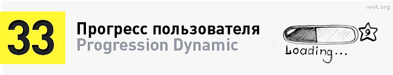
* <u>Определение:</u> Механизм, который отображает рост игрока в процессе выполнения игровых задач.
* <u>Пример:</u> Индикатор, отмечающий прогресс пользователя, от паладина 1-го уровня до 60-го.

---

### 34: Вознаграждение за действия (Ratio Reward Schedules)

* <u>Определение:</u> Награда предоставляется после выполнения серии действий. Есть две разновидности: переменная и постоянная.
* <u>Пример:</u> Убейте 10 орков - получите прибавку к силе.

---

### 35: Мгновенное или отложенное поощрение (Real-time vs. Delayed Mechanics)
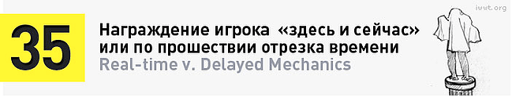
* <u>Определение:</u> В режиме «здесь и сейчас» информация о полученных бонусах выдается сразу. При использовании механизма с задержкой выдачи награды во времени игрок уведомляется о получении приза за действие через некоторое время после его совершения.
* <u>Пример:</u> Бонусы, выдающиеся в режиме реального времени, приводят к мгновенной реакции игрока (удовлетворение или демотивация). Уведомление о награде с задержкой по времени привносит двусмысленность, которая стимулирует больше действий из-за неуверенности игрока в достаточности предпринятых им усилий для получения желаемого бонуса/награды.

---

### 36: Усиление (Reinforcer)
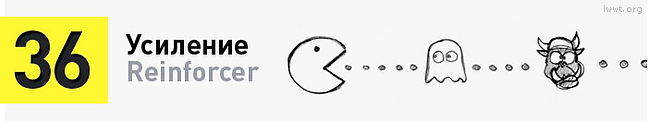
* <u>Определение:</u> Вознаграждение, выдаваемое в случае, если ожидаемое действие осуществляется в рамках сценария вознаграждений (состоящего из трех частей: «случайное событие», «реакция на событие» и «усиление»).
* <u>Пример:</u> Получение уровня после убийства 100 орков.

---

### 37: Реакция на событие (Response)
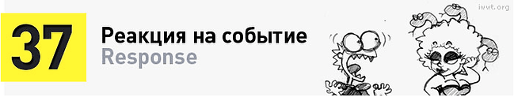
* <u>Определение:</u> Вознаграждение, выдаваемое за действие игрока в рамках сценария вознаграждений (состоящего из трех частей: «случайное событие», «реакция на событие» и «усиление»).
* <u>Пример:</u> Игрок выполняет действие для убийства 100 орков.

---

### 38: Сценарий вознаграждений (Reward Schedules)
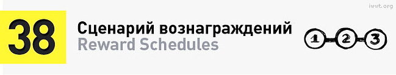
* <u>Определение:</u> Сроки и механизмы, посредством которых вознаграждения (очки, призы, повышение уровня) доставляются игроку. Сценарий вознаграждений состоит из трех основных частей: «случайное событие», «реакция на событие» и «усиление».
* <u>Пример:</u> Получение уровня за убийство 100 орков, очистка строки в Тетрисе, получение новых ростков в Farmville. Каким образом ты получишь новый эпический шмот или целый сэт?

---

### 39: Распределение реальных призов (Rolling Physical Goods)
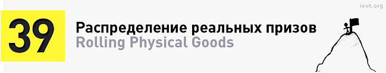
* <u>Определение:</u> Реальный приз (обладающий реальной стоимостью), который может быть выигран любым игроком, если тот соответствует определенным требованиям.
* <u>Пример:</u> Быть первым в чем-то. Так создают ценность игрового мерча ("товары для геймеров", футболки с логотипом игры или персонажа, etc.).

---

### 40: Игра-иллюзия (Shell Game)
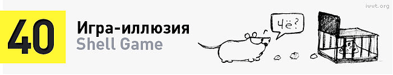
* <u>Определение:</u> Игра, в которой игроку представляется иллюзия выбора, хотя на самом деле он находится в ситуации, когда любое его решение приведет к одному и тому же финалу (запланированному разработчиком).
* <u>Пример:</u> Наперстки, лотереи, азартные игры; нелинейный квест с несколькими разветвлениями, но одним и тем же концом.

---

### 41: Социальная составляющая игр (Social Fabric of Games)
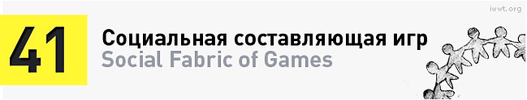
* <u>Определение:</u> Идея в том, что люди нравятся друг другу сильнее после совместной игры, они начинают больше доверять друг другу и сплачиваются.
* <u>Пример:</u> Jane McGonicgal на конференции TED заявила, что совместная игра требует высокой степени доверия между людьми, т.к. игроки проводят много времени вместе, играют по одним правилам, преследует общие цели.

---

### 42: Статус (Status)
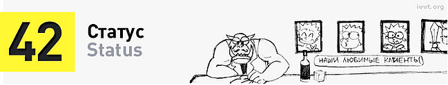
* <u>Определение:</u> Ранг или уровень игрока. Игроков можно успешно мотивировать более высокими уровнями или статусами.
* <u>Пример:</u> Белый паладин 20-го уровня в WоW (то есть, не просто паладин 20-го уровня, а <u>белый</u> паладин 20-го уровня).

---

### 43: Неудержимый оптимизм (Urgent Optimism)
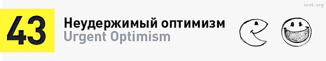
* <u>Определение:</u> Крайняя степень самомотивации. Желание действовать безотлагательно для устранения препятствия в сочетании с верой в свой успех.
* <u>Пример:</u> Идея в том, что в правильных играх «эпическая победа» или просто «победа» достижимы, а значит, они стоят того, чтобы за них побороться.

---

### 44: Вознаграждения без чётко обозначенного срока (Variable Interval Reward Schedules)
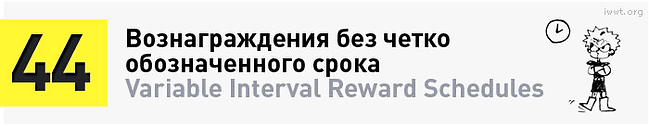
* <u>Определение:</u> Вознаграждения, которые выдаются не в четко обозначенный час, а в пределах определенного срока. Данный механизм позволяет создать довольно высокий уровень пользовательской активности, при этом всплеск активности происходит не взрывообразно, а размеренно и протяжно, так как игрок может получить награду в любой момент, но не знает, когда именно. Этот механизм защищен от резкого спада активности игроков, но и не может дать максимальных показателей, из-за отсутствия четкого срока выдачи наград.
* <u>Пример:</u> В течении дня появится новое оружие или монстр. Возвращайтесь так часто, как пожелаете, но это не ускорит процесс. Как правило, игроки не врубаются в эту идею.

---

### 45: Вознаграждения за неявную цепочку действий (Variable Ratio Reward Schedules)
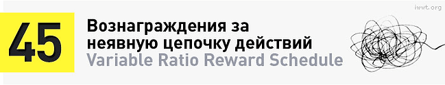
* <u>Определение:</u> Вознаграждения, которые выдаются в награду за выполнение неявной цепочки действий. Данный механизм повышает количество выполняемых игроком последовательных действий (так как после каждого нового действия всегда может следовать награда), но никогда не порождает взрывной активности последовательно выполняемых цепочек, как в случае с механизмом «вознаграждения за выполнение определенной цепочки действий», ввиду неочевидности действия для получения награды. Из очевидных плюсов использования - активность пользователя после выполнения ряда «стандартных» действий и получения приза за них снижается не так стремительно (игрок надеется заработать что-то большее).
* <u>Пример:</u> Потопите примерно 20 кораблей - и получите уровень. Посетите несколько локаций (около 5-ти) и получите медаль.

---

### 46: Вирусная механика (Viral Mechanics)
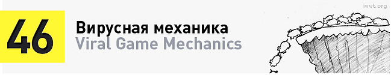
* <u>Определение:</u> Части игры, сыграть в которые можно лишь пригласив большое количество людей (или в которые играть лучше и веселее вместе с другими людьми).
* <u>Пример:</u> Farmville. Вы станете успешнее, если привлечете в игру новых людей.

---

### 47: Виртуальные товары (Virtual Items)
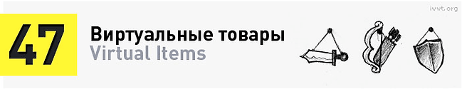
* <u>Определение:</u> Цифровые подарки, награды, объекты, найденные или взятые в процессе прохождения игры. Часто эти товары могут продаваться или дариться.
* <u>Пример:</u> Платные стикеры, подарки в Facebook, медальки, ездовые животные в World of Warcraft, etc.#

---

## Что почитать:

* "Не рычите на собаку! Книга о дрессировке людей, животных и самого себя!" Карен Прайор