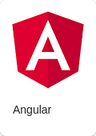

# Angular

Теги: #программирование #фреймворк #фронтенд #angular

Angular — открытая и свободная платформа для разработки веб-приложений, написанная на языке TypeScript, разрабатываемая командой из компании Google, а также сообществом разработчиков из различных компаний. Angular — полностью переписанный фреймворк от той же команды, которая написала AngularJS. [Википедия](https://ru.wikipedia.org/wiki/Angular_(%D1%84%D1%80%D0%B5%D0%B9%D0%BC%D0%B2%D0%BE%D1%80%D0%BA))

## Ссылки

* [Angular Основы. Полный Курс для начинающих](https://youtu.be/Rf54BH35yrY)

## Ссылки на эту страницу

* [00 Программирование](00%20%D0%9F%D1%80%D0%BE%D0%B3%D1%80%D0%B0%D0%BC%D0%BC%D0%B8%D1%80%D0%BE%D0%B2%D0%B0%D0%BD%D0%B8%D0%B5.md)
* [Фронтенд-фреймворки](%D0%A4%D1%80%D0%BE%D0%BD%D1%82%D0%B5%D0%BD%D0%B4-%D1%84%D1%80%D0%B5%D0%B9%D0%BC%D0%B2%D0%BE%D1%80%D0%BA%D0%B8.md)
* [TypeScript](TypeScript.md)
