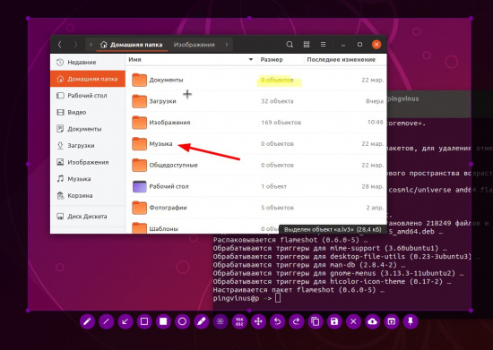
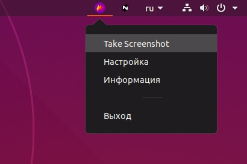
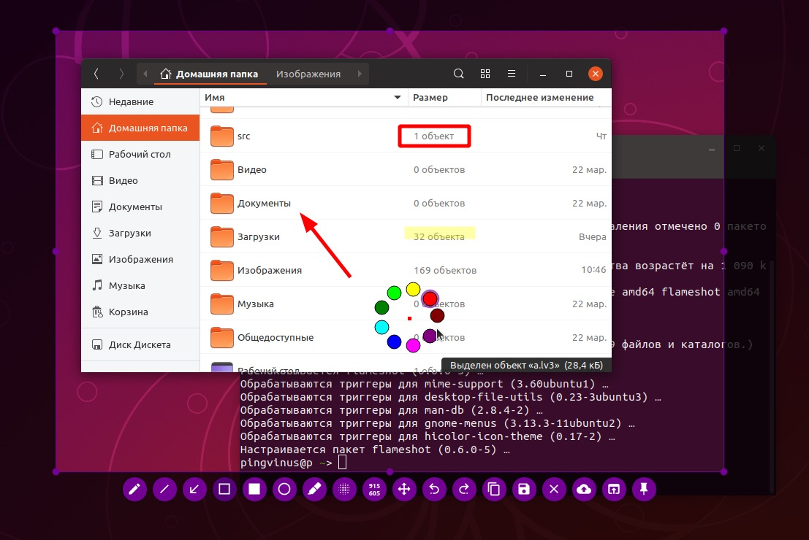

# Flameshot. Создание скриншотов



**Flameshot** — программа для создания скриншотов и добавления к ним различных графических примитивов (стрелки, линии, подчеркивание, выделение цветом и так далее).

## Как работать с Flameshot

При запуске программа помещает свой значок в область уведомлений. Чтобы сделать скриншот нужно кликнуть по значку и выбрать пункт меню Take Screenshot.



Появится всплывающая подсказка. Чтобы сделать скриншот произвольной прямоугольной области, выделите область, используя мышь. Чтобы сделать скриншот всего рабочего стола, нажмите клавишу Enter.


Когда скриншот будет создан, откроется окно редактирования. Нажмите Правую кнопку мыши, чтобы открыть цветовую палитру. Колесиком мыши можно изменять толщину линий.



## Возможности

Возможности программы Flameshot:

-   Создание скриншота рабочего стола.
-   Создание скриншота выбранной области.
-   Создание скриншота активного окна программы.
-   Редактирование скриншота:
    -   Добавление графических примитивов: стрелок, прямоугольников, окружностей, линий.
    -   Выделение маркером (полупрозрачное выделение).
    -   Размытие выделенной области.
-   Возможность прикрепить скриншот на рабочий стол (в плавающем окне).
-   Копирование снимков в буфер обмена.
-   Открытие снимка во внешней программе.
-   Загрузка снимка на сервис Imgur.
-   Изменение цвета интерфейса программы.
-   Задание шаблона для имен файлов. Доступны предустановленные элементы для шаблона имени файла: год, день недели, месяц, время, час, минута, секунда, название месяца и другие.
-   Всплывающие уведомления на рабочем столе.
-   Поддержка командной строки.

## Установка

### Установка в Ubuntu (LinuxMint)

```
sudo apt install flameshot
```

### Установка в ArchLinux (Manjaro)

```
sudo pacman -S flameshot
```

### Установка в Fedora

```
sudo dnf install flameshot
```

## Разработка

Лицензия логотипа программы: Free Art License v1.3   
Лицензия пиктограмм кнопок программы: Apache License 2.0 Open Source.

|                         |                      |
| ----------------------- | -------------------- |
| Исходный код:           | Open Source (открыт) |
| Языки программирования: | C++                  |
| Библиотеки:             | Qt                   |
| Лицензия:               | GNU GPL v3           |
