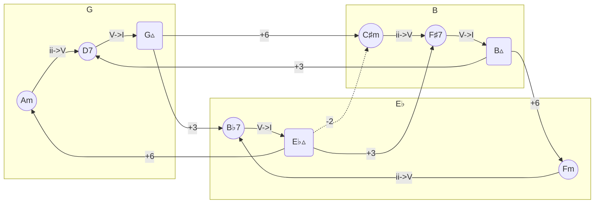

```mermaid
  flowchart LR
  

  
  subgraph ide2 ["G"]
  g2-->|ii->V|g5-->|V->I|g1
  end
  
  subgraph ide3 ["E♭"]
  eb2-->|ii->V|eb5-->|V->I|eb1
  end
  
  subgraph ide1 ["B"]
  b2-->|ii->V|b5-->|V->I|b1
  end

  b1("B▵")
  b2(("C♯m"))
  b5(("F♯7"))
  
  g1("G▵")
  g2(("Am"))
  g5(("D7"))
  
  eb1("E♭▵")
  eb2(("Fm"))
  eb5(("B♭7"))
  
  b1-->|+3|g5
  b1-->|+6|eb2
  
  g1-->|+3|eb5
  g1-->|+6|b2
  
  eb1-->|+3|b5
  eb1-->|+6|g2
  eb1-.->|-2|b2

```
