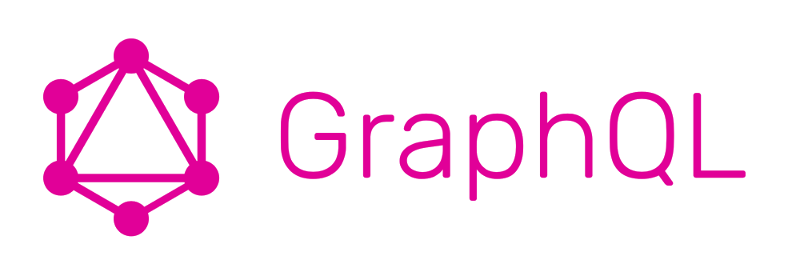

# GraphQl

**GraphQL** — это язык запросов данных и манипулирования ими с открытым исходным кодом для API, а также среда выполнения для выполнения запросов с существующими данными. [Википедия (Английский язык)](https://en.wikipedia.org/wiki/GraphQL)

## Ссылки

* [Что же такое этот GraphQL?](https://habr.com/ru/post/326986/)
