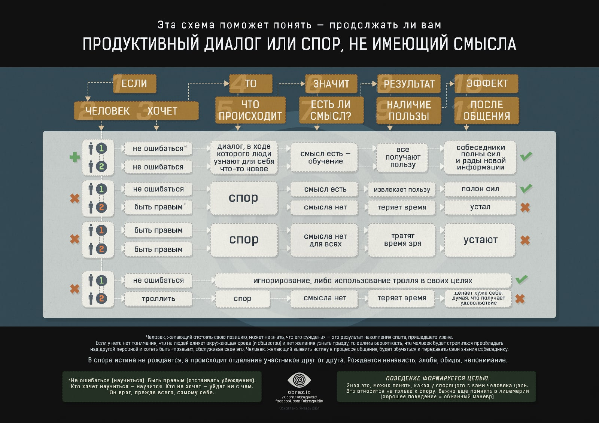
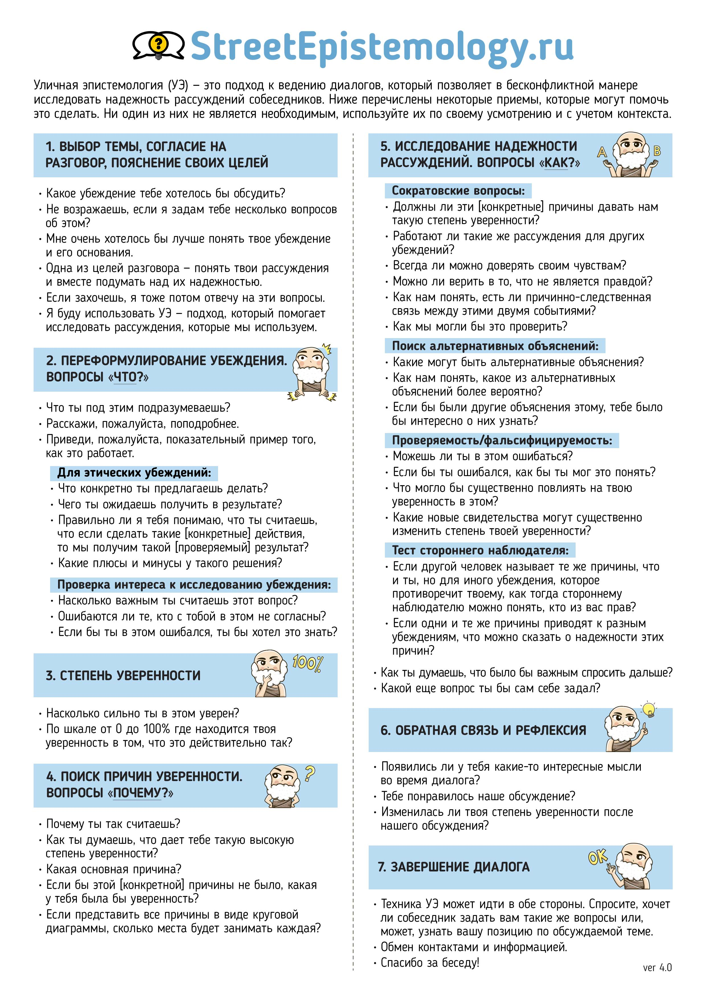
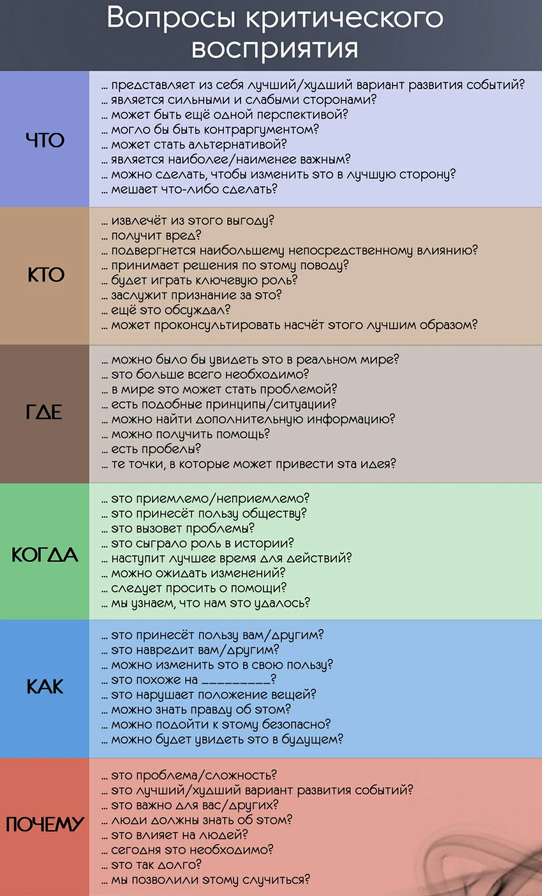

# Ведение беседы

- "Продуктивность"?
- Коммуникация, общение - [Жак Фреско](Жак%20Фреско.md) - Проект Венера ([YouTube](https://youtu.be/wQmz-zT09IU))

## Цель беседы?

- Выяснение позиции собеседника
  - УЭ
  - ОС
- Передача информации
  - УЭ
  - Лекция?
- Обмен информацией (взаимообогащение)
  - ОС
  - НП

## Продолжать ли диалог?

  
  

[Пирамида Грэма. Практика ведения споров](%D0%9F%D0%B8%D1%80%D0%B0%D0%BC%D0%B8%D0%B4%D0%B0%20%D0%93%D1%80%D1%8D%D0%BC%D0%B0.%20%D0%9F%D1%80%D0%B0%D0%BA%D1%82%D0%B8%D0%BA%D0%B0%20%D0%B2%D0%B5%D0%B4%D0%B5%D0%BD%D0%B8%D1%8F%20%D1%81%D0%BF%D0%BE%D1%80%D0%BE%D0%B2.md)
  
### Уличная Эпистемология (далее УЭ)

- [Статьи УЭ](https://streetepistemology.ru/articles_new)
- Памятка УЭ
  
- Цель УЭ - выяснить позицию и основания собеседника
- Методы УЭ
  - "Я не понимаю твоей реакции"
  - "Может что-то еще я должен знать о том, что я не понял?"

## Поиск значения значения (ОС)

Говоря о повседневных словах - таких, которыми мы пользуемся в общении с друзьями, семьёй и сотрудниками - нам недостаточно спрашивать о только что употреблённом слове: **«Что &#39;это&#39; значит?»**

Более эффективно мы можем подойти к пониманию друг друга, если мы спросим говорящего (или пишущего; разница здесь только в системах волн): **«Что &#39;вы&#39; имеете в виду?»**

(Среди толковых примеров можно привести работу художника, о которой почти бесполезно спрашивать: *«Что эта работа значит?»*. Куда продуктивнее будет спросить: *«Что вы имели ввиду этой работой?»*)

Когда люди вас не понимают стоит задать себе вопросы. Подумайте некоторое время, &#39;перед тем&#39; как сделать глубокомысленное высказывание, а затем заполните пробелы, ответив на вопросы о предмете, месте и времени.

## «Что? Где? Когда?»

## Ссылки

- [13 Симпотмов неадекватного языкового поведения](13%20%D0%A1%D0%B8%D0%BC%D0%BF%D0%BE%D1%82%D0%BC%D0%BE%D0%B2%20%D0%BD%D0%B5%D0%B0%D0%B4%D0%B5%D0%BA%D0%B2%D0%B0%D1%82%D0%BD%D0%BE%D0%B3%D0%BE%20%D1%8F%D0%B7%D1%8B%D0%BA%D0%BE%D0%B2%D0%BE%D0%B3%D0%BE%20%D0%BF%D0%BE%D0%B2%D0%B5%D0%B4%D0%B5%D0%BD%D0%B8%D1%8F.md)
- 9 Советов Публичных Выступлений, Чтобы Зацепить Любого Слушателя ([YouTube](https://youtu.be/yWS5B-z-hJQ))
- Книга: **Как разговаривать с мудаками (Марк Гоулстон)**
