# Государство будущего: Суперкомпьютеры, старики и другие сценарии. Ноократия, демархия и униократия

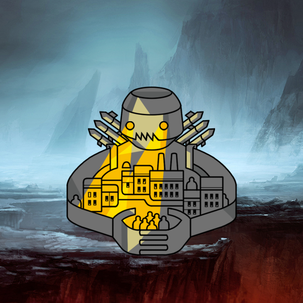

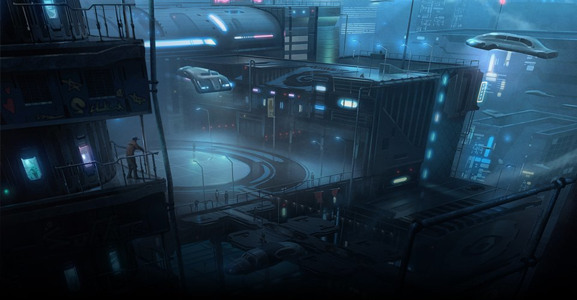

## Одна страна на всю планету

Глобальная демократия

Не совсем новая форма государства, а скорее, уже известная, но раздутая до небывалых масштабов. В основе глобальной демократии будет лежать единое мировое государство, работающее по либеральным и демократическим принципам. Многим учёным кажется, что появление такого государства вполне [возможно](http://www.danielearchibugi.org/downloads/papers/CD_and_critics_A_review.pdf) — в конце концов, уже сейчас существует огромное количество общемировых [инициатив](http://www.globaldemo.org/) и [организаций](http://ru.wikipedia.org/wiki/%D0%9E%D1%80%D0%B3%D0%B0%D0%BD%D0%B8%D0%B7%D0%B0%D1%86%D0%B8%D1%8F_%D0%9E%D0%B1%D1%8A%D0%B5%D0%B4%D0%B8%D0%BD%D1%91%D0%BD%D0%BD%D1%8B%D1%85_%D0%9D%D0%B0%D1%86%D0%B8%D0%B9), которые действуют и стоят выше отдельных правительств. Экономическая и культурная глобализация идёт полным ходом, так что дело осталось за глобализацией политической; мировой парламент уже не кажется такой безумной идеей. История показывает, что человечество и отдельные цивилизации в принципе стремятся к исчезновению границ: можно вспомнить объединение Китая во времена династии Цинь, появление Соединённых штатов Америки или Евросоюза. А для объединения человечества в одно государство достаточно одной большой, общей проблемы — ею может стать глобальное потепление.

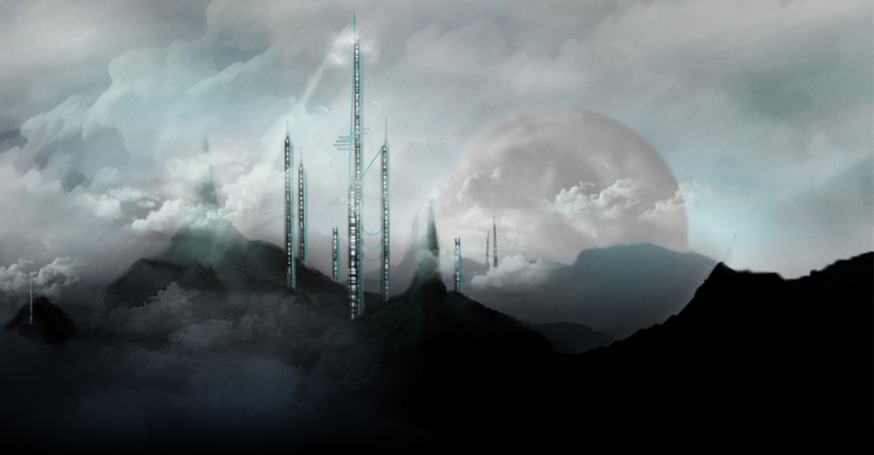

## Вся власть у стариков

Геронтократия

Принцип управления, при котором вся власть _(официально или фактически)_ находится в руках у стариков. В то время, как само слово «геронтократия» появилось ещё [в начале XX века](http://popular.academic.ru/890/%D0%B3%D0%B5%D1%80%D0%BE%D0%BD%D1%82%D0%BE%D0%BA%D1%80%D0%B0%D1%82%D0%B8%D1%8F) и использовалось по отношению к самым разным обществам, от аборигенов Австралии до верхушки СССР, в будущем всё может принять гораздо более жуткий и конкретный вид. Мы постепенно приближаемся к тому, что продолжительность жизни человека [сильно увеличивается](http://news.bbc.co.uk/2/hi/uk_news/4003063.stm) — не исключено, что в таком случае у пожилых людей будет гораздо больше власти и денег, чем у молодых; просто потому, что они успеют их накопить. Такой строй общества был описан во многих научно-фантастических романах: например, в «Священном огне» Брюса Стерлинга, где молодые люди являются изгоями, или в «Видоизменённом углероде» Ричарда Моргана, где описано будущее, в котором люди могут перемещать сознание между клонированными телами и фактически становятся бессмертными. В книге Моргана самыми богатыми и влиятельными становятся люди, которым удаётся прожить сотни лет.

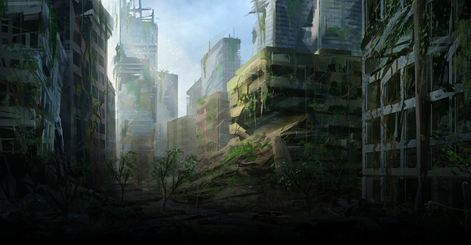

## Демократия по принципу лотереи

Демархия

Форма демократии, когда депутаты (то есть люди, принимающие политические решения от имени всего населения государства) выбираются случайно, например, с помощью лотереи. Жребий может выпасть кому угодно — примерно как с судом присяжных в США, и любой человек будет обязан отработать какое-то время политиком. Смысл демархии в том, что простые люди будут служить общим интересам, а не своим, как профессиональные политики, что должно снизить риск коррупции и политического давления.

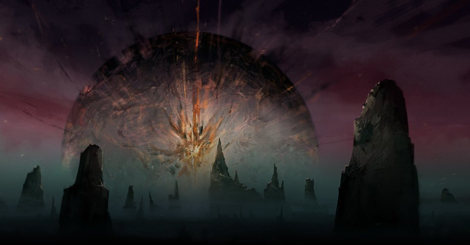

## Коллективное сознание

Униократия

Вид государственного правления, для осуществления которого требуется невероятный прогресс: при униократии всей нашей планетой будет править единый роевый интеллект, коллективный человеческий разум, соединяющий в себе сознание всех людей с помощью телепатии или технологий. Такой разум будет принимать справедливые и правильные решения, основываясь на коллективном опыте, и легко решать все проблемы, которые будут возникать на пути общества. Немного похоже на идеальное демократическое голосование, но разница, конечно, огромная: униократия подразумевает ещё колоссальные культурные и социологические перемены; всё-таки с возможностью объединить всё человечество в одно сверхсознание вряд ли мы останемся такими же, как были.

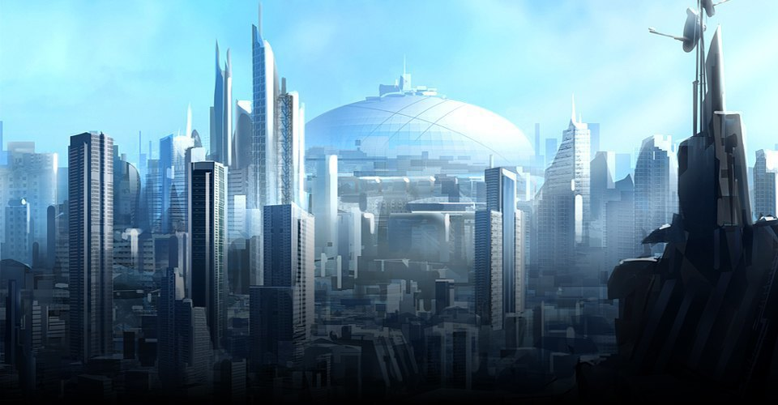

## Государство-корпорация

Корпоративная республика

Любимый сценарий авторов киберпанковых романов: государство, устроенное, как корпорация, а ещё лучше — появившееся на основе какой-нибудь реальной корпорации. Главное свойство корпоративной республики — то, что она (имея некоторые свойства [республики)](http://ru.wikipedia.org/wiki/%D0%A0%D0%B5%D1%81%D0%BF%D1%83%D0%B1%D0%BB%D0%B8%D0%BA%D0%B0) управляется, как настоящая компания, с советом директоров и топ-менеджерами. Больницы, школы, оборона в таком государстве находятся в частном секторе. Хотя появление настоящих корпоративных республик сложно представить, некоторые учёные считают, что нечто похожее можно найти в человеческой истории: например, средневековую Флоренцию или социалистические страны, где правительство целиком контролирует экономическую и политическую жизнь.

## Миром правит суперкомпьютер

Автократия искусственного интеллекта

Если человечеству удастся создать достаточно мощный искусственный интеллект, например, внутри компьютера, не исключено, что этот компьютер установит мировой порядок, которым сам и будет управлять. Это возможно сделать открыто или не слишком: используя армии роботов, управление разумом людей или попросту угрозы разрушения всего человечества. С одной стороны, власть искусственного интеллекта — один из самых популярных сценариев [уничтожения человечества](http://www.nickbostrom.com/existential/risks.html), с другой — сверхкомпьютер может оказаться «добрым», решить мировые проблемы, которые люди не могли бы решить сами по себе, скоординировать нас и отправить человечество по какому-нибудь радикально новому пути развития, до которого мы бы сами не дошли.

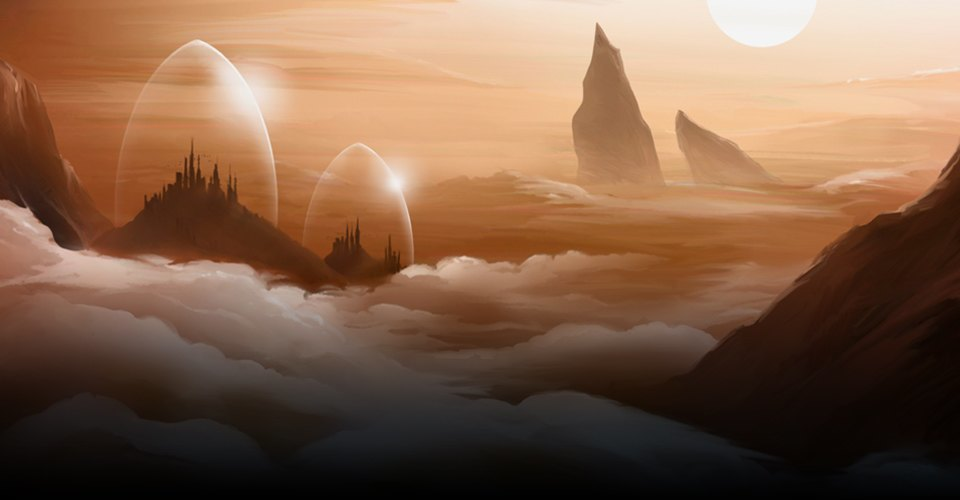

## Государство на выбор

Полигосударство

Идея, придуманная Заком Уинерсмитом _(кто-то может знать его как автора комиксов [Saturday Morning Breakfast Cereal](http://www.smbc-comics.com/))_ и описанная им в книге Polystate: A Thought Experiment in Distributed Government. Полигосударство — это геополитический субъект, в рамках которого может существовать сразу несколько государственных строев, не привязанных к географическим границам. Каждый отдельный человек может выбирать, к какому из этих государств принадлежать. Звучит как что-то очень хаотичное, но Уинерсмит красиво описывает, как такая система теоретически может работать; примерно, как если бы вы выбирали себе мобильного оператора. Да, вам придётся, скажем, пользоваться общими дорогами с остальными людьми или даже попросту дышать тем же воздухом, что и все, но зато, например, человек сможет не платить налоги за хранение ядерного оружия, борьбу с наркотиками или что-то ещё, что вам не по душе, а жить по законам того мета-государства, которое вас устраивает.

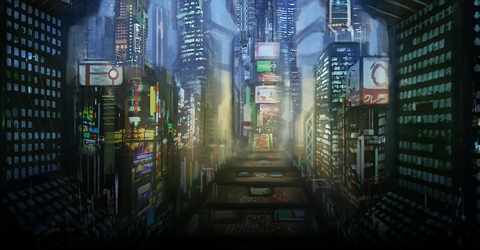

## Власть у самых умных

Ноократия

Ноократия — вид политического устройства, основанного на «приоритете человеческого разума», была предложена ещё в начале XX века учёным Владимиром Вернадским _(тем самым, который придумал понятие [ноосфера](http://ru.wikipedia.org/wiki/%D0%9D%D0%BE%D0%BE%D1%81%D1%84%D0%B5%D1%80%D0%B0))_. Ноократия — это следующий шаг вслед за демократией, более совершенная форма государственного правления, когда власть находится у интеллектуальной элиты, с помощью технологий и науки толкающей человечество к прогрессу. Соответственно, все решения в таком государстве будут приниматься максимально взвешенно и прагматично; то, к чему стремится любое государство, — если, конечно, отбросить деньги, конкуренцию, психологию и так далее. Что-то подобное описывал ещё Платон, считавший, что идеальная форма правления — это «аристократия мудрых».

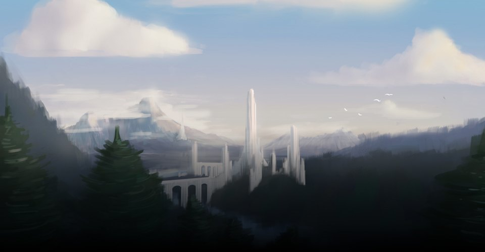

## Автономные города

Города-государства

Есть мнение, что мир стремится не к глобализации, а, наоборот, к децентрализации и распаду: в ближайшем будущем, во многом благодаря технологическому прогрессу, существующие государства распадутся на маленькие и независимые _(хотя бы частично)_ города-государства — примерно как в Древней Греции. Смысл у этого исключительно прагматический: всё завязано на энергии. Эксперт по энергетике Джо Бродуер, например, [считает](http://www.danielbbotkin.com/2013/07/20/the-shifting-geography-technology-and-politics-of-u-s-energy-production/), что технологии развиваются так, что отдельным городам в скором времени будет выгоднее перейти на самообеспечение и не получать электричество от больших станций, находящихся на большом расстоянии от них; вслед за такой автономностью с большой вероятностью придёт политическая автономность. Похожую картину нарисовали недавно в журнале [Forbes](http://www.forbes.com/sites/joelkotkin/2013/09/04/a-map-of-americas-future-where-growth-will-be-over-the-next-decade/), где опубликовали статью, описывающую США будущего, где страна разбита на отдельные и независимые города-государства.

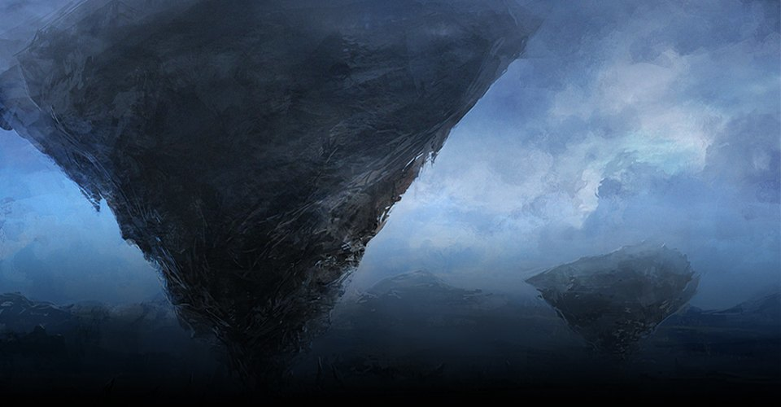

## Власть информации

Киберократия

Форма государственного правления, основанного на эффективном использовании информации. Фундаментальная характеристика киберократии — моментальная передача важной информации от источника проблемы к людям, которые проблему способны решить. Это будет осуществляться с помощью компьютерных программ, способных распознавать и сортировать информацию; скажем, где-то происходит пожар — об этом моментально узнают пожарные, ну и так далее. Люди при киберократии принимают минимальное участие в управлении и отвечают только за самые важные решения и справляются с самыми необычными проблемами. В общем, киберократия — это традиционная бюрократия наоборот; то есть максимально быстрая, удобная и логичная система взаимодействия человека и государства, со сведенным к минимуму человеческим фактором.

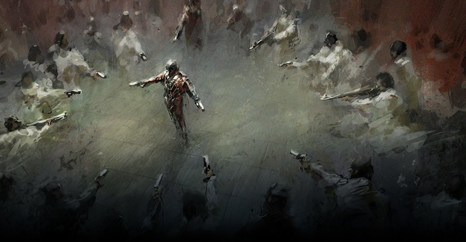

## Первобытные племена

Постапокалиптическая анархия

Нельзя исключать и такой вариант: никаких видов государственного строя в будущем не будет вовсе — потому что в результате какой-нибудь глобальной катастрофы _(эпидемии, падения астероида, атаки зомби или восстания роботов)_ государства в принципе исчезнут, а оставшееся в живых человечество вернётся к первобытному укладу жизни, то есть к анархии. Люди соберутся в маленькие группы — племена и будут бороться за выживание.

## Ссылки

* [Источник](http://www.lookatme.ru/mag/live/future-research/205641-future-states)
