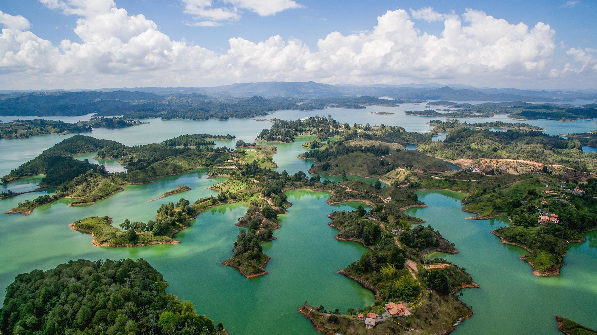

# Гуатапе

Гуатапе — город и муниципалитет на севере Колумбии, на территории департамента Антьокия. Входит в состав субрегиона Восточная Антьокия. [Википедия](https://ru.wikipedia.org/wiki/%D0%93%D1%83%D0%B0%D1%82%D0%B0%D0%BF%D0%B5)

## Ссылки

* [google](https://www.google.com/search?q=guatape&oq=guatape&aqs=chrome..69i57j46j0l3j69i60l2j69i61.21195j1j7&sourceid=chrome&ie=UTF-8)