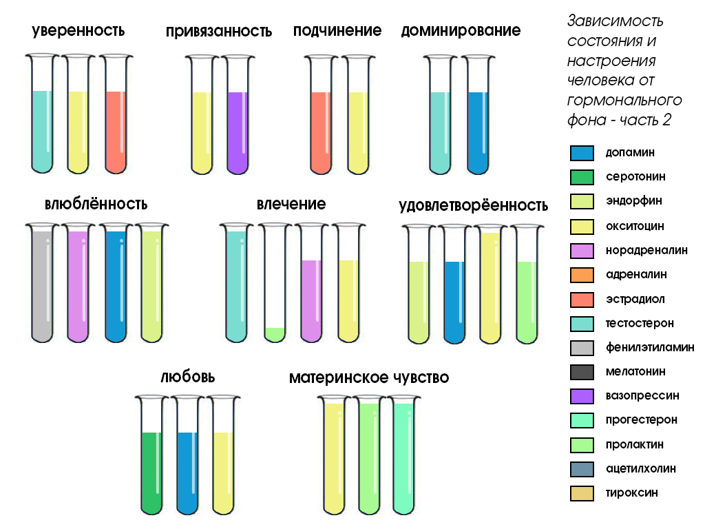

# Депрессия

## Ссылки

* [Эпидемия Одиночества (Мэтт Давелла на русском)](https://youtu.be/N87l147P5jM)
* [Роберт Сапольски — Депрессия (Vert Dider)](https://youtu.be/_UtA0dwGoUQ)
* [Роберт Сапольски «Биология поведения человека» (плейлист)](https://www.youtube.com/watch?v=ik9t96SMtB0&list=PL8YZyma552VcePhq86dEkohvoTpWPuauk)
* Роберт Сапольски «Почему у зебр не бывает инфаркта. Психология стресса» ([PDF](https://drive.google.com/file/d/1PjdS_pFRKsHqUxZdgGAO5GfKTsZUaWHe/view?usp=sharing))
* [Психология стресса. Роберт Сапольски. Краткое содержание книги](https://smart-lab.ru/blog/664740.php)
* [Депрессия, бихевиоризм - Жак Фреско - Проект Венера](https://youtu.be/2Tw51FqEH4A)
* [Депрессия и самооценка - Жак Фреско](https://youtu.be/TJ5PbekD9cs)
* [Контекстуальный взгляд на депрессию](https://vk.com/@apsychology-contextual-depression)
* [Депрессия. Постнаука](https://postnauka.ru/themes/depressiya)
* [Выученная беспомощность: зона комфорта — страдание](https://vk.com/wall5476436_8107)
* [Справочник по избавлению от депрессии и апатии]([https://4brain.ru/blog/%D0%BA%D0%B0%D0%BA-%D0%B8%D0%B7%D0%B1%D0%B0%D0%B2%D0%B8%D1%82%D1%8C%D1%81%D1%8F-%D0%BE%D1%82-%D0%B4%D0%B5%D0%BF%D1%80%D0%B5%D1%81%D1%81%D0%B8%D0%B8/Справочник по избавлению от депрессии и апатии](https://4brain.ru/blog/%D0%BA%D0%B0%D0%BA-%D0%B8%D0%B7%D0%B1%D0%B0%D0%B2%D0%B8%D1%82%D1%8C%D1%81%D1%8F-%D0%BE%D1%82-%D0%B4%D0%B5%D0%BF%D1%80%D0%B5%D1%81%D1%81%D0%B8%D0%B8/))
* [Шкала депрессии А. Бека: инструкция к применению](https://4brain.ru/blog/shkala-depressii-a-beka-instrukcija-k-primeneniju/)
* [Научные основы безумия](https://vk.com/wall5476436_9374)
* [Депрессия](https://www.psychologos.ru/articles/view/depressiya)

