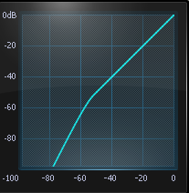
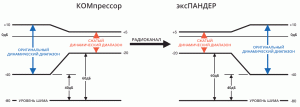

# Динамическая обработка звука. Экспандер (Expander)

Периодически бывает нужно восстановить запись, которая пережата (перекомпрессирована) или в ней вообще отсутствуют все пики из-за сильного вмешательства лимитера. Вот здесь нам на помощь и придет расширитель динамического диапазона — Экспандер (Expander).

**Экспандер** переводится с английского как расширитель. И действительно это устройство расширяет динамический диапазон аудиофайла.

## Типы экспандеров

1. **Понижающий экспандер**. К этому типу относятся рассмотренные нами ранее [Noise Gate и DeNoiser.](https://nssound.ru/svedenie-i-mastering/dinamicheskaja-obrabotka-zvuka-noise-gate-i-noise-reduction/) Они ослабляют область шумов (низ) и тем самым увеличивают отношение сигнал/шум во всем аудиофайле. 
2. **Повышающий экспандер.** Если понижающий экспандер ослабляет уровень сигнала, который ниже порога срабатывания (Treshold), то повышающий наоборот увеличивает этот уровень, превышающий порог. По сути этот тот же [компрессор](https://nssound.ru/svedenie-i-mastering/sposoby-obrabotki-zvuka-kompressory/) и с такими же параметрами, только коэффициент сжатия в нем меньше единицы. Например, 0,5 : 1 иногда обозначается как -5 : 1 или 1 : 5 (в разных плагинах по-разному). 
3. **Компандер** — сочетает в себе компрессор и экспандер. Это прибор можно встретить в системе DOLBY NOISE REDUCTION SYSTEM, в радиомикрофонах. Компрессор сжимает динамический диапазон входного сигнала за счет непропорционального подъёма его низких уровней. В процессе воспроизведения происходит всё наоборот. Экспандер восстанавливает сигнал, но пониженный коэффициент передачи ослабляет шумы, что увеличивает отношение сигнал/шум. 

## Основные параметры

- **Treshold** (порог срабатывания) - порог ниже которого (понижающий) или выше которого (повышающий) экспандер начинает работать.
- **Attack** (время срабатывания) - время, за которое экспандер начинает работать. Зависит от порога срабатывания и типа экспандера.
- **Release** (время восстановления) - время, за которое экспандер перестанет работать. Также зависит от порога срабатывания и типа экспандера.
- **Ratio** (степень расширения) - коэффициент по которому происходит изменение уровня сигнала.
- **Gain** (Makeup) - уровень в dB после расширения динамического диапазона.

## Особенности применения

**_Понижающий экспандер_** работает как прибор шумопонижения или даже шумоподавления. Он применяется когда нужно увеличить соотношение сигнал/шум и ослабить область низких уровней. Подробнее см. [Noise Gate и DeNoiser.](https://nssound.ru/svedenie-i-mastering/dinamicheskaja-obrabotka-zvuka-noise-gate-i-noise-reduction/)

**_Повышающий экспандер_** нужен для того, чтобы восстановить запись, которая пережата (перекомпрессирована) или в ней вообще отсутствуют все пики из-за сильного вмешательства лимитера. Кроме этого он может применяться для работы с транзиентами, что может повлиять на увеличение глубины звука.

_Компандеры_ вы вряд ли встретите в плагинах, поэтому их обсуждать не будем.

## Некоторые нюансы

Что касается повышающего экспандера, то, во-первых, если сигнал очень сильно пережат, то восстановить его практически не реально. Во-вторых, как вы видели у прибора есть параметры времени срабатывания и восстановления (Attack, Release). Представьте, что вы хотите обработать экспандером всю фонограмму. Чтобы звучали ударные нужно установить быстрое открывание экспандера, но с другой стороны инструменты с медленной атакой начнут «щелкать», так как им нужно наоборот большее время срабатывания. Поэтому этот тип применяется довольно редко, особенно на суммарном звуковом сигнале.

## Ссылки

- [Источник](https://nssound.ru/svedenie-i-mastering/dinamicheskaja-obrabotka-zvuka-jekspan/)
- [Программы - Редакторы аудио](Программы%20-%20Редакторы%20аудио.md)
