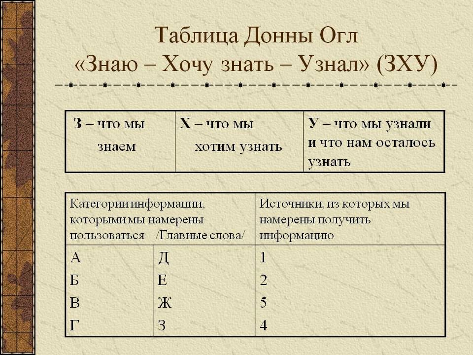

# "Знаю. Хочу знать. Умею" — методический прием в работе с информацией на уроке

Среди большого разнообразия методических приемов, образовательных технологий, стратегий обучения хотелось особое место занимают те из них, которые направлены на развитие критического мышления. В этой статье пойдет речь об одном таких из приемов — ЗХУ: Знаю. Хочу знать. Умею. Что это такое?

## Что такое ЗХУ?

«Знаю. Хочу знать. Умею», сокращенно ЗХУ — интерактивный методический прием, направленный на развитие обратной связи в познавательном процессе. Впервые о нем заговорили в 1986 году, после презентации Донны Огл, профессора из Чикаго. Позднее этот прием стал активно применяться в педагогической практике.

Для проведения целенаправленной работы с информацией отлично образом помогают в обучении графические схемы, таблицы (ранее мы уже рассматривали методы [Кластер](https://pedsovet.su/metodika/priemy/5673_metod_klaster_na_uroke), [Фишбоун](https://pedsovet.su/metodika/priemy/5714)). В основе ЗХУ также лежит таблица.

Это очень удобный способ структурирования и систематизации изучаемого материала. При применении таблицы ЗХУ в учебном процессе происходит двустороння активность: как со стороны учителя, так и со стороны учащихся. В ходе заполнения таблицы ученики учатся соотносить между собой уже знакомое и новое, определять свои познавательные запросы, опираясь при этом на уже известную информацию.

Эффективным будет использование приема «Знаю. Хочу знать. Узнал» на занятии, за которым последует в дальнейшем исследовательская деятельность учащихся. Работа же с таблицей является своеобразной установкой на последующую самостоятельную деятельность.

## Заполнение таблицы ЗХУ

В ученических тетрадях и на доске чертится таблица, заполнение которой будет происходить в ходе всего урока.

В начале урока, на основе ответов учащихся по пройденному материалу заполняется графа «Знаю».

Сразу же, после заполнения столбца "Знаю", формулируются новые вопросы, ответы на которые ребята хотели бы получить после изучения темы. Их записывают во второй графе. Здесь важна помощь учителя, он должен замотивировать учащихся к рассуждению: Что вы хотели бы узнать еще? Чему сегодня на уроке можно научиться?

В конце урока, на [этапе рефлексии](https://pedsovet.su/metodika/refleksiya/5665_refleksiya_kak_etap_uroka_fgos), учащиеся делают выводы и записывают в третьей графе то, что узнали.

В зависимости от возрастной категории учеников, таблицу можно модифицировать и использовать в работе вариант, более понятный и интересный детям. Так, например, в начальных классах проще будет применить следующую формулировку: «Уже знал (или догадывался). Узнал. Осталось непонятным». Главное, помнить о цели метода — развитие навыков самостоятельной работы с имеющейся информацией.

## Советы педагогам

- Во время заполнения графы «Знаю» необходимо правильно поставить вопрос. На него не должно быть слишком много ответов. Достаточно 6-7. При этом ребята должны самостоятельно попытаться вспомнить необходимые сведения.
- Если при заполнении графы «Знаю» были зафиксированы какие-то неверные данные, их можно предложить занести во вторую графу. Или же пометить для себя этот факт и дождаться, когда ученик сам осознает свою ошибку.
- Для формулировки выводов в графе «Умею» эффективнее будет подготовить инструкцию, чтобы ребята смогли использовать все полученные знания и умения.
- Не стоит начинать заполнение графы «Знаю» сразу же, как только начинается урок. Это будет казаться учащимся чем-то наигранным. А у вас впереди исследовательская деятельность. Приступать к записям следует лишь после обозначения проблемы на этапе перехода к работе с информацией.

## Ссылки

- [Источник](https://pedsovet.su/metodika/priemy/5725_zhu)
- [Презентация «Развитие критического мышления»](http://900igr.net/prezentatsii/filosofija/Razvitie-kriticheskogo-myshlenija/027-Tablitsa-Donny-Ogl-Znaju-KHochu-znat-Uznal-ZKHU.html)
