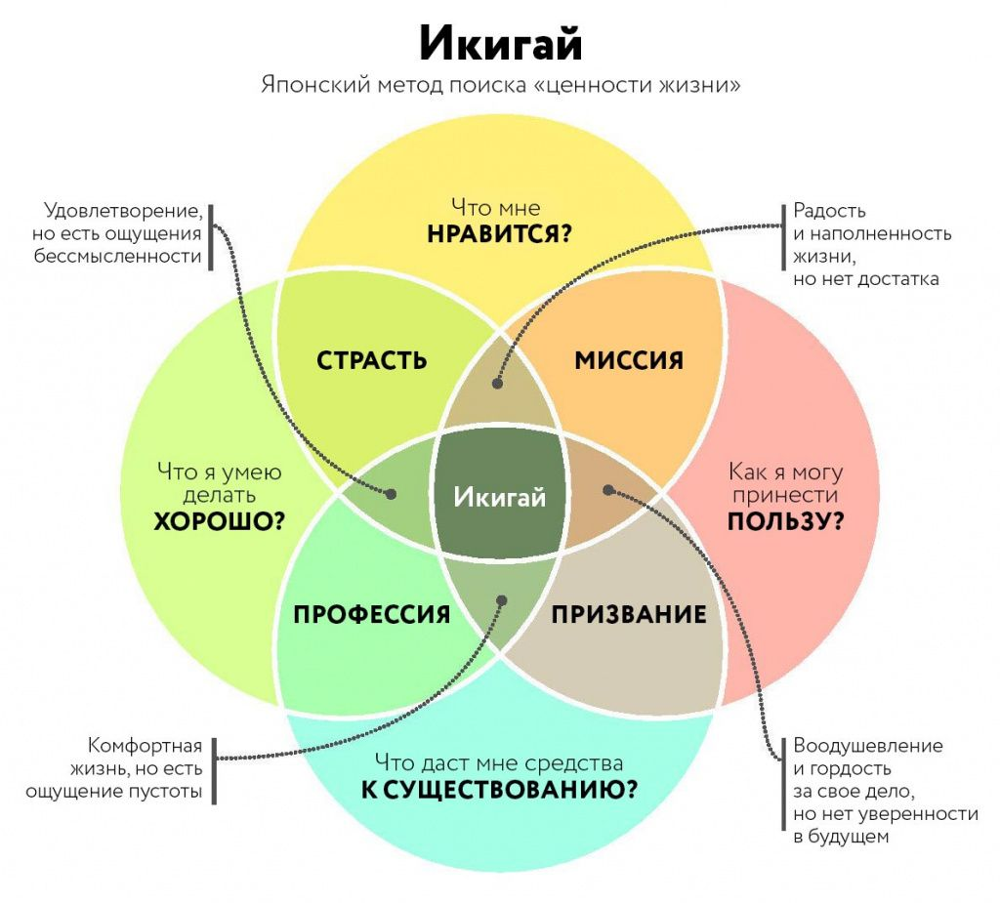
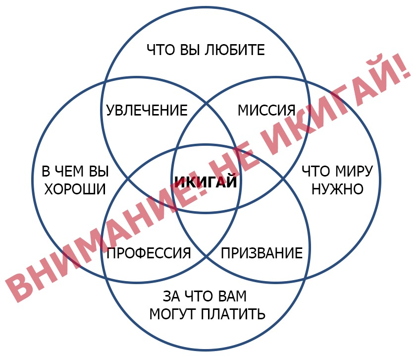

# Икигай. Японский метод поиска «ценности жизни»

Во многих источниках ответ на вопрос о том, что может быть нашим «икигай», дается через диаграмму Венна, где «икигай» - это пересечение того, что мы любим, что хорошо умеем, что нужно миру и за что нам могут платить. Японцы относятся к такой трактовке критично, поскольку она предполагает, что достичь «икигай» и настоящего счастья можно лишь при соблюдении всех четырех условий. Например, если мы делаем то, что любим, но это не приносит денежного вознаграждения, то, согласно диаграмме, мы не можем почувствовать «икигай». Основатель Ikigaitribe - Николас Кемп стремится развенчать мифы по теме «икигай» и проводит подробную критику диаграммы, которую можно описать несколькими пунктами:

- Хотя успех и накопление богатства могут быть побочными продуктами вашего «икигай», они не должны быть в центре внимания.
- «Икигай» - это не то, что нужно от нас миру. Икигай лежит в сфере сообщества, семьи, дружбы и ролей, которые мы выполняем. Когда мы преследуем свой икигай, мы не стремимся спасти мир. Это больше о соединении и помощи людям, которые придают смысл нашей жизни - семье, друзьям, коллегам и сообществу.
- Необязательно уметь что-то делать, чтобы найти собственный икигай. Икигай может быть очень простым ежедневным ритуалом или практикой нового хобби. Икигай - это больше о росте, чем о мастерстве.
- Наконец, икигай может быть тем, что мы любим или увлечены, но также мы можем найти икигай в областях своей жизни, от которых меньше всего этого ожидаем. Икигай больше ориентирован на то, чтобы жить в соответствии с нашими ценностями и находить смысл, цель в повседневной жизни, независимо от того, какие ограничения у нас могут быть.

