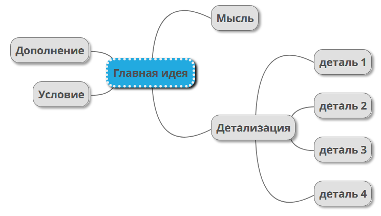

# Интеллект-карта (MIndmap)

Диагра́мма свя́зей, известная также как интелле́кт-ка́рта, ка́рта мыслей или ассоциати́вная ка́рта — метод структуризации концепций с использованием графической записи в виде диаграммы. [Википедия](https://ru.wikipedia.org/wiki/%D0%94%D0%B8%D0%B0%D0%B3%D1%80%D0%B0%D0%BC%D0%BC%D0%B0_%D1%81%D0%B2%D1%8F%D0%B7%D0%B5%D0%B9)

## Что такоей Mind Map?

Если с традиционными способами **структурирования и отображения информации** все понятно, то **карта мыслей** - это что-то новое. Mind Mapping - это способ представления информации с помощью диаграммы связей. Суть **интеллект-карты** - построить ассоциативные цепочки. В основе карты разума нужно поставить основную мысль, а дальше рисовать ветки, разбирая общую идею на более подробные. [Скетчноутинг](https://blog.checkiant.com/ru/blog-o-produktivnosti/151-sketchnouting-dlya-kontrolya-vremeni-razrisuj-svoj-rabochij-den) - это тоже своеобразное построение ментальных карт.

Изначально рисовать кустообразные картинки предложил **Тони Бьюзен -** психолог, автор многочисленных книг про способности мозга, специалист в области самосовершенствования (развития памяти, мышления). Технология Mind Mapping может пригодится для решения задач, конспектирования лекций, создания нового проекта, при анализе сложного вопроса, планирования доклада, а также для постановки личных целей в жизни.

## Чем хороши карты мыслей?

Различия и достоинства метода Mind Mapping по сравнению с линейными записями:

- легко увидеть всю структуру записи целиком, не надо перелистывать, просто найти нужный пункт;
- четко видно главные элементы, они не теряются в тексте;
- законченная карта имеет все элементы на своем месте, она продумана и целостна;
- мозг лучше воспринимает комбинацию из картинок, цветов, связей, нежели монотонную запись;
- создать карту мыслей гораздо быстрее, чем записать полноценные предложения.

## Как правильно создавать интеллект-карты?

Научиться [**запоминать информацию**](https://blog.checkiant.com/ru/blog-o-produktivnosti/164-kak-zapominat-bystree-prostye-metody-zapominaniya) с помощью техники Mind Map очень просто: в середине запишите главную тему, а на ветках дерева указывайте тезисы лекции. Под ними можно в виде списка рисовать маленькие веточки с различными терминами или особенностями. Такая **графическая техника** предполагает включение зрительной памяти. Для каждого нового решения можно применять разные цвета, чтобы визуально отделить пункты.

Использовать **Mind Maps для изучения иностранного языка** тоже можно. Например, Вы учите тему "Мой дом". В центре диаграммы поместите слово "home". Далее решите для себя, на какие подкатегории Вы поделите слова, которые связанны с этой темой. Например, у Вас будет ветка с различными видами домов и ветка с мебелью. Для каждой ветки лучше выбрать другой цвет ручки, так мозг будет сразу различать, что к чему относится. Далее в каждой ветке можно записать дополнительные подкатегории. Для видов домов можно записать такие значения: особняк, квартира, комната, домик на дереве, многоэтажный дом. Если это мебель, ее разделите на мягкую мебель, столы, стулья, кухонную мебель, шкафы, посуду. Тут можно выделить новые подкатегории: материалы, цвета, предназначение. продолжайте до тех пор, пока хватит знаний и фантазии.

Другой пример - Вы готовите доклад по биологии про царства живой природы. В таком случае можно даже нарисовать две Mind Map карты:

1) общая карта мыслей, чтобы сформулировать ход доклада, какие темы нужно вспомнить, основные моменты, какой предполагается объём материалов;
  

2) диаграмма связей между конкретными темами и данными по ним. В центре следует написать "Живая природа", далее 5 веток с названием каждого царства: животные, растения, грибы, бактерии и вирусы. К каждой ветке пропишите особенности данного царства, расскажите про представителей. Расписывайте, пока не кончиться информация и фантазия. В конце эту карту можно будет даже показать во время доклада, а не только подготовиться по ней.

## Где создать ментальную карту?

Самый простой и быстрый способ нарисовать интеллект-карту **Mind Map** - разноцветными фломастерами на бумаге. Рисуйте и пишите так, как Вам нравится. Оформляйте пункты разными цветами, фигурами, используйте списки или облачка - делайте все так, чтобы Вам было удобно и интересно воспринимать информацию.

Для тех, кто больше любит пользоваться гаджетами, существуют специальные программы и сервисы, предназначенные для создания карт мыслей. Есть бесплатные и платные приложения и веб-сайты с множеством **инструментов** и **шаблонов**. Они помогут Вам легко управлять ресурсами и просто запоминать новый материал.

Предлагаем ознакомится с некоторыми наиболее популярными  [инструментами для создания интеллект-карт](Инструменты%20для%20создания%20интеллект-карт.md).

## Какие бывают интеллект-карты

Метод используется для множества целей людьми с разными типами мышления. Поэтому единого вида карт нет. Используются построения в виде:

1. Схемы - распространённый формат древовидного типа. В центре записывается основная мысль, от неё идёт множество лучей, которые, при необходимости, разветвляются;

2. Структуры - знакомый большинству формат записи. Главный тезис размещается сверху, от него вниз уходят несколько значимых направлений. Прорабатывание темы - это запись подпунктов по заданным векторам. Это распространённая картосхема, примеры которой можно найти на схематическом изображении отделов компании с указанием градации субординации.

3. «Рыбьего скелета» - популярная методика записи данных, действительно напоминающая кости рыбы. Проблема - это голова, а хребет скрепляет и удерживает косточки-решения. Можно использовать два подхода: постепенно удлинять «рыбу», дописывая новые мысли, или сразу проранжировать идеи - самые важные размещаются у головы, незначительные - у хвоста.

4. Таблицы - один из самых распространённых форматов структуризации информации. С её помощью удобно сравнивать аналогичные объекты или подсчитывать «за» и «против» каждой идеи.

5. Временного графика - изображения данных, с учётом конкретных последствий во времени. С его помощью можно отследить предполагаемые изменения на нужный срок. Например, что будет через неделю, какие задачи будут решены через месяц и так далее. С помощью временного графика можно наглядно оформить хронологию событий.

При выборе вида интеллект-карты стоит отталкиваться от личных предпочтений и той задачи, которую нужно решить.

## Как сделать mind map: рекомендации и лайфхаки

Методика составления карт основывается, прежде всего, на удобстве для её автора. Но лучше следовать рекомендациям, которые улучшат конечный результат:

1. Придерживайтесь иерархии. Важные и второстепенные мысли не должны перемешиваться на одном уровне, это усложняет работу и может запутать как создателя, так и зрителя.

2. Используйте большое пространство и начинайте заполнение карты, оставляя много свободного места между элементами. Во-первых, это даст возможность прорабатывать новые подпункты и идеи, не перекрывая  более старые записи. Во-вторых, это позволит не «терять мысль» при чтении карты.

3. Записывайте идеи коротко. Лучше всего формулировать мысль в одном-трех словах. Запись длинных предложений засоряет карту и отвлекает от сути.

4. Используйте рисунки и фотографии. Это упрощает чтение карты и делает её информативней.

5. Используйте цветовые градации. Каждую ветвь можно обозначить своим цветом, но есть одно ограничение: если использовать больше восьми цветов, то карта начинает выглядеть аляпистой и неудобной для работы.

6. Не делайте огромную интеллект-карту. Если тема обширная и для её раскрытия нужно больше пяти уровней, то есть смысл выделить её в отдельную схему, проставив нужные ссылки на оба документа.

## Как сделать интеллектуальную карту

Зная основные формы и рекомендации по составлению, можно приступать к созданию интеллектуальной карты. Для этого рекомендуем следующий порядок действий:

1. Запишите первостепенную мысль, идею или проблему в центре. Вокруг неё разместите главные направления или категории. Подчеркните их, чтобы не забыть об их значимости.

2. Возьмите отдельное направление и начните прорабатывать его, или заполните, насколько это возможно, все категории самыми очевидными вариантами. Соединяйте слова линиями, размером в слово.

3. Заключайте каждый подпункт в блок - овал или прямоугольник, связь между двумя мыслями рисуйте стрелкой с одним или двумя направлениями.

Заполнение интеллект-карты - процесс индивидуальный, а значит, следует экспериментировать и искать удобные подходы и способы оформления. Используйте разные виды карт, подбирайте удачные цвета, попытайтесь зарисовать некоторые идеи. Это поможет прийти к наиболее эффективному варианту.

## Ссылки

- [The Perfect Mindmap: 6 Step Checklist](https://youtu.be/5zT_2aBP6vM)
- [Диаграмма связей (Wikipedia)](https://ru.wikipedia.org/wiki/%D0%94%D0%B8%D0%B0%D0%B3%D1%80%D0%B0%D0%BC%D0%BC%D0%B0_%D1%81%D0%B2%D1%8F%D0%B7%D0%B5%D0%B9)
- Источники:
  - <https://blog.checkiant.com/ru/blog-o-produktivnosti/166-tekhnologiya-mind-mapping>
  - <https://romi.center/ru/learning/article/what-is-a-mind-map-and-how-to-use-it-in-marketing/>
