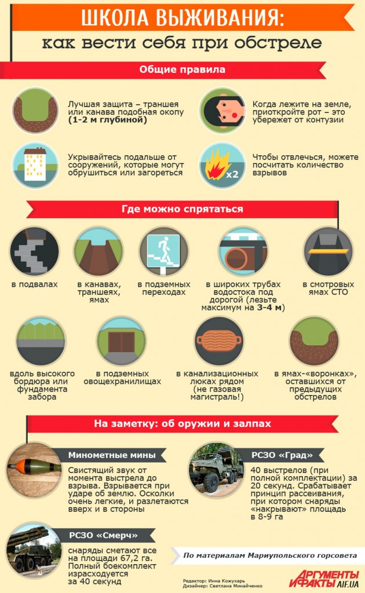

# Как вести себя при обстреле. Основные правила

## На улице

Если вы услышали свист снаряда (он похож больше на шорох), а через 2-3 секунды — взрыв, сразу падайте на землю. Не паникуйте: уже то, что вы слышите сам звук полета, означает, что снаряд пролетел достаточно далеко от вас, а те секунды перед взрывом лишь подтвердили достаточно безопасное расстояние. Однако всегда есть вероятность, что следующий снаряд полетит ближе к вам, поэтому быстро и внимательно оглянитесь вокруг: где можно спрятаться надежнее.

Если есть какой-то выступ, канава, любой выступ или углубление в земле — воспользуйтесь этой естественной защитой. Если рядом есть какая-то бетонная конструкция — нужно лечь рядом с ней.

Принимать лежачую позицию необходимо для того, чтобы снизить шанс попадания осколков. Осколки летят вверх и по касательной. Если человек стоит — больше вероятности оказаться у них на пути, нежели в лежачем положении.

## В транспорте

Если первые взрывы застали вас в дороге в автомобиле: немедленно останавливайте машину и быстро ищите укрытие. Не рассчитывайте, что на авто вы сможете быстро убежать от обстрела: вы никогда не знаете, в какую сторону перенесется огонь, и не начнется ли дальше обстрел, скажем, из минометов. Кроме того, бензобак вашего авто добавляет риска.

В случае, если обстрел застал вас в маршрутном такси, троллейбусе или трамвае — следует потребовать немедленно остановить транспорт, отбежать от дороги в противоположную от обстрела сторону в направлении «от зданий и сооружений» и залечь на землю. Оглянитесь и глазами поищите более надежное укрытие неподалеку. Перебегать или отползать следует короткими быстрыми бросками сразу после следующего взрыва.

## Не подходят для укрытия

- Подъезды любых зданий, даже небольшие пристроенные сооружения. От многоэтажных/ многоквартирных домов вообще следует отбежать хотя бы метров на 30-50, так как есть большой риск оказаться под массивными завалами. Загромождение подвалов таких зданий влечет риск моментального пожара или задымленности.
- Различная техника (нельзя прятаться, скажем, под грузовиком или под автобусом);
- Снаружи под стенами современных зданий. Нынешние бетонные «коробки» не имеют ни малейшего запаса прочности и легко рассыпаются (или «складываются») не только от прямого попадания, но даже от сильной взрывной волны: есть большой риск оползней и завалов.
- Нельзя прятаться под стенами офисов и магазинов: от взрывной волны сверху будет падать много стекла; это не менее опасно, чем металлические осколки снарядов.
- Иногда люди инстинктивно прячутся среди любых штабелей, в местах, заложенных контейнерами, заставленных ящиками, стройматериалами и т.п. (вступает в дело подсознательный рефлекс: спрятаться так, чтобы не видеть ничего). Эта ошибка опасна тем, что вокруг вас могут быть легковоспламеняющиеся предметы и вещества: возникает риск оказаться среди внезапного пожара.
- Порой люди из страха прыгают в реку, в пруд, фонтан и т.д. Взрыв бомбы или снаряда в воде даже на значительном расстоянии очень опасны из-за сильного гидроудара, что может привести к тяжелой контузии.

## Подходят для укрытия

- специально оборудованные бомбоубежища. От обычного подвала настоящее бомбоубежище отличается толстым надежным перекрытием над головой, системой вентиляции и наличием двух (и более) выходов на поверхность
- подземные переходы;
- метро (идеально подходит);
- канава, траншея или яма;
- широкие трубы водостока под дорогой (не стоит лезть слишком глубоко, максимум на 3-4 метра);
- вдоль высокого бордюра или фундамента забора;
- очень глубокие подвалы под капитальными домами старой застройки (желательно, чтобы он имел 2 выхода);
- подземное овощехранилище, силосная яма и т.п.;
- смотровая яма открытого (на воздухе) гаража или СТО;
- канализационные трубы рядом с вашим домом, это очень хороший тайник (но хватит ли у вас сил быстро открыть тяжелый люк? Важно также, чтобы это была именно канализация или водоснабжение — ни в коем случае не газовая магистраль!)
- ямы-«воронки», оставшиеся от предыдущих обстрелов или авианалетов.

В худшем случае — когда в поле зрения нет укрытия, куда можно перебежать одним быстрым броском — просто ложитесь на землю и лежите, закрыв голову руками. Подавляющее большинство снарядов и бомб разрываются в верхнем слое почвы или асфальта, поэтому осколки в момент взрыва разлетаются на высоте не менее 30-50 см над поверхностью.

## Общее правило для укрытий

Ваше укрытие должно быть хоть минимально углубленным и, вместе с тем, должно находиться подальше от сооружений, которые могут обрушиться сверху при прямом попадании или загореться. Идеальную защиту дает траншея или канава (подобная окопу) глубиной 1-2 метра, на открытом месте.

Спрятавшись в укрытие, ложитесь и обхватите голову руками. Приоткройте рот — это убережет от контузии при близком разрыве снаряда или бомбы.

Не паникуйте. Займите свою психику чем-то. Можно считать взрывы: знайте, что максимум после 100-го взрыва обстрел точно закончится. Можно мысленно считать минуты. Во-первых, это отвлекает. Во-вторых, так вы сможете ориентироваться в ситуации: артиллерийский обстрел не длится вечно, максимум двадцать минут; авианалет — значительно меньше. В наше время не бывает длинных бомбардировок, большие группы бомбардировщиков не применяются.

## В доме

Если в доме есть подвал — спуститесь в подвал.

Если подвала нет — спуститесь на нижние этажи. Чем ниже, тем лучше.

Заранее найдите самую внутреннюю комнату, чем больше бетона вокруг, тем лучше (найдите несущие стены, например, ванная комната), если все комнаты внешние — выходите на лестничную площадку.

Ни в коем случае не стойте напротив окон!

Если известно, с какой стороны ведется обстрел, то выбирайте самую удаленную комнату с противоположной стороны.

В выбранном месте, сядьте на пол у стены — чем ниже человек находится во время попадания снаряда, тем больше шансов, что его не зацепит осколком. Опять-таки, не напротив окон. Окна можно замостить диванными подушками (большими, плотными, но лучше мешками с песком), закрыть массивной мебелью, но не пустой (набить мешками с песком или вещами, но плотно).

## В погребе

Для укрытия можно использовать погреб в частных домах, но примите во внимание, что его может завалить! Поэтому оставьте в доме на видном месте большой бросающийся в глаза плакат «во время бомбежек мы в погребе» и укажите, где погреб находится.

Возьмите с собой телефоны, радио на батарейках, воду.

Не впадайте в панику.

## После окончания обстрела

Оставляя место убежища, не давайте себе расслабиться. Теперь все ваше внимание должно быть сконцентрировано себе под ноги! Не поднимайте с земли никаких незнакомых вам предметов: авиабомба, ракета или снаряд могут быть кассетными!

Боевые элементы обычно разрываются при падении, но могут взорваться и позже, в руках — от малейшего движения или прикосновения.

Берегите себя и будьте бдительны!

## Ссылки

- [Источник](http://donbasssos.org/20150605_obstrel/)
