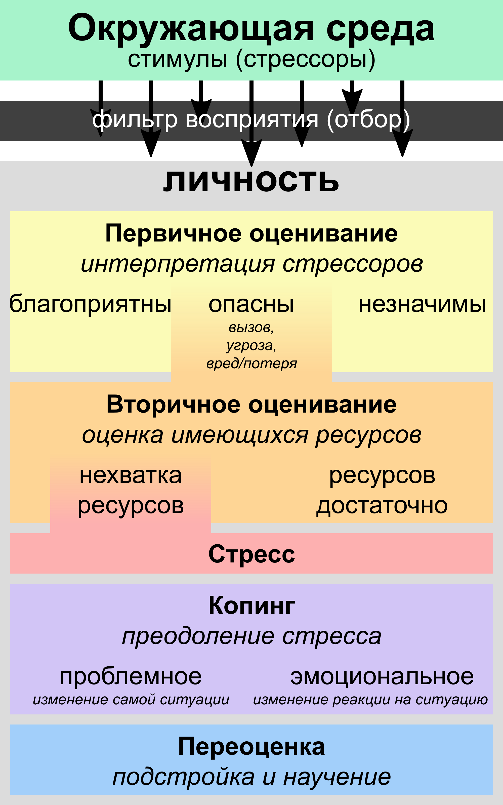
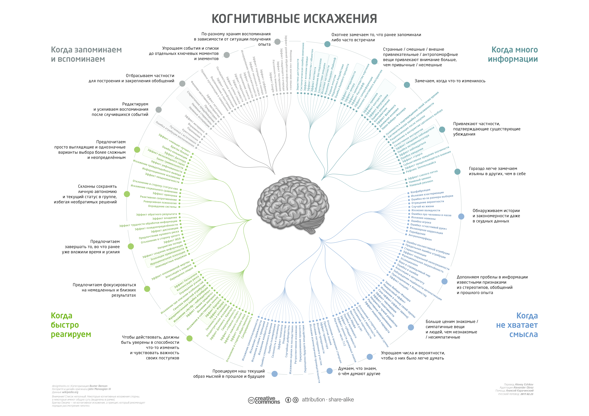

# Когнитивные искажения

Исследования когнитивных искажений имеют большое значение для когнитивной науки, социальной психологии и поведенческой экономики, поскольку позволяют «выделить» психологические процессы, лежащие в основе процессов восприятия и принятия решений. [Википедия](https://ru.wikipedia.org/wiki/%D0%9A%D0%BE%D0%B3%D0%BD%D0%B8%D1%82%D0%B8%D0%B2%D0%BD%D0%BE%D0%B5_%D0%B8%D1%81%D0%BA%D0%B0%D0%B6%D0%B5%D0%BD%D0%B8%D0%B5)

## Когнитивное оценивание

**Когнитивное оценивание** — процесс восприятия и интерпретации субъектом тех или иных обстоятельств, результатом которого является субъективная картина ситуации в сознании человека. [Википедия](https://ru.wikipedia.org/wiki/%D0%9A%D0%BE%D0%B3%D0%BD%D0%B8%D1%82%D0%B8%D0%B2%D0%BD%D0%BE%D0%B5_%D0%BE%D1%86%D0%B5%D0%BD%D0%B8%D0%B2%D0%B0%D0%BD%D0%B8%D0%B5)

## Список когнитивных искажений

- Список когнитивных искажений ([Википедия](https://ru.wikipedia.org/wiki/%D0%A1%D0%BF%D0%B8%D1%81%D0%BE%D0%BA_%D0%BA%D0%BE%D0%B3%D0%BD%D0%B8%D1%82%D0%B8%D0%B2%D0%BD%D1%8B%D1%85_%D0%B8%D1%81%D0%BA%D0%B0%D0%B6%D0%B5%D0%BD%D0%B8%D0%B9))

- [Таблица Тимура Аникина](http://metaver.pbworks.com/w/page/74234666/%D0%A1%D0%BF%D0%B8%D1%81%D0%BE%D0%BA%20%D0%BA%D0%BE%D0%B3%D0%BD%D0%B8%D1%82%D0%B8%D0%B2%D0%BD%D1%8B%D1%85%20%D0%B8%D1%81%D0%BA%D0%B0%D0%B6%D0%B5%D0%BD%D0%B8%D0%B9%2C%20%D1%83%D0%BB%D1%83%D1%87%D1%88%D0%B5%D0%BD%D0%BD%D0%B0%D1%8F%20%D0%B2%D0%B5%D1%80%D1%81%D0%B8%D1%8F)
- [Статья Анатолия Ализара (включает только блок Проблемы 1)](https://geektimes.ru/post/282064/)
- [Собственная версия JSON-файла](http://ezh.li/cbcs-json)
- Презентация ([GoogleSlides](https://docs.google.com/presentation/d/14AApIU6ZOrjN5UaED5kvbQkHW971NV_h9pPCtNgi2eg/edit?usp=sharing))

## Ссылки

- [Памятка по когнитивным искажениям (статья)](https://medium.com/russian/cognitive-bias-cheat-sheet-5bb0664b67b5)
