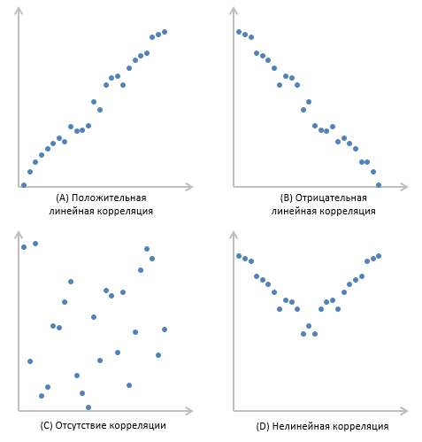

# Корреляция

Корреля́ция, или корреляцио́нная зави́симость — статистическая взаимосвязь двух или более случайных величин. При этом изменения значений одной или нескольких из этих величин сопутствуют систематическому изменению значений другой или других величин. [Википедия](https://ru.wikipedia.org/wiki/%D0%9A%D0%BE%D1%80%D1%80%D0%B5%D0%BB%D1%8F%D1%86%D0%B8%D1%8F)

