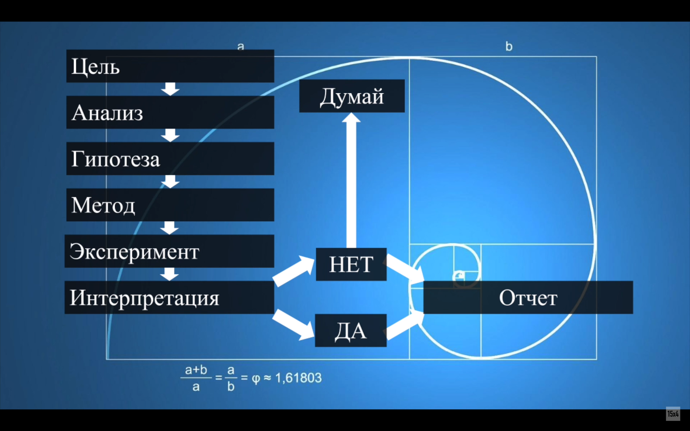

# Научный метод

Научный метод можно свести к трём пунктам:

## Создание новой идеи

Мы используем наше воображение, интуицию, память для создания нового способа объяснения или решения задачи.

## Тщательное обдумывание идеи

Мы проводим анализ мыслей, чтобы найти способ проверить их экспериментально. С помощью логики мы можем определить, насколько наше детище соответствует известным фактам. Мы можем попытаться вычислить в уме, сработает ли идея. Каков будет результат?

## Проверка экспериментом

Мы проводим анализ мыслей, чтобы найти способ проверить их экспериментально. С помощью логики мы можем определить, насколько наше детище соответствует известным фактам. Мы можем попытаться вычислить в уме, сработает ли идея. Каков будет результат?

## Ссылки

* Научный метод в повседневной жизни для новичков на примере ([PDF](https://drive.google.com/file/d/1RTTDh5uzBmnHm-f-0C_zrvtH-WCgKA5l/view?usp=sharing))
* Научный метод ([YouTube-плейлист](https://www.youtube.com/playlist?list=PLkitAWWhaFc4XsurN6bjafcBZOxRzFZbD))
* [План лекции "Научный метод"](https://docs.google.com/document/d/1uacDyzCszBzYaSqAgHdOd68njhdHhP-WcTI-OYuVp_g/edit?usp=sharing)
