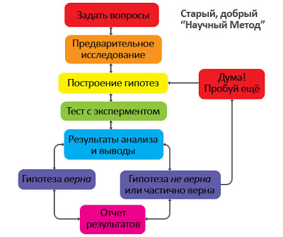

# Научный метод

Теги: #научныйметод

Научный метод можно свести к трём пунктам:

### Создание новой идеи

Мы используем наше воображение, интуицию, память для создания нового способа объяснения или решения задачи.

### Тщательное обдумывание идеи

Мы проводим анализ мыслей, чтобы найти способ проверить их экспериментально. С помощью логики мы можем определить, насколько наше детище соответствует известным фактам. Мы можем попытаться вычислить в уме, сработает ли идея. Каков будет результат?

### Проверка экспериментом

Мы проводим анализ мыслей, чтобы найти способ проверить их экспериментально. С помощью логики мы можем определить, насколько наше детище соответствует известным фактам. Мы можем попытаться вычислить в уме, сработает ли идея. Каков будет результат?

## Ссылки

* Научный метод в повседневной жизни для новичков на примере ([PDF](https://drive.google.com/file/d/1RTTDh5uzBmnHm-f-0C_zrvtH-WCgKA5l/view?usp=sharing))
* Научный метод ([YouTube-плейлист](https://www.youtube.com/playlist?list=PLkitAWWhaFc4XsurN6bjafcBZOxRzFZbD))

## Ссылки на эту страницу

* [TVP - Основы формирования будущего](TVP%20-%20%D0%9E%D1%81%D0%BD%D0%BE%D0%B2%D1%8B%20%D1%84%D0%BE%D1%80%D0%BC%D0%B8%D1%80%D0%BE%D0%B2%D0%B0%D0%BD%D0%B8%D1%8F%20%D0%B1%D1%83%D0%B4%D1%83%D1%89%D0%B5%D0%B3%D0%BE.md)