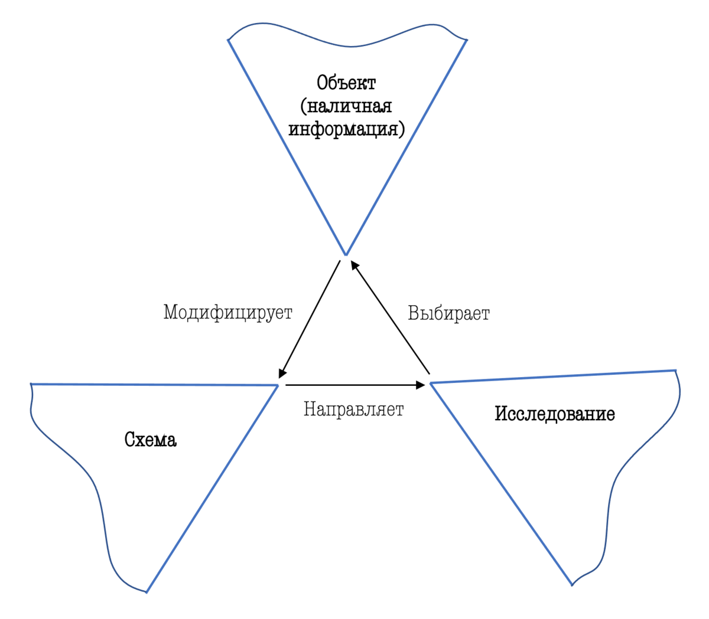

# Перцептивный цикл

Перцептивный цикл — модель У. Найссера, представителя школы когнитивной психологии, рассматривающая восприятие как результат циклического взаимодействия трёх структур: объекта, перцептивной схемы и исследования. [Википедия](https://ru.wikipedia.org/wiki/%D0%9F%D0%B5%D1%80%D1%86%D0%B5%D0%BF%D1%82%D0%B8%D0%B2%D0%BD%D1%8B%D0%B9_%D1%86%D0%B8%D0%BA%D0%BB)

## Ссылки

* [Психология](Психология.md)
