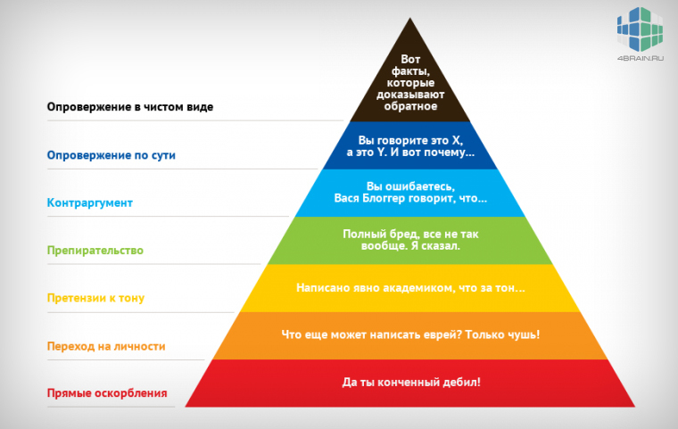

# Пирамида Грэма. Практика ведения споров

Очень сложно спорить из-за нахлынувших [эмоций](https://4brain.ru/akterskoe-masterstvo/emotions.php). Задним умом или тонким внутренним голосом вы понимаете, что в аргументе визави есть логическая несуразица, но эмоции напрочь убивают [критическое мышление](https://4brain.ru/blog/%D1%80%D0%B0%D0%B7%D0%B2%D0%B8%D1%82%D0%B8%D0%B5-%D0%BA%D1%80%D0%B8%D1%82%D0%B8%D1%87%D0%B5%D1%81%D0%BA%D0%BE%D0%B3%D0%BE-%D0%BC%D1%8B%D1%88%D0%BB%D0%B5%D0%BD%D0%B8%D1%8F/). Если же оставить их и после первой же фразы собеседника, которая вызывает смутный дискомфорт, попытаться рассмотреть не конкретные слова, а структуру, которая за ними стоит, некие [манипулятивные приемы](https://4brain.ru/blog/%D0%BF%D1%80%D0%B8%D1%91%D0%BC-%D0%BD%D0%BE%D0%B3%D0%B0-%D0%B2-%D0%B4%D0%B2%D0%B5%D1%80%D0%B8/), которые незаметно вкладываются во вроде бы логическую обертку — вы поймете, что аргумент высосан из пальца, факт подменяется напором, а разумный диалог — переходом на личности.

Золотой стандарт в классификации комментариев — «Пирамида Грэма». Ее автор — программист и инвестор Пол Грэм. В статье 2008 года он классифицировал комментарии по ценности для окружающего мира.

## Об авторе

Пол Грэм (Paul Graham) – известный программист, эссеист, венчурный капиталист и автор эссе «Как не соглашаться» (How to disagree), которое он написал в 2008 году. Получил степень бакалавра в Корнелльском университете, позже — степень магистра и доктора философии по специализации «информатика». Автор книг «On lisp» и «Hackers & Painters».

Журнал BusinessWeek включил Пола Грэма в список 25 самых влиятельных людей сети за 2008 год.

Проблема ведения споров в том, что нет четкого деления на очернительное и аргументированное опровержение. Существует ряд промежуточных стадий и оттенков. Именно в этом большая ценность пирамиды Грэма — она компактная, состоит из семи опровержений, понятная и охватывает если не все, то большинство основных методик ведения споров.

## Опровержения по пирамиде Грэма

Итак, начнем с самого низа, с самых грязных, и, к сожалению, популярных, методов ведения споров.

### 7. Прямые оскорбления

Распознать это опровержение проще простого. Человек прямо вас оскорбляет, не настроен даже при ближайшем рассмотрении добиться истины. Даже простые оскорбления сигнализируют о том, что диалог пора сворачивать и не иметь впредь с этим человеком никаких дел.

«Да ты просто дурак!»

Если вы в интернете, ставьте его в черный список, если это произошло в жизни, лучший способ — реагировать с [юмором](https://4brain.ru/blog/%D0%BA%D0%B0%D0%BA-%D1%80%D0%B0%D0%B7%D0%B2%D0%B8%D1%82%D1%8C-%D1%87%D1%83%D0%B2%D1%81%D1%82%D0%B2%D0%BE-%D1%8E%D0%BC%D0%BE%D1%80%D0%B0/).

### 6. Переход на личности

Здесь, как и в прямом оскорблении, просто россыпь вариантов — социальный статус, расовые предрассудки, физические недостатки, воспоминание о прошлом и так далее. Что приятно, в сравнении с предыдущим опровержением, оппонент наконец обращает хоть какое-то внимание на вас, вы для него уже не просто объект для спора, вы — конкретный человек с конкретным недостатком, который не достоин вести с ним спор.

«И об экономике мне говорит человек, который развелся со своей женой?»

Оппонент хочет вызвать в вас негативные эмоции, увести от обсуждаемой темы. Помимо этого есть один неприятный момент — иногда подобные фразы дискредитируют оппонента в глазах других людей. Однако если эти люди и правда задумались о вашем недостатке в контексте спора, они ничем не лучше манипулятора и это вам стоит помнить.

В идеале здесь вам тоже стоит проигнорировать слова оппонента, но если вам важно победить в этой дискуссии и уйти от нее не получится, тогда на помощь (помимо улыбки и спокойствия) фраза: «Хорошо, а расскажешь мне по сути, в чем именно я неправ?».

### 5. Претензия к тону

Человек понимает, что у него нет никаких аргументов, а потребность сохранить лицо у каждого человека существует, правда у разных людей принимает разные формы. В данном случае оппонент не оскорбляет вас прямо, да и на личности не переходит, ему просто не нравится ваш тон. Хорошая новость — скорее всего, он уже почти согласился с вашим аргументом, просто хочет проиграть достойно. Хочет, чтобы вы с уважением отнеслись к тому, что у него недостаточно аргументов. Кстати, вполне возможно, что вы и правда повысили голос или говорили язвительно.

«Не повышай на меня голос и не смей говорить таким ядовитым тоном!»

Человек не примет никаких аргументов, пока вы не измените свое к нему отношение. В данном случае, скорее всего, элементарное понижение громкости голоса и небольшое смирение поможет добиться успеха в дискуссии. В том случае, если нужно найти компромисс, а победителями станут оба.

### 4. Препирательство

Препирательство характеризуется абсолютно бессмысленной дискуссией, топтанием на месте, когда оба оппонента (или один) не имеют желания найти общий язык. Здесь может и не быть оскорблений, перехода на личности, претензий к тону, зато есть бессмыслица, грызня. Спор ради спора, повышенное эго и гордыня, заряженность на процесс, а не на результат — таковы неутешительные признаки препирательства. Иногда такому человеку просто нужен хоть кто-нибудь, ваша личность ему почти безразлична. Постоянные придирки и десятки вопросов призваны поставить вас в тупик.

«И что дальше? Ну и зачем? Да никогда в жизни!»

Если есть возможность — просто уйдите от спора. Если же все равно нужно добиться положительного результата — постарайтесь перевести разговор в правильное русло. Сделать акцент на том, что если человек продолжит упираться, проиграют все. У каждого, даже самого упертого человека, есть ценности, которые он боится потерять. Найдите эту ценность и намекните, что пока спор будет ни о чем, его ценность под угрозой.

### 3. Контраргумент

Первые признаки конструктивного диалога. Осталось понять, насколько этот контраргумент логичен и решить, соглашаться ли с ним. Иногда ответный аргумент только причина для продолжения спора, человеку приятно найти нечто такое, что покажет его позицию, особенно если она зыбка.

«В прошлый раз мы сделали именно так, как я сказал, и я это сработало»

Правильный ответ в этом случае подсказывает [Карнеги](https://4brain.ru/blog/%D0%B4%D0%B5%D0%B9%D0%BB-%D0%BA%D0%B0%D1%80%D0%BD%D0%B5%D0%B3%D0%B8-%D0%BA%D0%B0%D0%BA-%D0%BF%D1%80%D0%B8%D0%BE%D0%B1%D1%80%D0%B5%D1%82%D0%B0%D1%82%D1%8C-%D0%B4%D1%80%D1%83%D0%B7%D0%B5%D0%B9/). Дать возможность человеку сохранить лицо и косвенная критика его позиции идеальны в этой ситуации. Нужно указать на то, что контраргумент оппонента имеет право на существование, но в данном случае не совсем уместен. То есть полностью отвергать его запрещено, иначе человек упрется, пытаясь сохранить свое лицо и пойдет на принцип. «Да, ты прав, этот аргумент очень сильный и правильный. Но в нашем случае подойдет вот этот». Важно указывать не на оппонента, а на аргумент. Не человек плох, а аргумент — да и то не всегда, а только в этом конкретном случае.

### 2. Опровержение по сути

Мы почти близки к идеальной дискуссии, спора уже и след простыл. Оппонент (или вы) опровергает ваши слова, не подменяет понятия, признаков демагогии или софистики нет, зато есть причина наконец-то обратить внимание на его слова и задуматься. Идеальная ситуация, когда оба человека говорят об одном и том же на протяжении всей дискуссии.

«Вы говорите, что это X, а это Y. И вот почему…»

Если вы понимаете, что человек прав, пора соглашаться. Если аргумент отчасти хорош, похвалите оппонента и предложите ему модифицированный аргумент, но признайте, что он все равно принадлежит ему.

### 1. Опровержение в чистом виде

Такое случается крайне редко, поэтому берегите таких людей и старайтесь не терять с ними связь. Такие люди очень внимательно слушают вас, что уже говорит об их тактичности и внимательности. Но это не лицемерная тактичность, если вы не правы — они об этом скажут и приведут не один, а много аргументов в свою защиту, а не просто признают за вами право на свое мнение. Такой диалог похож на шахматную партию и приносит огромное удовольствие.

«Вот факты, которые доказывают обратное»

В любой дискуссии ключевым моментом является спокойствие, чувство юмора и внимательность. Пирамида Грэма показывает на каком уровне опровержений находится ваш оппонент, позволяет отделить зерна от плевел и сосредоточиться не на словах, а на том, что они собой несут и зачем произнесены.

## Ссылки

* [Источник](http://xn--b1acuoifv.xn--p1ai/2016/11/14/%d0%bf%d0%b8%d1%80%d0%b0%d0%bc%d0%b8%d0%b4%d0%b0-%d0%b3%d1%80%d1%8d%d0%bc%d0%b0-%d0%bf%d1%80%d0%b0%d0%ba%d1%82%d0%b8%d0%ba%d0%b0-%d0%b2%d0%b5%d0%b4%d0%b5%d0%bd%d0%b8%d1%8f-%d1%81%d0%bf%d0%be%d1%80/)
