# Текстовые редакторы

202102230506
Теги: #текстовыйредактор #программы
___

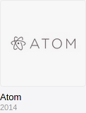
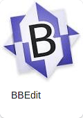

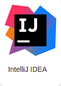
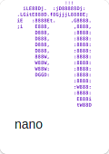
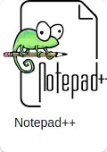
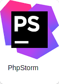
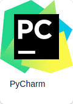
[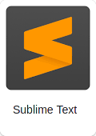](Sublime%20Text%203.md)
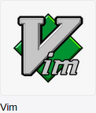
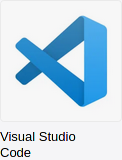
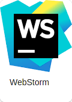

## Ссылки

- [Atom](Atom.md)
- [BBedit](BBedit.md)
- [Brackets](Brackets.md)
- [gedit](gedit.md)
- [IntelliJ IDEA](IntelliJ%20IDEA.md)
- [nano](nano.md)
- [Notepad++](Notepad++.md)
- [PhpStrom](PhpStrom.md)
- [PyCharm](PyCharm.md)
- [Sublime Text 3](Sublime%20Text%203.md)
- [Vim](Vim.md)
- [Visual Studio Code](Visual%20Studio%20Code.md)
- [WebStorm](WebStorm.md)
