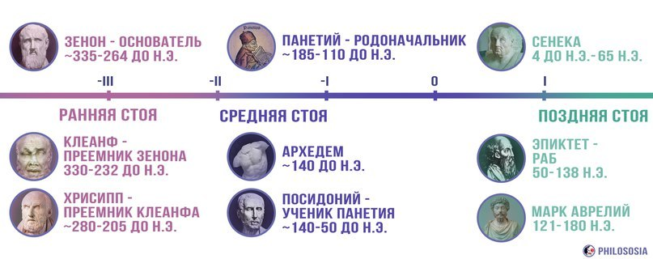

# Стоицизм
[Стоицизм (Википедия)](https://ru.wikipedia.org/wiki/%D0%A1%D1%82%D0%BE%D0%B8%D1%86%D0%B8%D0%B7%D0%BC)

## Ссылки

* [Александр Саликов. Стоицизм – это не вера, стоицизм – это философия](Александр%20Саликов.%20Стоицизм%20–%20это%20не%20вера,%20стоицизм%20–%20это%20философия.md)
* [Стоицизм. Какие книги почитать](Стоицизм.%20Какие%20книги%20почитать.md)
* [Основа стоицизма: дихотомия контроля](https://memori.online/posts/2019/05/dvoistvennost-kontrolya-v-stoicizme/)
* сайт о стоицизме — [Вилка Стоика](https://stoicfork.online/?utm_source=memori.online&utm_medium=site)
* [🔶 Философия стоицизма \[TED-Ed на русском\]](https://youtu.be/4v1QBoNI8rw)
* [7 УПРАЖНЕНИЙ СТОИКОВ ДЛЯ ВНУТРЕННЕГО ПОКОЯ | (Insatiable mind)](https://www.youtube.com/watch?v=dYc2tTy_K3c)
* [Цените не привязываясь. Упражнение от стоиков](https://www.youtube.com/watch?v=3dNi0QGiaIs)
* [СТАНЬ НЕВОЗМУТИМЫМ. ФИЛОСОФИЯ СТОИЦИЗМА](https://www.youtube.com/watch?v=CuHEiWfYDaM)
* [ПОМЕНЯЙ своё Отношение к РЕАЛЬНОСТИ. Стоицизм](https://www.youtube.com/watch?v=fp7AB_yppw4)
* [Что такое стоицизм](https://youtu.be/88JHluksgaE)
* [Стоицизм или Как правильно жить. Александр Саликов](https://youtu.be/JwV4-A1STp4)
* [МАРК АВРЕЛИЙ Наедине с собой Размышления](https://youtu.be/VuEsRU-_9ck)