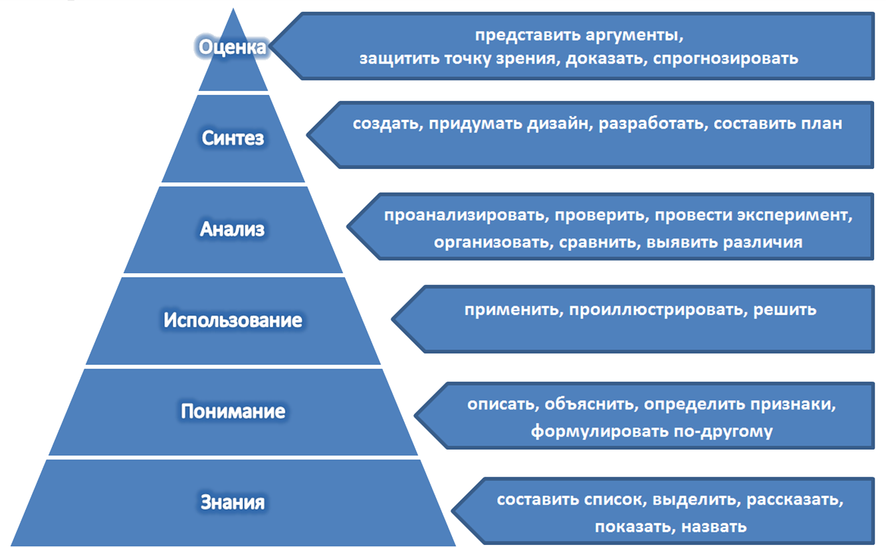

# Таксономия Блума

## ЛЕКЦИЯ 1

### Таксономия Блума

В течение многих лет специалисты в области образования стремились разработать наглядную и доступную теорию, которая помогла бы педагогам в эффективном и систематическом развитии навыков мышления у обучающихся. Самой известной моделью, описывающей процесс мышления, является Таксономия Блума (Bloom's Taxonomy). Данная модель состоит из навыков мышления, структурированных от самого базового до самого продвинутого уровня.

_Таксономия Блума -_ иерархическая модель навыков мышления, состоящая из шести различных уровней. В рамках этой модели целесообразно рассматривать и развитие критического мышления, т.к. педагогу, чтобы развивать критическое мышление у обучающихся, отслеживать его, нужно понимать, мышление какого уровня развивают задания и вопросы, которые используются в процессе работы. Таксономия Блума является инструментом, который помогает отслеживать эффективность деятельности всех типов интеллекта учащихся.

_[Таксономия](Таксономия.md)_ — иерархически выстроенная система целей и результатов от простой к сложной системе.

Понятие таксономии возникло впервые в биологии. Сам термин был предложен швейцарским ботаником О. Декандолем в 1813 г. _Таксономия Блума_ — классификация учебных целей в когнитивной (познавательной) сфере, предложенная в 1956 году Б. Блумом в книге «Таксономия Образовательных Целей: Сфера Познания». Традиционная таксономия Блума сегодня широко используется в качестве инструмента планирования образовательного процесса.

В таксономии целей когнитивная (познавательная) деятельность включает в себя следующие категории: _знание, понимание, применение, анализ, синтез, оценка_. Мыслительные умения расположены им в иерархии от простых к более сложным. К мышлению низкого порядка относятся знание и понимание (они находятся внизу пирамиды), т.к. именно эти процессы наиболее широко представлены в процессе обучения: учащиеся получают знания и воспроизводят их.

Цели обучения более эффективны, если они включают конкретные глаголы, которые могут сказать обучающимся, что они должны делать. Глаголы, перечисленные в таблице, связаны с каждым уровнем мышления, которые в свою очередь связаны с деятельностью, продуктами и результатами, специфичными для цели.

_Таксономия образовательных целей Блума (традиционная)_

| **Навык (уровень мышления)** | **Определение (результат обучении)**                                                                                                                                                                                                                                                                                                                 | **Ключевые слова** **(когнитивные действия и операции)**                                              |
| ---------------------------- | ---------------------------------------------------------------------------------------------------------------------------------------------------------------------------------------------------------------------------------------------------------------------------------------------------------------------------------------------------- | ----------------------------------------------------------------------------------------------------- |
| Знание                       | Припоминание информации (запоминание и воспроизведение изученного материала)                                                                                                                                                                                                                                                                         | Определять, описывать, называть, выделять, маркировать, узнавать, воспроизводить, показать, следовать |
| Понимание                    | Понимать значение, перефразировать главную мысль, передать новую информацию своими словами (интерпретация материала)                                                                                                                                                                                                                                 | Обобщать, преобразовывать, сравнивать, перефразировать, защищать, интерпретировать, давать примеры    |
| Применение                   | Использовать информацию или в новой ситуации. **Три типа режима понимания:** 1) _перевод_ - воспринимать изложенное и переносить в другую форму (другие слова, графики и т.д.); 2) _интерпретация_ - перестраивание идей в новую конфигурацию; 3) _экстраполяция_ - оценивание и прогнозирование, исходя из ранее полученной информации. | Выстраивать, конструировать, классифицировать, моделировать, предсказывать, готовить                  |
| Анализ                       | Разделять информацию или концепции на части для лучшего понимания                                                                                                                                                                                                                                                                                    | Сравнить/противопоставить, разбить информацию на части, выделить, разграничить отобрать, исследовать  |
| Синтез                       | Соединить идеи для создания чего-то нового                                                                                                                                                                                                                                                                                                           | Группировать, обобщать, реконструировать                                                              |
| Оценка                       | Делать суждения относительно ценности. Создание суждений, основываясь на критериях и стандартах путем проверки и критики.                                                                                                                                                                                                                            | Оценивать, критиковать, судить, оправдывать, оспаривать, классифицировать                             |

На каждом уровне осваиваются определенные алгоритмы операций мыслительной деятельности: операции сравнения, анализа, синтеза, конкретизации и абстрагирования, формирования понятий, построения суждений и умозаключений, классификации, обобщения, систематизации.

Слабым местом оригинальной классификации педагогических целей Блума считают:

1) отсутствие уровня, отвечающего за продуктивную, творческую деятельность;

2) отсутствие действий, предполагающих решение проблем или проектную деятельность.

В конце 90-х гг. группа ученых с Лорином Андерсоном составили обновленную версию таксономии Блума, которая более соответствует образовательной практике XXI века. Согласно этой версии шестой уровень _«создавать»_ включает конструирование учащимися творческих проектов и решение учебно-познавательных задач на основе самостоятельно разработанных алгоритмов деятельности. Новая версия включает наивысший компонент _-_ творчество. Этот навык подразумевает соединение уже известного для создания чего-нибудь нового, для чего обучающиеся генерируют, планируют и, в конечном счете, производят_._ Новая таксономия проводит различие между знанием о том, «что», т.е. содержанием мышления, и знанием того, «как», то есть, процедурах, используемых в решении проблем.

### Применение таксономии Блума в приёмах технологии развития критического

#### Прием «Ромашка вопросов»

«Ромашка вопросов» (автор Загашев И. О.) ― это модифицированная «Ромашка Блума». Данный прием формирует умение создавать вопросы.Шесть лепестков - шесть типов вопросов, которые связаны с классификацией уровней познавательной деятельности: _знание, понимание, применение, анализ, синтез и оценка._

| Навык (уровень мышления) | Тип вопроса       | Пример вопроса                                    |
| ------------------------ | ----------------- | ------------------------------------------------- |
| Воспроизведение          | простой           | Кто? Когда? Где? Как?                             |
| Понимание                | уточняющий        | Правильно ли я понял..?                           |
| Применение               | практический      | Как можно применить..? Что можно сделать из..? |
| Анализ                   | интерпретационный | Почему?                                           |
| Синтез                   | творческий        | Что будет, если..?                                |
| Оценка                   | оценочный         | Как вы относитесь ?                               |

_Простые вопросы_ предполагают знание определенных фактов иоперирование конкретной темой (информацией). Данный тип вопросов часто присутствует на традиционных формах контроля: зачетах, терминологических диктантах и т.д.

Цель _уточняющих вопросов -_ предоставление обратной связи относительно сказанного. Уточняющие вопросы также задают с целью получения информации, отсутствующей в сообщении, но подразумевающейся. Такие вопросы обычно начинаются со слов: «То есть ты говоришь, что…?», «Если я правильно понял, то…?», «Ты действительно думаешь, что…?». Важно, чтобы вопросы задавались без негативной мимики.

_Интерпретационные (объясняющие) вопросы_. Обычно начинаются со слова «Почему?», могут быть направлены на установление причинно-следственных связей: «Почему идет дождь?». Если учащийся знает ответ на этот вопрос, тогда он из интерпретационного «превращается» в простой. Следовательно, данный тип вопроса «срабатывает» тогда, когда в ответе на него присутствует элемент самостоятельности. Педагогу следует внимательно относится к постановке данного типа вопросов, т.к. вопрос может восприниматься негативно (как принуждение к оправданию).

_Творческие вопросы_ можно формулировать в условном наклонении, что предполагает элемент предположения и импульс к фантазии.

_Оценочные вопросы_ направлены на выяснение критериев оценки тех или иных событий, явлений, фактов: «Чем урок алгебры отличается от урока геометрии?».

_Практические вопросы_ направлены на _установление_ взаимосвязи между теорией и практикой: «Где вы в обычной жизни можно наблюдать диффузию?»

Применение данного приема приемлемо для всех возрастных категорий учащихся.

#### Прием «Кубик Блума»

Приём разработан американским ученым и психологом Бенджамином Блумом и направлен на проверку усвоения знаний и выявление степени предметно-эмоционального погружения детей в тему.

### Методика использования

Грани кубика содержат вопросы, предполагающие рассмотрение всех аспектов темы, а также которые затрагивают все уровни познания: назови, почему, объясни, предложи, придумай, поделись.

Формулируется тема урока, которая должна обозначить круг вопросов, на которые придется отвечать. Учащийся бросает кубик и формулирует вопрос к учебному материалу по той грани, которая выпадает.

Возможны два режима использования данного приёма:

1) Учитель задаёт соответствующие вопросы.

2) Ученики формулируют вопросы.

Данный прием уникален тем, что позволяет формулировать вопросы самого разного характера.

Вопрос, начинающийся со слова **_«Назови…»_** может соответствовать уровню репродукции, т.е. простому воспроизведению знаний.

Вопросы, начинающиеся со слов **_«Почему…»_** соответствуют **_процессуальным знаниям_**. Дети в данном случае должны найти причинно-следственные связи, описать процессы, происходящие с определённым предметом или явлением.

При формулировке вопроса _«**Объясни…»**_ учащийся анализирует изученный материал, а при ответе применяет знания в новых практических ситуациях.

Задания **_«Предложи…»_**, **_«Придумай…»_**, **_«Поделись…»_** направлены на активизацию мыслительной деятельности учащегося. Он выделяет скрытые (неявные) предположения, проводит различия между фактами и следствиями, анализирует, оценивает значимость данных, использует знания из разных областей, обращает внимание на соответствие вывода имеющимся данным

Прием «Кубик Блума» позволяет провести повторение, обобщение знаний, наблюдение достижения обучающимися определенных уровней мышления.

Для работы с младшими школьниками учителя-практики предлагают модификацию кубика Блума, используя следующие вопросы:

- **_Опиши_** (форму, размер, цвет, назови по имени, и т.д.);

- **_Сравни_** (сравнить заданный предмет или явление с подобными, указать сходства и различия);

- **_Назови ассоциацию_** _(_с чем ассоциируется у тебя предмет, явление);

- **_Сделай анализ_** (из чего состоит, как работает и пр.);

- **_Примени_** (привести примеры использования или показать применение).

- **_Оцени_** (указать все «плюсы» и «минусы»).

Основным преимуществом модели Б. Блума является то, что мышление представлено в ней в структурированной и доступной форме. Классификация уровней усвоения учебного материала как метод оценки успешности обучения, позволяет четко формулировать дидактические цели при разработке разноуровневых заданий. Таксономия Бенджамина Блума оказывает практическую помощь современному педагогу, является **эффективным инструментом** в руках учителя-практика как при обучении школьников решению проблем, так и при оценке результатов обучения.

### Список источников:

1. Климова Т.В. Способы формирования критического мышления студента. Вестник ОГУ №2 (138)/февраль 2012. - [http://docplayer.ru/28699373-Sposoby-formirovaniya-kriticheskogo-myshleniya-studenta.html](http://docplayer.ru/28699373-Sposoby-formirovaniya-kriticheskogo-myshleniya-studenta.html)

2. Общие положения таксономии Блума. - [https://studopedia.ru/16_87688_glava-obshchie-polozheniya-taksonomii-b-bluma.html](https://studopedia.ru/16_87688_glava-obshchie-polozheniya-taksonomii-b-bluma.html)

3. Dalton, J. & Smith, D., (1986). Расширение специальных способностей детей: стратегии для начальных классов.

4. Смирнова В. А. Использование таксономии целей и задач для разработки кодификатора познавательных универсальных учебных действий // Молодой ученый. — 2015. — №17. — С. 572-576. — URL [https://moluch.ru/archive/97/21698/](https://moluch.ru/archive/97/21698/)

5. Загашев И. О. Умение задавать вопросы // Перемена (Международный журнал о развитии мышления через чтение и письмо). - 2001. № 4.

6. Аствацатуров Г.О. Кубик Блума как приём педагогической техники [http://didaktor.ru/kubik-bluma-kak-priyom-pedagogicheskoj-texniki/](http://didaktor.ru/kubik-bluma-kak-priyom-pedagogicheskoj-texniki/)

## ЛЕКЦИЯ 2

### Стратегии постановки вопросов

Вопрос является одним из основных инструментов развития навыков критического мышления. По мнению Б. Блума, существует прямая связь между уровнями мышления и ответами на вопросы, которые мы задаем. При этом сами вопросы образуют иерархию, соответствующую таксономии мышления. Вопросы на запоминание относятся к самому низкому уровню. Вопросы на оценку или суждения рассматриваются как высокий уровень мышления. На самом деле все вопросы важны и все они приводят к различным видам мышления. При ответе на вопросы учащиеся анализируют и интерпретируют информацию, анализируют идеи, строят гипотезы, отстаивают свою точку зрения. Вопросы являются средством стимулирования различных видов мышления на разных уровнях сложности.

#### Типология вопросов по уровню сложности

**_Вопросы на знания_** _(кто, что, назови, где, когда, перечисли)_ - самый низкий уровень вопросов, требующий механического вспоминания информации. Информация воспроизводится практически в том самом виде, в котором была получена. Ученику достаточно знать фрагменты материала для того, чтобы успешно ответить на вопрос. Такие вопросы чаще всего предусматривают один правильный ответ. Данный тип вопросов часто бывают наиболее трудными для слабых учащихся. Вопросы на знания используются для проверки знаний не стимулируют развитие навыков критического мышления, способствуют тренировке памяти.

**_Вопросы на понимание_** _(опиши, расскажи своими словами, подчеркни, объясни, обсуди, сравни)_ задаются для раскрытия связей между идеями, фактами, определениями или ценностями. Ученик должен подумать, как они увязываются между собой, группируются, объединяются в категории. Эти вопросы являются ключевыми, поскольку они как никакие другие стимулируют мыслительную деятельность.

**_Вопросы на применение_** _(примени на практике, используй, продемонстрируй, объясни, выбери, интерпретируй)_ требуют использования уже известной ученикам информации в новых условиях или ситуациях. Вопросы на применение дают возможность решать проблемы, исследовать их. Эти вопросы достаточно сложны, так как подразумевают нестандартные ответы и поиск решений.

**_Вопросы на анализ_** _(обобщи, проанализируй, разложи, построй диаграмму, упрости, представь результаты опроса, сравни)_ предусматривают разложение информации на составляющие. Анализ требует от ученика уметь определить причины, последствия, мотивы, уметь обобщать и приходить к умозаключениям.

**_Вопросы на синтез_** _(составь, построй, придумай, пересмотри, формулируй, сделай, спланируй)_ связаны с творческим решением проблем на основе оригинального мышления. Если вопросы на применение сводятся к решению проблем на основе имеющейся информации, то вопросы на синтез дают возможность использовать собственные знания и опыт для творческого решения проблемы. Вопросы на синтез могут иметь неоднозначный ответ.

**_Вопросы на оценку_** _(оцени, сравни, кто прав, назови важное)_ задаются учащимся для того, чтобы они вынесли собственное суждение о хорошем и плохом, о справедливом и несправедливом. У вопросов на оценку не может быть одного правильного ответа.

Выходя за рамки вопросов формального уровня, педагог демонстрирует ценность мысли учащихся. Дети начинают сознавать, что изучение фактической информации - это лишь один из видов учения, а для того, чтобы знания стали ценными, их надо интегрировать, анализировать и использовать.

### Рекомендации по организации работы с вопросам, которые задает учитель

- Готовьте вопросы еще на стадии планирования урока.

- Связывайте вопросы с наиболее важным материалом, что усилит его, даст учащимся понять, что именно на это вы хотите обратить их внимание.

- Задавайте открытые понятные и конкретные вопросы, на которые можно ответить больше, чем «да» и «нет». Избегайте общих неопределенных вопросов типа «Что вы думаете по поводу прочитанного?». Если ученик все-таки отвечает односложно, задайте следующий вопрос, который подтолкнет его к более распространенному ответу.

- Используйте понятные учащимся слова. Ребенок не сможет ответить на вопрос, содержащий незнакомую ему терминологию.

- Задавайте вопросы, следуя определенной логике, понятной ребенку. Дети могут быть сбиты с толку беспорядочно сыплющимися вопросами. Помните, вопрос - это хороший способ обозначить переход к другой теме.

- Задавайте вопросы разного уровня сложности. Педагог будет поддерживать активность учащихся, если сложные вопросы, которые требуют анализа, синтеза и оценки, будут чередоваться с простыми вопросами на память и понимание.

- Задавайте вопросы для обеспечения обратной связи, чтобы убедиться в том, что насколько правильно дети поняли материал.

- Давайте учащимся время подумать, прежде чем спросить их. Имеется прямая связь между количеством времени, которое учителя тратят на ожидание, и уровнем мышления учащихся. В среднем учителя обычно ждут одну секунду. Исследования показывают, что если учителя продлят время ожидания до трех секунд, а еще лучше 10-15, то уровень мышления значительно повысится. Здравый смысл требует давать учащимся время подумать о возможных вариантах ответов на ваши вопросы. Повисшая пауза может раздражать, но она необходима для того, чтобы ученики поверили в то, что учитель действительно заинтересован получить ответ на свой вопрос. Можно попросить записать ответ, а потом спросить несколько человек прочитать свои ответы. Этот прием способствует активному вовлечению всех учащихся в работу.

- Если не получаете на вопрос ожидаемого ответа, то попробуйте перефразировать вопрос. Одной из причин может быть разное понимание вопросов педагогом и обучающимся.

- Важно привлекать к ответам на вопросы всех учащихся. Для этого педагог должен обращаться по имени к наиболее застенчивым ученикам и иногда игнорировать тех, кто считает, что может давать ответ на каждый вопрос. Многие учащиеся не любят отвечать на вопросы в классе, потому что боятся получить плохую оценку. Когда учителя перестают все время задавать вопросы на оценку и переходят к вопросам, направленным на развитее мышления, дети обычно становятся более активными. По мере того, как учащиеся привыкают к свободному обмену мнениями, где все идеи встречаются с уважением и считаются важными, и где не существует единственно правильных ответов, они будут стремиться выразить свои мысли и выслушать мнение других.

### Рекомендации по организации работы с вопросам, которые задает ученик

- Создайте комфортную обстановку которая бы располагала ребенка к задаванию вопросов.

- Дайте понять, что вы ждете от учеников вопросы, что вам интересно отвечать на них, что «глупых» вопросов для вас не существует.

- Планируйте время для вопросов учеников в процессе урока. Часто классическая фраза «Есть ли вопросы?» произносится за минуту до звонка и у учащихся является сигналом к окончанию урока.

- Не торопите учеников, когда они формулируют свои вопросы. Оставляйте 10-15 секунд на то, чтобы собраться с мыслями.

- Переадресуйте вопросы, заданные учеником, другим ученикам. Это может помочь завязать дискуссию среди учеников.

- Вводите в практику заблаговременную подготовку вопросов: каждый раз, когда дается задание на чтение, решение задач, письменное сочинение и т.д., предлагаете детям записать три вопроса, которые возникали у них в процессе подготовки.

### Классификация вопросов по методу Блума

| Уровни целей   | Типы вопросов                                                                                                                                                                                                                                                                                                                                                                                                                                                                                                                           | Примерные задания                                                                                                                                                                                                                                                                                                                                                                                                                                                                                                                                                                                                                                                               |
| -------------- | --------------------------------------------------------------------------------------------------------------------------------------------------------------------------------------------------------------------------------------------------------------------------------------------------------------------------------------------------------------------------------------------------------------------------------------------------------------------------------------------------------------------------------------- | ------------------------------------------------------------------------------------------------------------------------------------------------------------------------------------------------------------------------------------------------------------------------------------------------------------------------------------------------------------------------------------------------------------------------------------------------------------------------------------------------------------------------------------------------------------------------------------------------------------------------------------------------------------------------------- |
| **Знание**     | Что такое? Когда? Кто это был?  Верно ли что …?  Как можно объяснить?  Что случилось после …?  Можете ли вы назвать …?  Опишите, что произошло в …?  Кто говорил с …?  Можете ли вы сказать, почему …?  Найти значение …?  Что является правдой или ложью …?                                                                                                                                                                                                                                              | Назовите …  Напишите формулу …  Перечислите …  Составьте список основных событий.  Составьте график событий.  Составьте таблицу фактов.  Перечислите все … в рассказе / статье / чтении.  Сделайте диаграмму, показывающую …                                                                                                                                                                                                                                                                                                                                                                                                                            |
| **Понимание**  | Какие сходства? Какие имеются факты или мысли? Какие предположения, факты подтверждают …? Как это понимать? Какая основная мысль/идея? С чем можно сравнить? Можете ли в написать своими словами …? Вы можете написать краткое описание …? Как вы думаете, что могло произойти дальше …? Какие различия существуют между …? Можете ли вы привести пример того, что вы имеете в виду …? Можете ли вы дать определение для …?                                                                            | Закончите фразу … Что вы узнали … Почему … Преобразуйте выражение … Объясните взаимосвязь … Расскажите своими словами… Подготовьте блок-схему, чтобы проиллюстрировать последовательность событий. Сделайте книжку-раскраску. Нарисуйте то, что вам нравится.                                                                                                                                                                                                                                                                                                                                                                                           |
| **Применение** | Что будет, если…? Как это связано? Какие примеры можно привести? Как можно применить? Каковы возможные результаты …? Вы знаете другой случай, где …? Можете ли вы сгруппировать п характеристикам, таким как …?   Какие факторы вы бы изменили, если …? Можете ли вы применить метод, использованный для некоторого собственного опыта …? Какие вопросы вы бы задали …? На основании приведенной информации вы можете разработать набор инструкций о …? Будет ли эта информация полезна, если у вас …? | Объясните цель применения… Решите домашнюю задачу несколькими способами … Приведите теоретические факты, которые позволят объяснить данное явление. Проверьте предложенную гипотезу … Выводы … Составьте игру-головоломку, в которой подаются идеи из учебной области.                                                                                                                                                                                                                                                                                                                                                                                           |
| **Анализ**     | Какие основания предлагаете для классификации? Есть ли разница между ними? Какой вывод можно сделать? Можно ли сгруппировать? Какие части или особенности…? Какие события могли произойти …? Какова была основная тема …? Что вы видите в качестве других возможных результатов? Почему … произошли изменения? Как … похоже на …? Каковы некоторые из проблем …? Какие мотивы были для действия …? Какой был поворотный момент в игре? В чем была проблема с …?                                  | Какова структура … Классифицируйте … Найдите соответствие… Что является следствием … Сравните … Проанализируйте причины … Разработать анкету для сбора информации. Написать рекламный ролик о продаже нового продукта. Провести расследование, чтобы получить информацию, подтверждающую мнение. Сделайте блок-схему, чтобы показать критические этапы. Построить график для иллюстрации выбранной информации. Сделать семейное древо, показывая отношения. Напишите биографию изучаемого лица. Составьте план решения проблемы. Рассмотрите произведение искусства с точки зрения формы, цвета и текстуры. Сделайте обзор фильма. |
| **Синтез**     | Как это можно сравнить? Какой вариант лучше? Какую пользу принесёт это решение? Согласны ли вы что…? Какой вывод вы могли бы сделать…? Как бы вы спроектировали…? Что произойдёт, если вы объедините…? Можно ли увидеть возможное решение …? Если бы у вас был доступ ко всем ресурсам, как бы вы справились с …? Сколько способов вы можете …? Можете ли вы создать новые и необычные применения для …? Вы можете написать новый рецепт вкусного блюда?                                               | Найдите собственное решение … Предложите алгоритм … Найдите альтернативу … Каковы возможные изменения … Систематизируйте … Исследуйте … Спроектируйте площадку для размещения спортивных объектов. Разработать обложку для записи, книги или журнала.                                                                                                                                                                                                                                                                                                                                                                                                      |
| **Оценка**     | В чём ценность и важность? Какие критерии вы используете для оценки…? Какие аргументы можно привести в пользу…? Какие решения вы могли бы предложить для…? Есть ли лучшее решение для … Как вы думаете … это хорошо или плохо? Насколько эффективны …? Соответствует ли ваш способ решения задачи эталону?                                                                                                                                                                                                         | Оцените логику … Опишите достоинства … Выделите критерии для оценки … Соответствуют ли … Что вы думаете о … Сделайте выводы Укажите приоритет и рейтинги. Провести дебаты по вопросу, представляющему особый интерес.                                                                                                                                                                                                                                                                                                                                                                                                                                      |

### Глаголы, формирующие учебные задачи по таксономии Блума

| Уровни целей   | Глаголы                                                                                                                                                                       |
| -------------- | ----------------------------------------------------------------------------------------------------------------------------------------------------------------------------- |
| **Знание**     | Перечислить, запомнить, назвать напишите, выучите, сымитируйте, определите                                                                                                    |
| **Понимание**  | Обсудить, определить, рассказать, опишите, сформулируйте, проиллюстрируйте, продемонстрируйте, перенос выводов на другой объект                                               |
| **Применение** | Применить, изменить, выбрать, завершить, продемонстрировать, обнаружить, исследовать, провести эксперимент, интерпретировать, оперировать . решите, используйте               |
| **Анализ**     | Проанализировать, структурировать, классифицировать, сравнить, противопоставить, различить, исследовать, объяснить, вывести, соотнести, отберите, разделите                   |
| **Оценка**     | Доказать, убедить, аргументировать, обосновать, предсказать, ранжировать, порекомендовать, оценить, сделать заключение                                                        |
| **Синтез**     | Составьте, сочините, соедините, сконструируйте, вообразите, сформулируйте, постройте                                                                                          |
| **Творчество** | Адаптировать, скомбинировать, составить, создать, разработать, сконструировать, придумать, модифицировать, организовать, спланировать, перегруппировать, переписать, заменить |

Основным преимуществом модели Блума является то, что мышление представлено в ней в структурированной и доступной для практиков форме. **_Оценивание по таксономии Блума_**

Таксономия Блума это не только классификация образовательных целей, уровней мышления, но и благодаря иерархии вопросов позволяет оценивать результаты обучения.Для каждого из уровней таксономии предлагается соответствующий список вопросов и глаголов. Поскольку результаты обучения касаются того, что учащиеся могут делать по завершении учебной деятельности, все глаголы являются глаголами действия (активными глаголами). _Уровни мышления_ - конкретные действия учащихся, свидетельствующие о достижении данного уровня. Б. Блум описал весь ход процесса когнитивной деятельности, в результате которой происходит получение и усвоение нового знания, умения, навыка.

### Планирование результатов обучения по таксономии Блума

| Уровни целей   | Результаты обучения                                                                                                                                                                                                                                                                                                                                                                                                                                              | Действия, свидетельствующие о достижении данного уровня                                                                                                                                                                                                                                                  |
| -------------- | ---------------------------------------------------------------------------------------------------------------------------------------------------------------------------------------------------------------------------------------------------------------------------------------------------------------------------------------------------------------------------------------------------------------------------------------------------------------- | -------------------------------------------------------------------------------------------------------------------------------------------------------------------------------------------------------------------------------------------------------------------------------------------------------- |
| **Знание**     | Категория обозначает запоминание и воспроизведение изученного материала (не обязательно понимая) Речь может идти о различных видах содержания - от конкретных факто до целостных теорий. Общая черта этой категории - припоминание соответствующих сведений.                                                                                                                                                                                                  | - воспроизводит термины, конкретные факты, методы и процедуры, основные понятия, правила и принципы.                                                                                                                                                                                                     |
| **Понимание**  | Показателем способности понимать значение изученного может служить преобразование (трансляция) материала из одной формы выражения в другую - его «перевод» с одного «языка» на другой (например, из словесной формы - в математическую). В качестве показателя понимания может также выступать интерпретация материала учеником (объяснение, краткое изложение) или же предположение о дальнейшем ходе явлений, событий (предсказание последствий, результатов). | - объясняет факты, правила, принципы; - преобразует словесный материал, схемы, графики, диаграммы; - преобразует словесный материал в математические выражения; - предположительно описывает будущие последствия, вытекающие из имеющихся данных                                                |
| **Применение** | Категория обозначает умение использовать изученный материал в конкретных условиях и в новых ситуациях. Сюда входят применение правил, методов, понятий, законов, принципов, теорий.                                                                                                                                                                                                                                                                              | - использует понятия и принципы в новых ситуациях; - применяет законы, теории в конкретных практических ситуациях; - демонстрирует правильное применение метода или процедуры                                                                                                                      |
| **Анализ**     | Категория обозначает умение разбить материал на составляющие так, чтобы ясно выступала структура. Сюда относятся вычленение частей целого, выявление взаимосвязей между ними, осознание принципов организации целого.                                                                                                                                                                                                                                         | - вычленяет части целого; - выявляет взаимосвязи между ними; - определяет принципы организации целого; - видит ошибки и упущения в логике рассуждения; - проводит разграничение между фактами и следствиями; - оценивает значимость данных; - выделяет скрытые (неявные) предположения |
| **Синтез**     | Категория обозначает умение комбинировать элементы, чтобы получить целое, обладающее новизной. Таким новым продуктом может быть сообщение (выступление, доклад), план действий, схемы, упорядочивающие имеющиеся сведения. Достижение соответствующих учебных результатов предполагает деятельность творческого характера, направленную на создание новых схем, структур.                                                                                     | - пишет сочинение, выступление, доклад, реферат; - предлагает план проведения эксперимента или других действий; - составляет схемы задачи, - использует знания из различных областей, чтобы составить план решения той или иной проблемы                                                        |
| **Оценка**     | Категория обозначает умение оценивать значение того или иного материала (утверждения, художественного произведения, исследовательских данных и т. д.). Суждения ученика должны основываться на чётких критериях: внутренних (структурных, логических) или внешних (соответствие намеченной цели)                                                                                                                                                                 | - оценивает логику построения письменного текста; - оценивает соответствие выводов имеющимся данным; - значимость того или иного продукта деятельности на основе критериев (внутренних, внешних)                                                                                                   |

Таксономия Блума помогает соотнести учебные вопросы и задания с определенной категорией мышления. Вопросы, особенно расставленные в определенном порядке, способствуют развитию критического мышления. Правильная методика задавания вопросов активизирует деятельность учащихся.

Таксономия Блума может быть полезна для разработки занятия, потому что знание уровней мышления поможет продвинуть школьников в процессе обучения: от запоминания и понимания до более сложной оценки и создания.

Таксономия Блума используется для написания результатов обучения, поскольку она обеспечивает готовую структуру и список глаголов (вопросов-действий), которые помогают определить те или иные цели обучения.

### Список источников:

1. Климова Т.В. Способы формирования критического мышления студента. Вестник ОГУ №2 (138)/февраль 2012. - [http://docplayer.ru/28699373-Sposoby-formirovaniya-kriticheskogo-myshleniya-studenta.html](http://docplayer.ru/28699373-Sposoby-formirovaniya-kriticheskogo-myshleniya-studenta.html)

2. Статья «Как задавать вопросы, стимулирующие критическое мышление» **-** [http://pendelson.ru/cognition/articles/person/71-critical-thinking.html](http://pendelson.ru/cognition/articles/person/71-critical-thinking.html)

3. Общие положения таксономии Блума. - [https://studopedia.ru/16_87688_glava-obshchie-polozheniya-taksonomii-b-bluma.html](https://studopedia.ru/16_87688_glava-obshchie-polozheniya-taksonomii-b-bluma.html)

4. Dalton, J. & Smith, D., (1986). Расширение специальных способностей детей: стратегии для начальных классов.

5. Серёменко Н.П. [Проектирование учебных заданий в соответствии с таксономией Блума](http://so.orleupvl.kz/index.php/ru/resursnyj-tsentr/pedagogicheskaya-masterskaya/194-pedagogicheskaya-masterskaya-po-teme-proektirovanie-uchebnykh-zadanij-po-taksonomii-bluma) [http://so.orleupvl.kz/index.php/ru/resursnyj-tsentr/pedagogicheskaya-masterskaya/194-pedagogicheskaya-masterskaya-po-teme-proektirovanie-uchebnykh-zadanij-po-taksonomii-bluma](http://so.orleupvl.kz/index.php/ru/resursnyj-tsentr/pedagogicheskaya-masterskaya/194-pedagogicheskaya-masterskaya-po-teme-proektirovanie-uchebnykh-zadanij-po-taksonomii-bluma)

6. Смирнова В. А. Использование таксономии целей и задач для разработки кодификатора познавательных универсальных учебных действий // Молодой ученый. — 2015. — №17. — С. 572-576. — URL [https://moluch.ru/archive/97/21698/](https://moluch.ru/archive/97/21698/)

## Ссылки

* [Источник](https://znanio.ru/pub/2242)
* [Таксономия Б.Блума (PDF)](http://sykt-uo.ru/files/---------------------------------.-----.pdf)
* [Образование](Образование.md)
* [Знаю. Хочу знать. Умею](Знаю.%20Хочу%20знать.%20Умею.md)