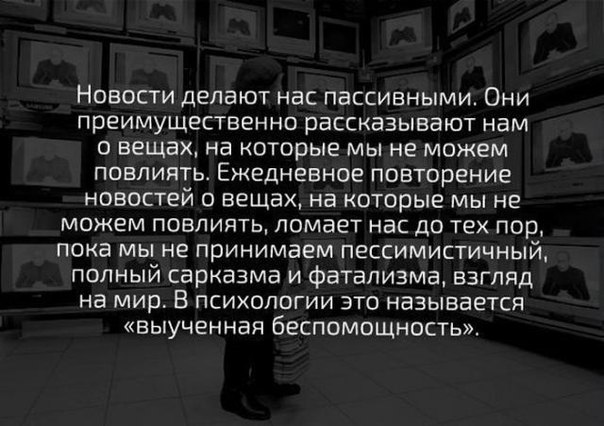
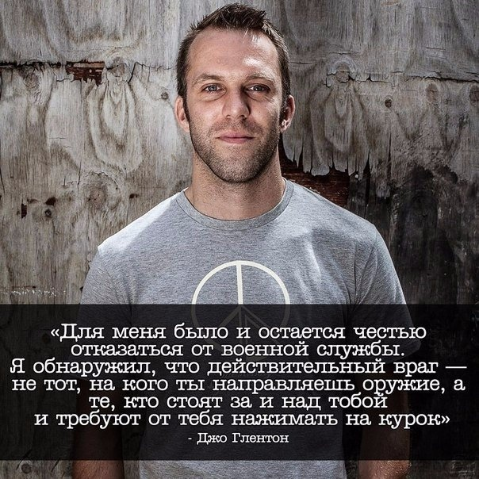

# Теория перманентной войны

>"Конечно, народ не хочет воевать. Но, в конце концов, политику определяют те, кто у власти, а народ легко пойдет, куда погонят, хоть при демократии, хоть при фашистской диктатуре, хоть при парламентаризме, хоть при коммунистах. Голосуют они или нет, людей всегда можно склонить к тому, чего хотят правители. Это просто. Нужно только сказать, что враг готовится напасть, и заткнуть рот пацифистам, объявив, что они не любят родину и бросают её в беде."
_— Герман Геринг На Нюрнбергском процессе_

Бесконечная война (англ. [Perpetual War](https://en.wikipedia.org/wiki/Perpetual_war)) - это длительное состояние войны без четких условий, которые привели бы к ее завершению. В таком состоянии постоянное напряжение и неустойчивость системы позволяют людям у власти манипулировать общественным мнением без особых последствий для них самих ("оправданные действия", "вынужденные меры", "ситуация обязывает" и т.д.).

Политикам нужна война, они очень боятся за свою власть. Всё их политическое влияние зависит от войн. **Если войны исчезнут - политики исчезнут.** Тогда правительство будет обыкновенной организацией, вроде почтового офиса или железнодорожной станции. У них будут определенные функции, но не будет власти. Война дает власть, поэтому политики не дадут войнам исчезнуть. Они продолжают говорить о мире и продолжают готовиться к войне.

Политики не могут позволить вам быть удовлетворенным в любви. **Как только вы удовлетворены в любви, вы стали бесполезны как солдат.** Вас нужно оставлять неудовлетворенным, чтобы гнев продолжал сжигать вас и вы были готовы сражаться - под любым предлогом - за самые глупые вещи. Люди способны воевать даже за клочок ткани, который они называют национальным флагом. Вы наблюдали это?

>"Какие бы лозунги ни выкрикивали ораторы, сгоняя дураков на бойню, какие бы благородные ни ставили перед ними цели, причина войн всегда одна. Деньги и убой умнеющего скота".

В лучшем мире следует [избавиться от всех национальных флагов](https://ru.wikipedia.org/wiki/%D0%A4%D0%BB%D0%B0%D0%B3_%D0%97%D0%B5%D0%BC%D0%BB%D0%B8). Они должны полностью исчезнуть. Вас учили, что вы принадлежите этой стране и должны быть готовы умереть за эту страну. Но никто не принадлежит ни к одной стране. **Вся земля - наш общий дом.** Мир нельзя делить, ведь это единый целостный организм. Если одна страна будет сливать токсичные отходы в море, то в итоге пострадает вся эко-система, все люди на планете.

[Космонавты из космоса не видят ни одной политической границы](https://ru.wikipedia.org/wiki/%D0%AD%D1%84%D1%84%D0%B5%D0%BA%D1%82_%D0%BE%D0%B1%D0%B7%D0%BE%D1%80%D0%B0). Мир поделен только на картах политиков. Политики нужны только из-за войн. Вот он - замкнутый порочный круг.

Понаблюдайте за людьми. Они готовы сражаться. Ради чего угодно: политика, религия. Любая чушь, - и они готовы убивать друг друга. Топливо для политиков - это «пушечное мясо» в виде патриотов. Нынче всё проверяют на патриотичность: сначала игры, а потом и мысли. И если ты не с нами, значит ты - против нас! Если ты не думаешь как мы, значит ты - против нас! Если ты не дал клятву верности куску цветной ткани или географической области, значит ты - против нас! Вы наверняка наблюдали и такое, верно?

>Война — это способ богатых людей защитить свои интересы, посылая детей среднего и бедного классов на смерть
_— Дж. Карлин_

Топливо для системы - это политики, которые поддерживают её, порой сами этого не осознавая. Они пытаются сочинять сотни законов и придумывают самые нелепые правила для собственного блага. Нужно понимать, что все созданные человеком законы и конвенции искусственны по своей природе. Они редко основаны на физических факторах, ответственных за человеческие ценности и поведение. В условиях дефицита люди более склонны к воровству и, неважно, сколько законов и конвенций при этом приведено в действие. **Людям нужны не законы, а доступ к необходимому для жизни — чистому воздуху, воде и пахотным землям вкупе с релевантным образованием, дающим знания о естественных науках.** А что делают политики? Они остаются на страже системы, блокируя доступ к информации, создавая искусственный дефицит ресурсов, создавая стадо послушных болванчиков. Это позволяет получать мгновенную личную выгоду для их собственного кармана. Страдает лишь карман послушного стада, которое так же послушно отправляется воевать во имя системы.

Целые индустрии работают только лишь для того, чтобы с [самого раннего детства воспитывать в детях патриотизм](https://vk.com/wall-55512460_61081) и превращать людей в эмоционально зависимых [телевизионных зомби](https://vk.com/wall-124609314_2601?w=wall-124609314_2601).

Вас пытаются держать в сомнамбулическом состоянии, [блокируя свободный доступ к данным](https://roskomsvoboda.org/post/what-happened-2021/), выстраивая искусственные рамки для вашего мышления, подменяя понятия, искажая информацию...

[Религия](https://vk.com/video68560971_171000236) - один из мощнейших инструментов манипулирования, лучший друг войны: [Жак Фреско - Обращение к ветеранам](https://youtu.be/YPZlfsG71N8)

А есть ещё [оружейная индустрия](https://vk.com/wall5476436_9626), где под видом развлечений вам продают смертоносные "игрушки"...

>"Вам говорят, что если вы убьёте человека в интересах страны, то станете героем! Но если вы убьёте человека в личных интересах, то станете заключённым".

Политики - это топливо для системы. Патриоты - это топливо для политической силы. Ни те, ни другие не способны решать проблемы, потому что их инструменты предназначены не для этого. Невозможно с помощью пулемётной очереди или танковым залпом решать общечеловеческие проблемы. Таким образом их можно только умножать.

>"Всегда есть деньги для войны. Но никогда нет денег на мир и на людей".

## Сегодняшняя перманентная война - информационная

Главная задача информационной войны похожа на задачу снайпера. По этой причине снайперов на всех войнах в плен не особо берут, а кончают, предварительно от души помучав. Потому что снайпер должен не столько убивать, сколько калечить. За раненым побегут товарищи, пока будут вокруг него суетиться, их можно немножко пострелять. Раненый — бОльшая обуза для тыла, чем убитый, как бы страшно это не звучало. Убитый взывает к мести. А раненый - отнимает внимание, средства, он источник деморализации и горя для всех родных и близких. Надолго, если не навсегда.

У информационной атаки точно такая же задача. Вы должны круглосуточно воевать с заведомым бредом, подбрасываемым вам под информационный выстрел, как чучело из вражеского окопа. Вы тратите патроны, то есть эмоциональную энергию. Вы устаете, вы считаете, что не имеете права радоваться жизни, веселиться, праздновать, пока где-то далеко гибнут люди.

Вы находитесь в состоянии траура по погибшим, даже если их не знаете. Вы заведомо готовы оплакивать еще живых. Вы не дарите радость другим, вам не до секса, стихов, цветов, рассветов и закатов. Вы считаете это высшим проявлением патриотического поведения? Поздравляю вас, вы убиты.

### Подмена понятий (ловушка [чёрно-белого мышления](Общая%20Семантика%20-%20Двустороннее%20ориентирование.md))

---

## Что делать?

Мирному населению в период информационной войны стоит помнить:

1. Любая война закончится.
2. В каждом народе есть разные люди, не все участвуют в войне, не нужно оскорблять всех подряд.
3. Политики договорятся, а ты останешься с тем говном, которым ты поливаешь "своих идеологических противников".
4. Во время войны врут все. Не распространяй информацию анонимную и ту, в истинности которой не уверен или не можешь проверить. Если хочется что-то написать, пиши о том, что видишь сам. А лучше снимай на видео и выкладывай публично.
5. Хочешь высказать свое отношение к политике - выскажи, при этом не обязательно кого-то оскорблять.
6. Не нравиться мнение другого человека - выскажись об этом мнении, а не об этом человеке, чаще всего вы лично не знакомы.
7. Помни, что ненавидеть незнакомых тебе людей - это заболевание.
8. Взаимоотношения между людьми весьма сложные даже на уровне семьи или трудового коллектива. Между государствами все еще сложнее. Всё просто и понятно только дуракам. Не торопись делать выводы.
9. Оставайся всегда Человеком и помни пункт 1.

Если ты - вне контекста, вне военных действий, а всю информацию получаешь из "тревожных новостных сводок" или YouTube-каналов, то лучше переключи своё внимание на что-то другое. Помни про выученную беспомощность и следующую за ней депрессию. Откажись от навешивания ярлыков:

>"Когда вы называете себя индуистом, мусульманином, христианином, или европейцем, или еще кем-либо, вы проявляете насилие. Понимаете, почему это насилие? Потому, что вы отделяете себя от других, от остального человечества. Когда вы отделяете себя верованием, национальностью, традицией — это порождает насилие. Поэтому человек, стремящийся понять насилие, не принадлежит ни к какой стране, ни к какой религии, ни к какой политической партии или системе. Все его мысли заняты только стремлением понять человечество."

## Хочешь мира? Работай над этим!

Мир — это когда люди контролируют поведение друг друга положительным подкреплением. Принуждение даёт быстрые результаты, но приносит страдания и ставит под угрозу выживание человечества. На [записи 1983-го](https://youtu.be/nRFblXa87EU) года Беррес Фредерик Скиннер и Джон М. Уайтли обсуждают контекст, препятствующий проектированию культуры соответственно отдалённому будущему, и возможные способы изменить его. 

Живя в цивилизованном обществе, Вы не сможете заставить одного образованного человека пойти убивать других людей. Если Ваши дети будут образованными, то они вам скажут, что **существует масса способов решения проблем, нежели убийство других людей.**

Ищите реальных врагов, с которыми стоило бы воевать: **грязная окружающая среда** — от смога в воздухе до химикатов в воде — приводит к смерти в 15 раз большего количества людей, чем все войны и насилие в мире. Также с загрязнением не могут сравниться курение, голод, стихийные бедствия, дорожные происшествия, и даже такие болезни, как ВИЧ, туберкулез и малярия все вместе уносят в три раза меньше жизней. Об этом говорится в отчете по результатам исследования связи загрязнения и здоровья, проведенного [журналом Lancet](https://www.thelancet.com/journals/lancet/article/PIIS0140-67361732345-0). 

## Ссылки

* [TrashSmash: Почему война никогда не меняется?](https://youtu.be/4hd0HZeydLM)
* [Ноам Хомский: 10 способов управления массами](https://4brain.ru/blog/mass-manipulation-chomsky/)