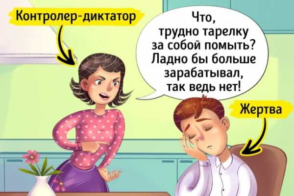

# Треугольник Карпмана или Как выйти из токсичных отношений

Треугольник Карпмана — самая распространенная модель взаимоотношений между людьми. Она может помочь построить здоровые счастливые отношения, а в случае невозможности — прекратить токсичные отношения.

Люди постоянно манипулируют друг другом, зависят друг от друга и очень от этого устают. Эрик Берн описал множество игр и ролей, создав целое течение в психотерапии под названием «трансактный анализ». Знание подхватили многие молодые умы, ставшие впоследствии выдающимися учёными. Одним из учеников Берна был Стивен Карпман, который пронаблюдал и описал треугольник взаимоотношений, ломающий жизни многим семьям, и в то же время способный семьям помочь.

**Альтернатива играм — настоящая человеческая близость.**

## Как это работает?

«Треугольник Карпмана» — это модель, и как любая модель, она позволяет посмотреть на свои отношения со стороны. В отношениях трое: один персонаж — **жертва**, другой — **преследователь**, третий — **спасатель**. Всего 3 объекта — отсюда и треугольник 🔻

Действует это так:

1. агрессор давит на жертву = контролирует, подавляет, унижает, саркастирует, ну, в общем, всё, о чём мы писали в статье «Признаки токсичных отношений»;
2. жертва чувствует себя беспомощной, отказывается брать на себя ответственность и ждёт помощи со стороны;
3. спасатель бежит на помощь жертве, причём зачастую сам он — несчастен, потому что о других думает больше, чем о себе, и соответственно — не реализуется.

**Пример**

**На примере среднестатистической семьи:**

* агрессором может быть мама, которая, допустим, строго воспитывает ребёнка;
* спасателем может быть отец, который, наоборот, слишком добр, мягок и уже перестал замечать, что малыш обнаглел;
* сам малыш — жертва: он вырастает ленивым, беспомощным и с массой комплексов.

Родители при этом находятся в состоянии вечной войны, постоянно споря о методах воспитания.

### Почему все продолжают этим заниматься? Что делать?
Дело в том, что жертва любит, что всё решают за неё. Спасатель получает удовольствие от того, что помог слабому. Агрессор любит ощущать себя в превосходящей позиции. Всем хорошо в такой ситуации, поэтому все продолжают играть в эту игру.

**Ключ к свободе — осознанность** 😊🙏

Начните замечать за собой — кто вы из этих трёх?

**Если агрессор** — снизьте уровень ожидания к другим людям и повысьте критичность к самому себе: жить можно и в мире, а близкие люди — не те, кто должен ходить у вас по струнке!

**Если спасатель** — прекратите лезть, куда не просят. Помогайте только по требованию и с учётом своих приоритетов и возможностей!

**Если вы жертва** — прекратите себя жалеть! Это не вас обижают, это вы решили обидеться! Вы не хотите брать ответственность за свою жизнь и принимать собственные решения!

**Знайте:** выйти из «токсичных отношений» можно самостоятельно! 
И первый шаг к решению проблемы — понять, что проблема существует ✊

## Ссылки

* [источник](https://semeinayapara.clinic/statji/psihologiya/treugolnik-karpmana-ili-kak-vyity-iz-toksichnyh-otnosheniy)