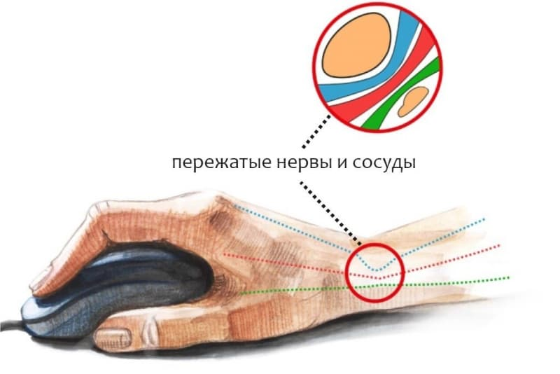

# Тунельный синдром

**Туннельный синдром** (**синдром** карпального канала, карпальный **синдром**) - патологическое состояние, возникающее на фоне межмышечного, межкостного или межсухожильного защемления срединного нерва в запястье. Происходит при отечности или компрессии (сжатии) нерва, отечности запястного канала, воспалении сухожилий.

## Ссылки

* [Тунельный синдром - болезнь офисных работников лечение и профилактика](https://youtu.be/oAI3WLbjZgI)
