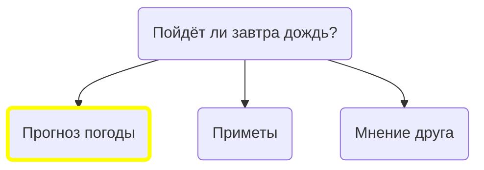
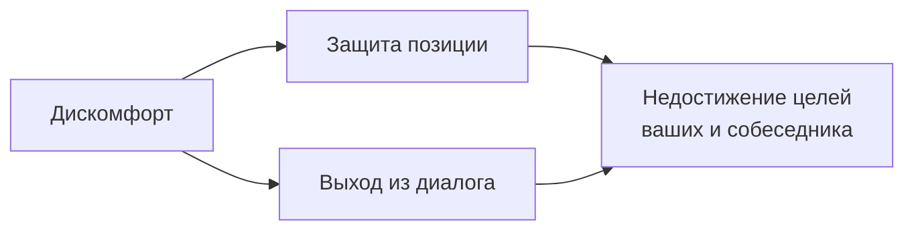
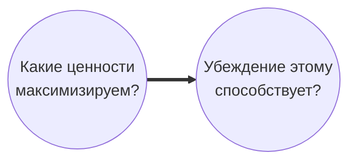

# Уличная эпистемология (УЭ)

Подход к ведению бесконфликтного диалога, который позволяет исследовать надежность рассуждений собеседников.

## Убеждение

Убеждение - это любое утверждение о внешнем мире. Убеждение может проистекать из личного опыта, может быть стереотипом и т.д.

## Верные и неверные убеждения

Верное убеждение - это убеждение, которое лучше соответствует реальности. Реальность можно представить, как территорию, а убеждения - как карту. Убеждения - это лишь наши представления о реальности. Убеждения не могут полностью соответствовать реальности, соответственно карта не может полностью соответствовать территории. Но тем не менее карта может более или менее точно отражать территорию.

## Зачем иметь верные убеждения?

Более верные представления о реальности помогают нам более адекватно действовать, в соответствии с этими представлениями. В противном случае - неверные представления реальности могут нам достаточно сильно навредить. Например, можно выпить неизвестное средство и не вылечиться или заболеть ещё больше.

## Как узнать, какое убеждение верное?

- Проверка
- Рассуждения

Например, если вам нужно знать пойдет ли завтра дождь, можно просто подождать до завтра и посмотреть будет ли дождь. Если пойдет, то мы были правы, если нет, то значит мы были неправы.

Но не всегда так легко что-то проверить. И придется узнавать, какие есть способы понять, на основе косвенных данных, какое мнение более вероятно. Т.е. мы рассуждаем и таким образом делаем предсказания о верности нашего мнения.

В этих случаях верными убеждениями называются те, которые получены при помощи более надежных методов познания.

## Структура убеждения

- Тезис
- Причины
- Методы познания

Астрология работает - это сам тезис убеждения. У этого тезиса есть какие-то причины, например: личный опыт, мнение экспертов, опыт знакомых, информация из интернета. Эти причины основываются на методах познания. Методы познания - это способы понимать что верно, что неверно; способы рассуждать; способы понимать, чему верить, чему нет. Например: доверие личному опыту, доверие опыту знакомых и доверие авторитетам.

Разные методы познания с разной вероятностью приводят к верным результатам и идея УЭ - это как раз исследование методов познания и понимания является ли метод познания надежным, т.е. приведет ли он с высокой вероятностью к верному убеждению, соответствующему реальности.

## Зачем говорить про убеждения?

### Подходящие цели для УЭ

- Понимание
- Улучшение своей картины мира
- Улучшение картины мира собеседника

### Не подходящие целя для УЭ

- Переубеждение
- Самооутверждение
- Донесение своей позиции

## Цели и потребности собеседника

### Важно о них помнить! Иначе

- Диалог не будет полезен собеседнику
- Вы не достигнете целей

### Собеседник может не хотеть говорить

- Хочет поделиться эмоциями
- Не хочет говорить на эту тему
- Не хочет говорить с вами
- Не хочет говорить именно сейчас
- Ему не нужна правда в этом вопросе

## Ненасильственное общение

### Зачем говорить ненасильственно?

Если диалог доставляет дискомфорт, то собеседник просто будет защищать свою позицию и ему будет неинтересно задумываться об этом или попытается выйти из диалога. Таким образом никто не достигнет своих целей в диалоге.

### Как говорить ненасильственно?

Как достичь комфорта в диалоге?

1. Уважение. Нужно просто уважительно относиться к собеседнику. Понимать, что это отдельно человек, что у него есть свое мнение. Не нужно считать его тупым, не нужно его оскорблять, даже, если вы правда считаете, что собеседник неправ.
2. Важно быть открытым к изменению своего мнения. Потому что на самом деле в диалоге может оказаться так, что собеседник прав, а вы не правы. Нужно всегда это допускать.
3. Активное слушание - в ходе диалога показываем, что нам интересно то, о чем говорит собеседник. Например: можно уточнять у собеседника правильно ли вы его поняли; можно мимикой, жестами показывать свой интерес.
4. Настрой. В диалоге важно быть настроенным на то, чтобы понять собеседника. При наличии других целей, вы можете забыть цель беседы и перестать стремиться узнать истину. Можете сразу сказать собеседнику в чем ваша цель в этом диалоге: "Мне интересна твоя позиция, я хочу ее обсудить, потому что мне важно понять в чем она заключается и мне хочется понять, как на самом деле устроен мир".
5. В ходе диалога желательно оставаться нейтральным. Не показывать свою позицию, если вас об этом не спрашивают. При возникновении вопросов, предложить объяснить свою позицию после диалога, потому что сейчас вы разговаривает о собеседнике и его убеждении.

## Типы убеждений

### О мире (физические)

- Земля круглая
- Экстрасенсы существуют
- Астрология работает
- Гомеопатия помогает
- Глобальное потепление вызвано человеческим фактором

Любые убеждения о том, как устроен мир. В данном случае в диалоге будет цель - понять, насколько надежно, опираясь на те данные, которые есть у собеседника, делать тот вывод, который он делает. Узнать насколько надежен метод познания и если возможно, найти способы проверки, так ли устроен мир или не так.

### Этические

- Запретить аборты
- Ввести смертную казнь
- Запретить/Легализовать что либо

Здесь сложно сказать объективно, что правда, что ложь. Это убеждения о том, что хорошо, что плохо или как людям нужно действовать.

Убеждение основано на ценностях собеседника. Например, если у собеседника убеждение, что нужно ввести смертную казнь и как один из вариантов, у него может быть ценность - снижение количества убийств и стратегия достижения этой ценности - смертная казнь. Мы не можем никак подтвердить или опровергнуть и доказать, что снижение убийств - это хорошо. Но мы можем проверить реально ли стратегия, выбранная собеседником, соответствует его ценностям. Реально ли она к этому приведет? Реально ли смертная казнь снизит количество убийств?

## Как говорить про убеждения?

Больше вопросов, меньше аргументов.

Что? —> Почему? —> Как? —>

Когда вы приводите аргументы, вы говорите о том, что важно вам, что убеждает вас самих, а не собеседника. У собеседника могут быть вообще другие причины так считать, и тогда ваши аргументы никак не повлияют. Поэтому важно говорить именно о том, во что верит собеседник и почему, и исследовать именно его причины, а не ваши.

### Что?

- Что ты имеешь ввиду под словом атом?
- Что такое плохо?
- Что собеседник имеет ввиду?

Что нам нужно вообще сделать в диалоге? В первую очередь нужно понять в чем конкретно заключается убеждение собеседника, т.е. понять его позицию.

На данном этапе можно согласовать определения и выяснить зачем это нужно, в случае этических убеждений, какие ценности у собеседника.

### Почему?

- Почему ты так считаешь?
- Есть ли еще какие-то причины?
- Какая причина самая главная?

Начинаем узнавать причины уверенности собеседника. Например, если мы говорим про то, что весь мир состоит из атомов, то возможная причина, что собеседнику в школе так сказали или может быть он занимается физикой, студент технического ВУЗа, хорошо в этом разобрался, прочитал много книг и пришел к такому выводу, или может быть он просто на основе философских рассуждений считает, что мир должен состоять из атомов. Могут быть разные причины и цель - понять какая причина основная и говорить именно о ней. Потому что, если мы будем говорить о причине, которая не очень важна для собеседника, то скорее всего для него мы никак не улучшим его картину мира и сами никак собеседника не поймем. Например, собеседник считает, что мир должен состоять из атомов, потому что читал труды Демокрита, который писал об этом.

После выяснения главной причины мы можем узнать насколько собеседник в этом уверен по шкале от 0 до 100. И чтобы узнать правда ли эта причина главная, можно спросить изменится ли как-то уверенность собеседника, если этой причины не будет. Например: если бы ты не читал Демокрита, ты посчитал, что мир состоит из атомов? Если Демокрит не основная причина, то будет что-то еще.

### Как?

- Альтернативные объяснения
- Надежность метода
- Универсальность
- Способы проверки
- "Что могло бы понизить/повысить уверенность?"
- "Если ты ошибаешься, как бы ты мог это понять?"
- Поиск минусов или недостатков

Вопросы про надежность методов познания. Пытаемся понять прав ли собеседник или нет. Можно ли полагаться на то что он полагается и прийти к верным выводам?

## Ссылки

- [Алеся Соколова "Как разговаривать на острые темы и не конфликтовать"](https://youtu.be/-VFkvG9gS0o)
- https://vk.com/street_epistemology
- https://youtube.com/c/ВиватСократ

