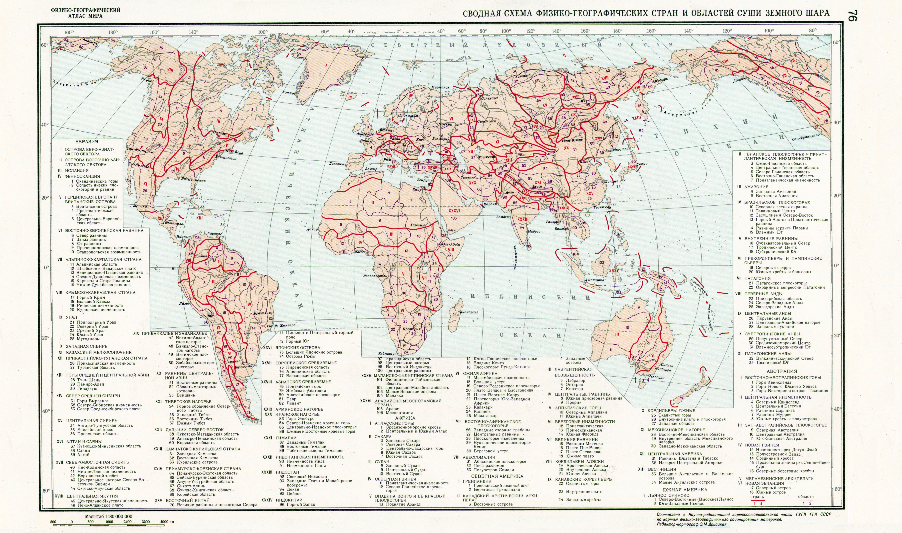

# Физико-географическая страна

Физико-географическая страна — это обширная часть материка, соответствующая крупной тектонической структуре и достаточно единая в орографическом отношении, характеризующаяся общностью макроциркуляционных процессов и своеобразной структурой географической зональности. [Википедия](https://ru.wikipedia.org/wiki/%D0%A4%D0%B8%D0%B7%D0%B8%D0%BA%D0%BE-%D0%B3%D0%B5%D0%BE%D0%B3%D1%80%D0%B0%D1%84%D0%B8%D1%87%D0%B5%D1%81%D0%BA%D0%B0%D1%8F_%D1%81%D1%82%D1%80%D0%B0%D0%BD%D0%B0)

## Ссылки

* [Физико-географический атлас мира](http://geochemland.ru/index.php?page=%D1%84%D0%B3%D0%B0%D0%BC)
* [География](География.md)
* О границах в «Проекте Венера»:
  * [Цели ПВ](TVP%20-%20Основные%20цели%20проекта%20Венера.md)
  * [Вопрос 1. Что такое Проект Венера](Вопрос%201.%20Что%20такое%20Проект%20Венера.md)
  * [Вопрос 9. Будут ли региональные различия иметь такое же сильное влияние, как сегодня](Вопрос%209.%20Будут%20ли%20региональные%20различия%20иметь%20такое%20же%20сильное%20влияние,%20как%20сегодня.md)
  * [Вопрос 11. В чем заключается самый важный аспект Проекта Венера](Вопрос%2011.%20В%20чем%20заключается%20самый%20важный%20аспект%20Проекта%20Венера.md)
  * [Вопрос 78. Чем будут заниматься люди](Вопрос%2078.%20Чем%20будут%20заниматься%20люди.md)
  * [TVP - Каков план действий в рамках Проекта Венера](TVP%20-%20Каков%20план%20действий%20в%20рамках%20Проекта%20Венера.md)
  * [TVP - общее представление о Проекте Венера за 5 минут](TVP%20-%20общее%20представление%20о%20Проекте%20Венера%20за%205%20минут.md)
  