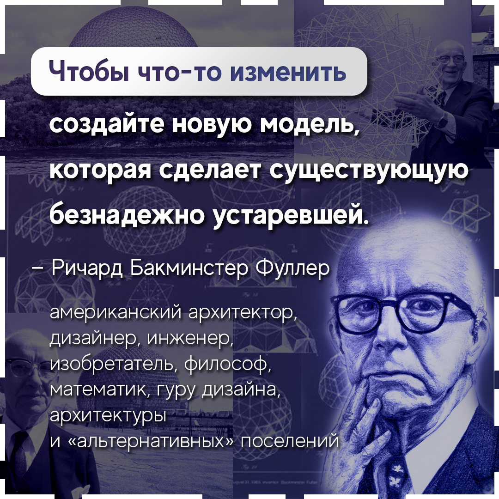

# Фуллер, Ричард Бакминстер

Ричард Бакминстер Фуллер — американский архитектор, дизайнер, инженер, изобретатель, философ, математик, писатель, поэт. В течение своей жизни Фуллер задавался вопросом относительно того, есть ли у человечества шанс на долгосрочное и успешное выживание на планете Земля и если да, то каким образом. [Википедия](https://ru.wikipedia.org/wiki/%D0%A4%D1%83%D0%BB%D0%BB%D0%B5%D1%80,_%D0%A0%D0%B8%D1%87%D0%B0%D1%80%D0%B4_%D0%91%D0%B0%D0%BA%D0%BC%D0%B8%D0%BD%D1%81%D1%82%D0%B5%D1%80)

 #цитата

## Ссылки

* 