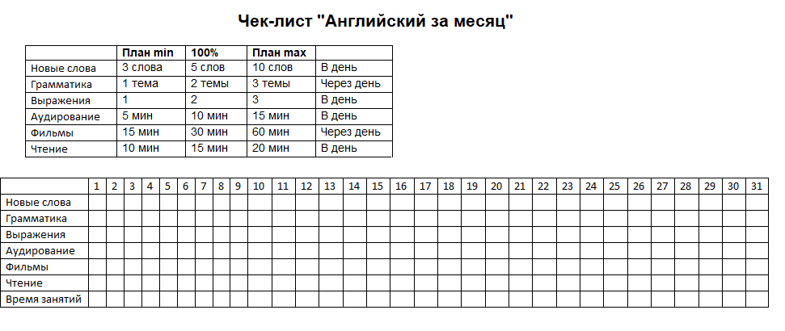

# Инструкция как освоить английский за месяц

Наверное, многие хотели бы освоить английский язык \(ведь без преувеличения – знать его полезно!\), и скорее всего одни неоднократно начинали его учить, а другие даже знают почти всю базу английского, НО говорить, а уж тем более воспринимать его на слух не могут. К категории последних относилась и я. Все мои попытки «выучить» английский заканчивались not good. То не хватало времени, то сил...

Затем я поняла, что если бы я с первого раза довела дело до конца, то уже бы давно применяла английский в жизни и смотрела любимые фильмы в оригинале. Осознав это, я решила попробовать еще раз!

Мною была поставлена цель заговорить на английском за месяц! Еще раз повторюсь, базовую грамматику и лексику я знала.

И с самого начала я столкнулась со сложностью: непонятно как, где и по какой методике учить английский, потому что информации в интернете ооочень много и  вся она несистематизированная \(по крайней мере, бесплатная\). И как мне кажется, с этой проблемой сталкиваются многие. Поэтому я создала чек-лист или трекер \(как хотите\) изучения английского. Вот он:

Систему я вроде как придумала \(см. фото выше\), оставалось найти ресурсы, которые позволили бы мне в удобной форме изучать грамматику, лексику и т.д.

После долгих поисков я определила для себя следующие **бесплатные ресурсы, которыми и хочу с вами поделиться**:

**Грамматика** – я скачала на телефон приложение «Lingualeo». Классика;\) Удобный интерфейс и понятные объяснения. А также просмотрела видеоуроки «Полиглот. Выучим английский за 16 часов». Очень советую данные ресурсы, если еще не знаете с чего начать.

**Выражения** – их я брала [тут](https://t.me/EngInPhrases). Это телеграм канал, на котором ежедневно публикуется по 2 фразы на английском. То есть здесь уже проделана вся работа по поиску фраз, остается только учить их по схеме и закреплять пройденное в ежедневных опросах.

\(Кстати, я выбрала для обучения именно телеграм, т.к. там нет диалогов с друзьями и прочей отвлекающей информации – только каналы, на которые я подписана\)

**Аудирование** – [тут](https://www.ted.com/talks). Для аудирования я выбрала площадку TED, т.к. там поднимаются различные интересные темы, а также выступают со своими докладами реальные люди!

**Фильмы** – можно использовать [этот сайт](https://fenglish.ru/films/). А вообще тут на ваш вкус и цвет, лично я искала любимые сериалы, которые смотрела на русском, и разбирала их.

**Чтение** – [тут](https://liteka.ru/english/library/). На этом сайте можно загружать свои книги и читать их в удобном формате. Или просто открыть любое из представленных там произведений \(лучше те, с которыми вы знакомы\) и читать их. Выбор хороший;\)

А для совсем новичков могу посоветовать[ этот телеграм канал](https://t.me/EngWith_HarryPotter), где выкладываются фрагменты текста частично на английском, частично на русском.  

И последняя рубрика – **новые слова**. Здесь вариантов много: можно скачивать различные приложения, можно открывать словари и по порядку брать оттуда слова и учить их. Однако, когда я учила, мне хотелось немного другого, более удобного подхода. И мне пришла идея создать свой телеграм-канал, в котором ежедневно будут публиковаться по 7 слов на английском, а в конце дня будет их проверка в опросах. Причем слова будут выкладываться в течение дня, чтобы можно было их учить просто по уведомлениям, даже не открывая телеграм. И я решила попробовать! Ждем тебя и начинаем учить English вместе –[ вот ссылка](https://t.me/English_in_words). Думаю еще создать чат на базе канала, чтобы все смогли делиться там своими успехами в изучении;\)

Далее я распечатала сам чек-лист, повесила его на рабочий стол и учила английский по этой методике весь месяц. Не скрою, что были дни полностью без английского, разве что уведомления из тг читала:D Но! Я завершила этот челлендж успешно и могу сказать, что **методика работает**! Я стала понимать английскую речь и за счет пополнения словарного запаса, начала более-менее говорить на английском свободно, опираясь на выученные фразы!

Чтобы ВЫУЧИТЬ английский, месяца, конечно, мало, но, чтобы его улучшить или начать понимать и заговорить на нем – вполне достаточно. Главное, система!

Проверьте на себе эту методику, мне кажется, она многим способна помочь;\) И помните, что если вы не начнете сегодня, то завтра будете об этом жалеть.

Благодарю за внимание;\)

## Ссылки

[Оригинал статьи](https://pikabu.ru/story/instruktsiya_kak_osvoit_angliyskiy_za_mesyats_7983466)

